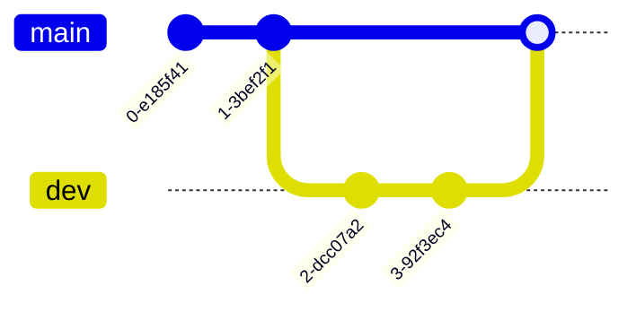

---
# ai
---

* Finetuning
Fine tuning的原理就是利用已知的网络结构和已知的网络参数，修改output层为我们自己的层，微调最后一层前的所有层的参数，加大最后一层的学习率，因为最后一层我们需要重新学习，所以与其它层相比要有相对较大的学习率，这样就有效利用了深度神经网络强大的泛化能力，又免去了设计复杂的模型以及耗时良久的训练，所以fine tuning是当数据量不足时的一个比较合适的选择。

commit
    commit
    checkout mast
    commit
    commit
    commit
    merge dev
