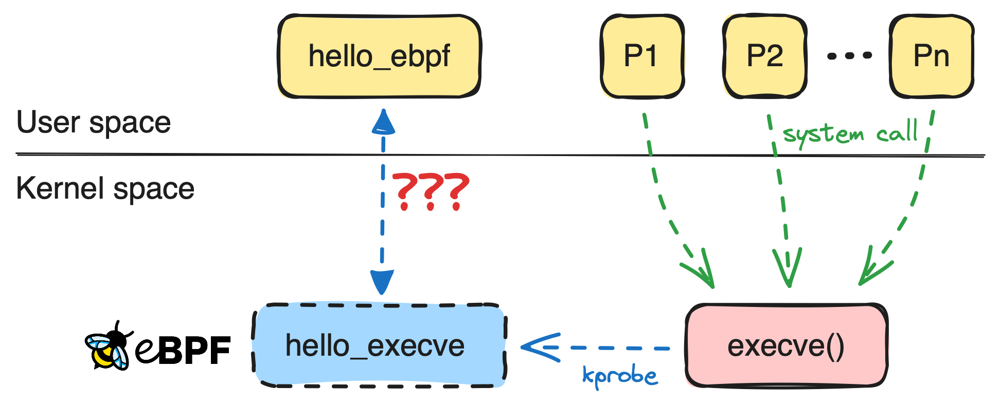
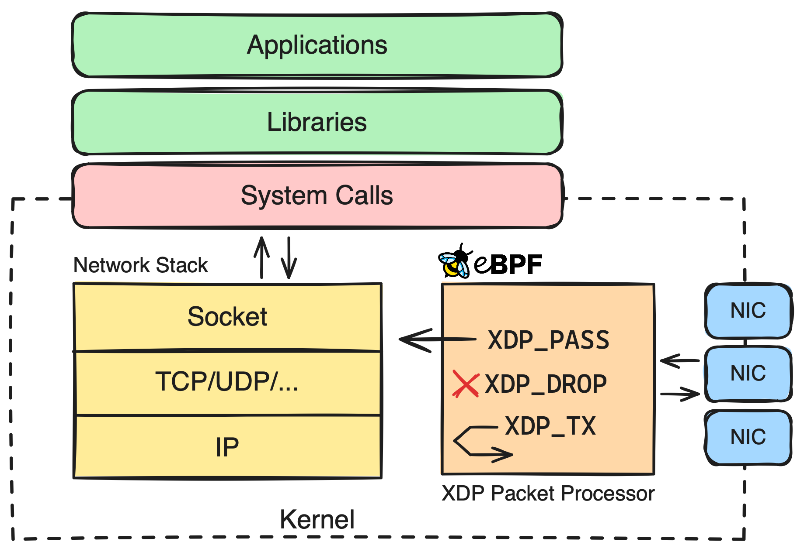

# eBPF技术
<!-- toc --> 

## [摘抄于文章](https://www.cnxct.com/an-applied-introduction-to-ebpf-with-go/)

如何使用
eBPF 是一个由多个组件组成的系统：

eBPF programs
eBPF hooks
BPF maps
eBPF 验证器
eBPF 虚拟机
请注意，我交替使用了术语“BPF”和“eBPF”。 eBPF 代表“扩展伯克利数据包过滤器”。 BPF 最初被引入 Linux 来过滤网络数据包，但 eBPF 扩展了原始 BPF，使其可以用于其他目的。今天它与伯克利无关，而且它不仅仅用于过滤数据包。

下面说明了 eBPF 如何在用户空间和底层工作。 eBPF 程序用高级语言（例如 C）编写，然后编译为 eBPF bytecode 。然后，eBPF 字节码被加载到内核中并由 eBPF virtual machine 执行。

eBPF 程序附加到内核中的特定代码路径，例如系统调用。这些代码路径称为 hooks 。当钩子被触发时，eBPF 程序就会被执行，现在它会执行您编写的自定义逻辑。这样我们就可以在内核空间中运行我们的自定义代码。

## 图示

## 应用示例

* [ecapture-官网](https://ecapture.cc/zh)
* [ecapture-github](https://github.com/gojue/ecapture)
