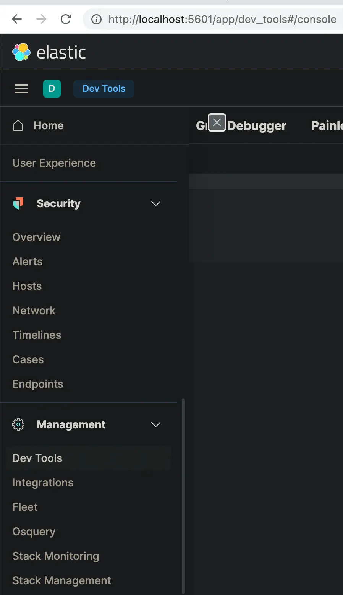
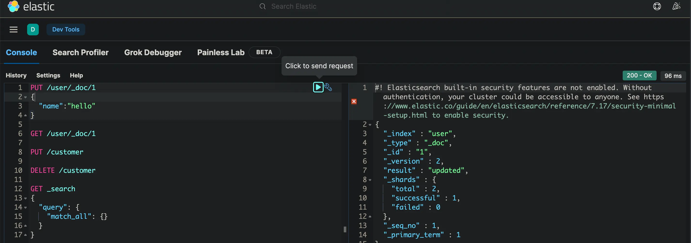

---
# elastic
---

### [官网](https://www.elastic.co/)

* [zinc-golang版本替代品](https://github.com/zinclabs/zinc)
* [meili-rust版本替代品](https://github.com/meilisearch/MeiliSearch)

```bash
docker run --name ms1.0 --restart always -p 9080:7700 -v $(pwd)/meili_data:/meili_data -d getmeili/meilisearch:v1.0
```

* [typesense-c++版本替代品,纯内存](https://typesense.org/)

### 安装

* elasticsearch,基于Lucene(TM)的开源搜索引擎

    ```sh
    brew tap elastic/tap
    brew install elastic/tap/elasticsearch-full
    brew services start elasticsearch-full
    curl -X GET http://localhost:9200/
    # 查看安装的插件
    curl -X GET http://localhost:9200/_cat/plugins
    ```

    ```sh
    docker pull docker.elastic.co/elasticsearch/elasticsearch:8.1.3
    docker run -p 9200:9200 -p 9300:9300 -e "discovery.type=single-node" docker.elastic.co/elasticsearch/elasticsearch:8.1.3
    ```

  * 名词概念对比
        | 关系数据库 | elasticsearch |
        | -- | -- |
        | 库 | 索引 |
        | 表 | 类型 |
        | 表模式 | 映射 |
        | 行 | 文档 |
        | 字段 | 字段 |
    * 支持类型
        | 字段类型 |说明 |
        | -- | -- |
        | string | 字符串 |
        | byte, short, integer, long | 数字 |
        | float, double | 浮点 |
        | boolean | 布尔 |
        | date | 日期 |

  * 采用倒序存储,关键字 --》[文档1, 文档2, 文档3 ....],所以能快速搜索

  * 插入的数据自动地创建类型(type)及其映射(mapping)

  * 没有事务一致性,采用乐观版本,文档每更新一次，文档元数据中版本号就增加

  * 传统数据库更关注数据一致性，永久存储等,在于操作数据,es则偏重于快速搜索

  * 通常用数据库数据初始化es索引

  * 索引别名理解及应用

  * 默认端口9200

  * 查询语法
    * Leaf query clauses
      * match,全文搜索,支持text, number, date or boolean

        ```js
        GET /_search
        {
            "query": {
                "match": {
                "message": "this is a test"
                }
            }
        }
        ```

      * term,精确相等,不要查询text字段

        ```js
        GET /_search
        {
            "query": {
                "term": {
                    "user.id": {
                        "value": "kimchy",
                        "boost": 1.0
                    }
                }
            }
        }
        ```

      * range

* 浏览器插件

  * es-client-elasticsearch客户端
  * Elasticvue-elasticsearch客户端

* kibana

    ```sh
    # 注意和elasticsearch版本配对,否则跑不起来
    curl -O https://artifacts.elastic.co/downloads/kibana/kibana-7.17.2-darwin-x86_64.tar.gz
    curl https://artifacts.elastic.co/downloads/kibana/kibana-7.17.2-darwin-x86_64.tar.gz.sha512 | shasum -a 512 -c - 
    tar -xzf kibana-7.17.2-darwin-x86_64.tar.gz
    cd kibana-7.17.2-darwin-x86_64/
    ./bin/kibana
    # 浏览器访问
    http://localhost:5601/
    ```

    
    

* 如果报内存不够,则删除monitoring索引
