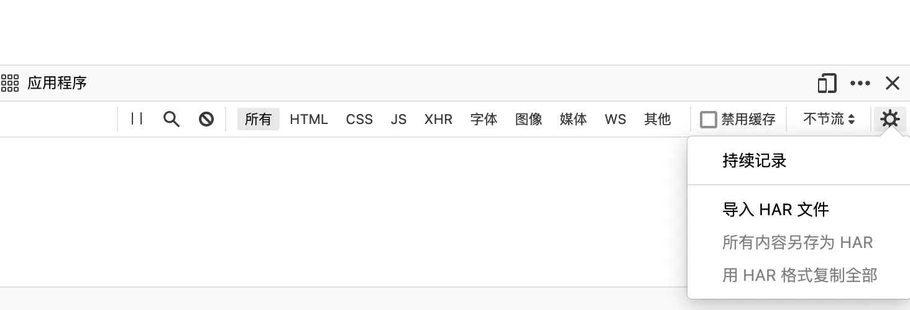
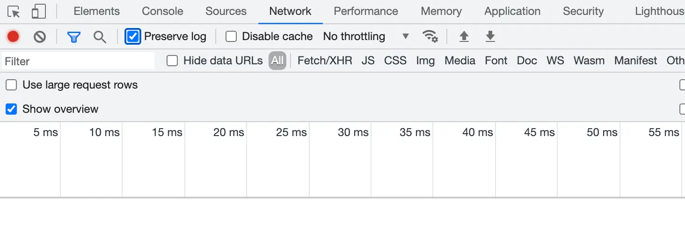
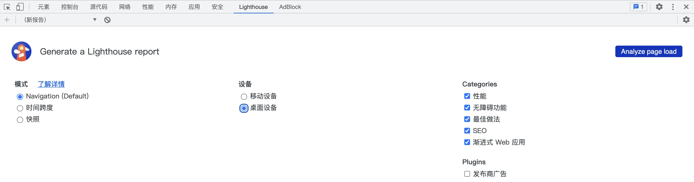
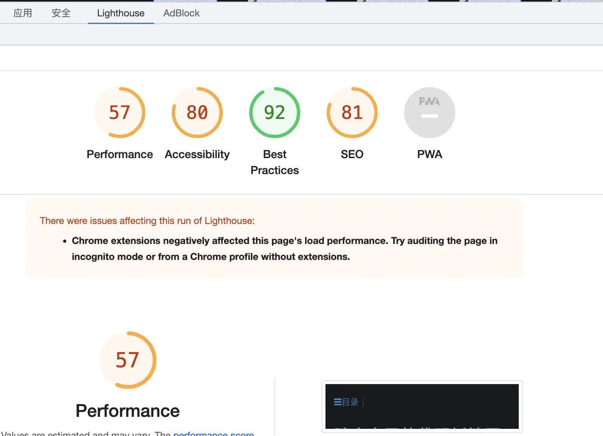

---
# firefox
---

* 扩展组件
  * 实际上zip压缩后,直接改后缀名xpi
  * 注意不能直接压缩整个目录,应该是选择文件压缩,否则认为损坏.估计压缩比解压多一级目录.
  * 现代firefox一般要求认证,扩展组件开发者,否则不能安装与运行

* "此附件组件无法安装，未通过验证"
  * 打开Firefox浏览器
  * 地址栏输入“about:config”
  * 搜索“xpinstall.signatures.required”设置项，双击改为“false”，重启
  * 再把xpi拖进Firefox窗口便会提示是否安装
  
* 优秀插件
  * Dark Reader-**推荐使用**,把网站改成暗黑主题,少数网站表现不好
  * uBlock Origin-**推荐使用**去广告
  * sourcegraph-**推荐使用**浏览器享受ide级别待遇
  * savetopdf-自动把网页转化为pdf
  * es-client-elasticsearch客户端
  * Elasticvue-elasticsearch客户端
  * autocopy-自动复制选中内容
  * 探索者小舒--一键切换多个搜索引擎
  * Vue.js devtools-vue.js开发助手
  * jsonview-在浏览器中查看JSON 文件
  * Postwoman中文版-优秀Api测试插件
  * monknow新标签页,美观且允许高度自定义的新标签页扩展插件
  * chrome://flags/#enable-force-dark 自带暗黑模式

* 开发者模式-禁止网页跳转自动清除日志
  * 禁止页面跳过自动清除log
  
  

* lighthouse-chrome出品网站优化建议报告,dev-tools自带，方便又快捷
  * 
  * 

* firefox开发者专用版,获取最新的开发者工具,帮助调试很多问题

* [MDN-前端开发必备](https://developer.mozilla.org/zh-CN/docs/Web)
  * MDN-Mozilla开发者社区（MDN）是一个完整的学习平台
  * 临时加载的脚本扩展，必须用cmd+shift+j调出浏览器控制台,设置"显示消息内容",才能看到日志,
  * PWA（Progressive Web App）-渐进式Web应用,利用缓存+在线网站构建本地应用

* WebDriver是远程控制接口，可以对用户代理进行控制。它提供了一个平台和语言中性线协议，作为进程外程序远程指导web浏览器行为的方法.

* 有空实现插件
  * 浏览器扩展 类似go search,python search
  * 浏览器扩展 把github有关hg项目生成pdf
  * dial,类似monknow
  * 批量html转化成pdf
