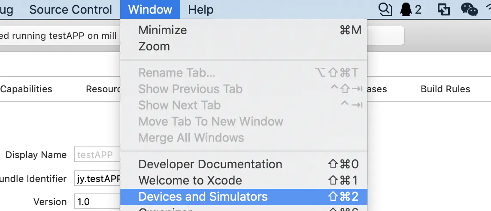
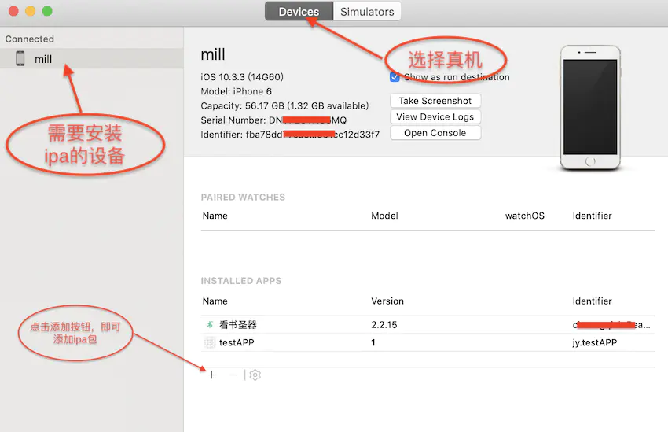

---
# flutter
---

### [中文官网](https://flutter.cn)

### 常用命令

```bash
# 检查环境
flutter doctor

# 创建新工程
flutter create xxx

# 调试运行
flutter run

# 生成apk,默认release,上线应用市场需要签名,个人使用可以直接生成
flutter build apk

# 插上数据线，连上手机，手机打开调试选项,直接安装
flutter install

# 生成不同的ios应用,默认生成apple store,否则就指定用途
# 没有订阅会费，无法生成上架及ad-hoc,只能生成 development
flutter build ipa --export-method ad-hoc、--export-method development 和 --export-method enterprise。

flutter build ipa --export-method development

# 应用程序支持的最低 macOS 版本。Flutter 支持 macOS 10.11 及更高版本。Deployment Target（部署目标）需要注意.
flutter build macos

# 出现类似下面提示，可能是xcode版本或m1芯片造成,仍然可以正常打包
# --- xcodebuild: WARNING: Using the first of multiple matching destinations:
# { platform:macOS, arch:arm64, id:xxxxx }
# { platform:macOS, arch:x86_64, id:xxxx }

# cd project/build/web
# python3 -m http.server 8000
flutter build web

# linux仅限linux主机支持
flutter build linux

# windows仅限windows主机支持
flutter build windows
```

### 中国特定的环境变量,否则doctor失败

```bash
vim .zshrc
vim .bashrc
export CHROME_EXECUTABLE=/Applications/Chromium.app/Contents/MacOS/Chromium
export PUB_HOSTED_URL=https://pub.flutter-io.cn
export FLUTTER_STORAGE_BASE_URL=https://storage.flutter-io.cn
```

### 本地跑起flutter官网

```bash
cd git-code/github/flutter-website
# make up,如果不能,就先启动docker
./local.sh
```

### 知名扩展库

* [samples-flutter官方示例](https://github.com/flutter/samples)

* [Fair-界面动态化](https://fair.58.com/)

* [bruno-组件开源](https://bruno.ke.com/)

* [AppFlowy-开源笔记](https://bruno.ke.com/)

### Bundle和apk区别

> Bundle是google推出一种文件格式,帮助下载时动态产生apk,以节省不必要的浪费.Google Play就是基于对aab文件处理，将App Bundle在多个维度进行拆分，在资源维度，ABI维度和Language维度进行了拆分，你只要按需组装你的Apk然后安装即可。如果你的手机是一个x86，xhdpi的手机，你在google play应用市场下载apk时，gogle play会获取手机的信息，然后根据App Bundle会帮你拼装好一个apk，这个apk的资源只有xhdpi的，而且so库只有x86，其他无关的都会剔除。从而减少了apk的大小。

### xcode无线调试真机(同局域内)

* 手机采用数据线连接上Xcode，打开Xcode菜单：Windows->Device and Simulators。找到连接上的设备，把Connect via network选项打勾.

* 之后Xcode将会转一会圈圈，耐心等待一会就成功了，此时拔掉数据线，可以看到左侧的设备连接列表上手机仍在列表中

* 运行我们的项目，在设备列表中不出意外会看到我们的无线连接的手机。选择手机后运行

* 不出意外的话，此时是跑不起来的。还需要最后一步，回到刚刚的设备列表中，选中手机右键，在出来的选项卡中选择一个Connect via IP Address项。选择之后输入手机的局域网ip地址。

* 完成后可以看到在连接的手机右边有一个地球连接标志.

* 以后项目运行，在下拉列表如果手机在局域网中也会有这个标志

* 最后一步，选择后直接运行，不出意外的话，项目无需数据线就跑起来了

* 此方法是支持无线调试的，连一次以后就不需要数据线了了

### 苹果帐户添加设备uuid

* 打开<https://developer.apple.com/> 登录你的苹果开发者账号,交过钱才能看到界面

* 登进去之后点击Certificates, Identifiers & Profiles

* 左侧点击Devices，可以看到现在账号里面注册的设备，再点击+号新增设备

* 填写设备的名字（这个自己随便写就好了，方便你知道是谁的什么设备就行）还有设备的UDID，完成后点击Continue

* 然后会让你再次确认信息，看你填写是否正确，下面显示的是该账号最多可以添加的测试设备数目和剩余可添加设备的数目。信息无误，点击Register下一步。再点击done完成注册，跳转回Devices页面，就可以看到我们新添加的设备了。如果是做app开发，需要重新打包之后，新设备才能进行测试

* 平时打**adhoc**，不用打store包

* iphone6 plus的uuid 0da336454935d7d38373cbd54a403cad888ba845

### xcode查看uuid

* iphone数据线连接MAC

* 打开Xcode

* 点击Window---->Devices and Simulators--->在右侧可查看到identifier

* identifier即为我们获取到的iPhone 的UDID

### 总结

* [xcode真机调试](https://www.jianshu.com/p/8c99cb119bb3)

* [xcode真机安装ipa](https://www.jianshu.com/p/19ed6b2ea8a1)




