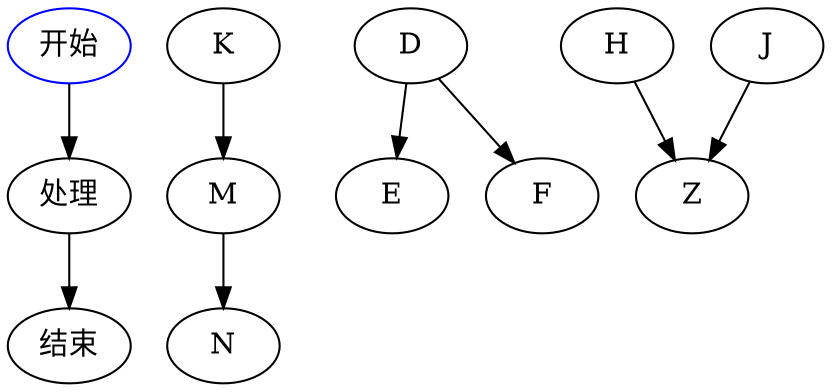
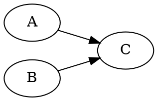
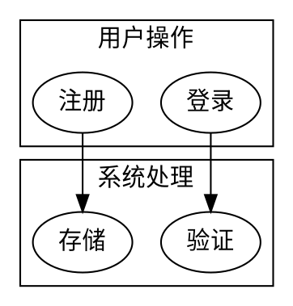

# dot简介
<!-- toc --> 

- 需要mdbook-graphviz插件支持
- 必须带上process参数,否则原样输出

```dot process
digraph G {
    // 节点定义
    A [label="开始", color=blue];
    B [label="处理", arrowhead=empty];
    C [label="结束"];
    
    // 箭头连接
    A -> B;
    B -> C;

    K -> M -> N; 
    D -> {E F};  

    {H J} -> Z;
}
```

```dot process
digraph G {
  rankdir=LR;  // 布局方向：从左到右（默认从上到下）
  { rank=same; A B; }  // A和B在同一层级
  A -> C;
  B -> C;
}
```

```dot process
digraph G {
  // 集群1：左侧节点组
  subgraph cluster_1 {
    label="用户操作";  // 集群标签
    A [label="登录"];
    B [label="注册"];
  }
  
  // 集群2：右侧节点组
  subgraph cluster_2 {
    label="系统处理";
    C [label="验证"];
    D [label="存储"];
  }
  
  // 集群间的边
  A -> C;
  B -> D;
}
```
