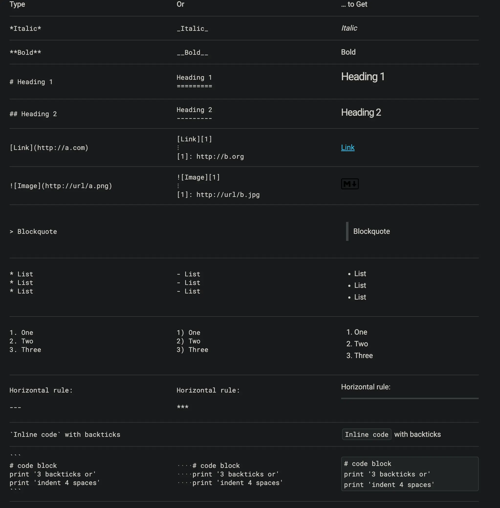
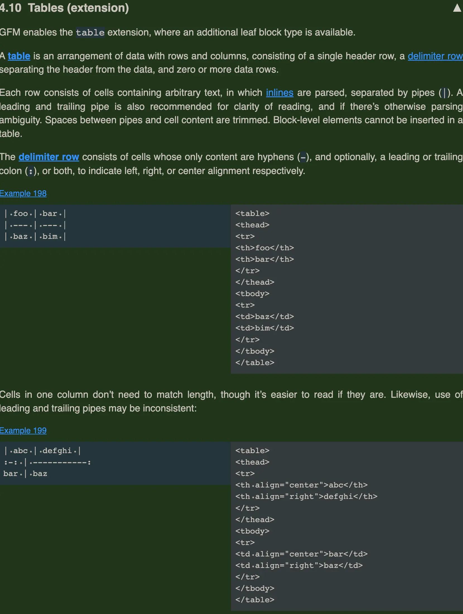
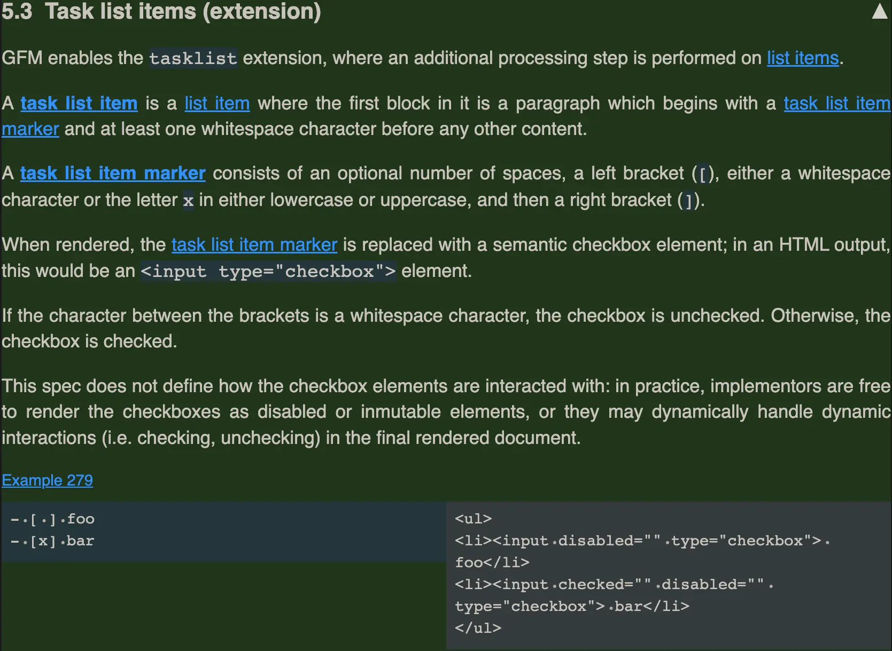
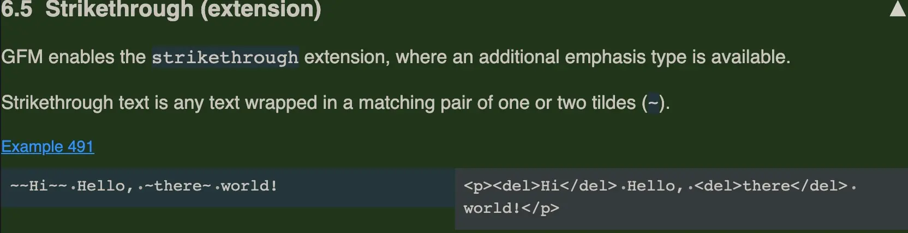

# markdown
<!-- toc --> 

以下是常用的 Markdown 语法，按功能分类整理，方便快速查阅和使用：


### 一、标题
使用 `#` 表示，`#` 数量对应标题级别（1-6级），`#` 后需加空格。
```markdown
# 一级标题
## 二级标题
### 三级标题
#### 四级标题
##### 五级标题
###### 六级标题
```


### 二、文本格式
- **加粗**：用 `**` 或 `__` 包裹文本
  ```markdown
  **这是加粗文本**  
  __这也是加粗文本__
  ```

- **斜体**：用 `*` 或 `_` 包裹文本
  ```markdown
  *这是斜体文本*  
  _这也是斜体文本_
  ```

- **加粗+斜体**：用 `***` 包裹文本
  ```markdown
  ***这是加粗且斜体的文本***
  ```

- **删除线**：用 `~~` 包裹文本
  ```markdown
  ~~这是带删除线的文本~~
  ```

- **下划线**：用 `<u>` 标签（部分编辑器支持）
  ```markdown
  <u>这是带下划线的文本</u>
  ```

- **高亮**：用 `==` 包裹（部分编辑器支持，如 Typora）
  ```markdown
  ==这是高亮文本==
  ```


### 三、列表
#### 有序列表
用数字 + 英文句号 + 空格 表示
```markdown
1. 第一项
2. 第二项
3. 第三项
```

#### 无序列表
用 `-`、`*` 或 `+` + 空格 表示（可混用）
```markdown
- 项目一
* 项目二
+ 项目三
```

#### 嵌套列表
子列表前加 4 个空格或 1 个制表符（Tab）
```markdown
- 父项 1
    - 子项 1.1
    - 子项 1.2
- 父项 2
    1. 子项 2.1
    2. 子项 2.2
```


### 四、链接
#### 基础链接
格式：`[显示文本](链接地址 "可选标题")`（标题 hover 时显示）
```markdown
[百度](https://www.baidu.com "访问百度")
```

#### 引用链接
先定义链接标识，再引用（适合重复使用同一链接）
```markdown
[谷歌][g]  
[必应][b]  

[g]: https://www.google.com  
[b]: https://www.bing.com
```

#### 自动链接
用 `<>` 包裹网址或邮箱，自动识别为链接
```markdown
<https://www.github.com>  
<example@mail.com>
```


### 五、图片
格式与链接类似，前缀加 `!`：``
```markdown

```

引用式图片：
```markdown
![风景图][img1]  

[img1]: https://picsum.photos/400/200
```


### 六、引用
用 `>` 表示，可嵌套（多组 `>`）
```markdown
> 这是一级引用
>> 这是二级引用（嵌套在一级内）
> 回到一级引用
```


### 七、代码
#### 行内代码
用 `` ` ``（反引号）包裹
```markdown
使用 `print()` 函数输出内容
```

#### 代码块
用 3 个反引号 `` ``` `` 包裹，可指定语言（实现语法高亮）
```markdown
```python
def hello():
    print("Hello, Markdown!")
```
```

也可用 4 个空格或 1 个制表符缩进（不支持指定语言）：
```
    # 这是 Python 代码
    x = 10
    print(x)
```


### 八、表格
用 `|` 分隔列，`-` 分隔表头和内容，`:` 控制对齐方式（左对齐 `:-`、右对齐 `-:`、居中 `:-:`）
```markdown
| 姓名 | 年龄 | 职业   |
| :--- | ---: | :----: |
| 张三 | 25   | 工程师 |
| 李四 | 30   | 设计师 |
```

效果：
| 姓名 | 年龄 | 职业   |
| :--- | ---: | :----: |
| 张三 | 25   | 工程师 |
| 李四 | 30   | 设计师 |


### 九、分隔线
用 3 个及以上 `-`、`*` 或 `_`（可加空格）
```markdown
---
***
___
```


### 十、脚注
用 `[^标识]` 定义，文末说明内容
```markdown
这是一段需要注释的文本[^1]  

[^1]: 这里是脚注的具体内容
```


### 十一、任务列表
用 `- [ ]` 表示未完成，`- [x]` 表示已完成（x 不区分大小写）
```markdown
- [x] 完成 Markdown 语法学习
- [ ] 练习实际应用
- [ ] 总结技巧
```


### 十二、数学公式（部分编辑器支持，如 Typora、GitHub）
#### 行内公式
用 `$` 包裹
```markdown
勾股定理：$a^2 + b^2 = c^2$
```

#### 块级公式
用 `$$` 包裹（自动居中）
```markdown
$$
\sum_{i=1}^n i = \frac{n(n+1)}{2}
$$
```


### 注意事项
- 语法后建议加空格（如标题、列表），增强兼容性。
- 不同编辑器对部分语法（如高亮、数学公式）支持有差异，需根据工具调整。

### [标准化语法](<https://commonmark.org/help/>)



### [github的扩展GFM](https://github.github.com/gfm)






### [表情符号网站](https://emojipedia.org/)

---

### 笔记

* emoji表情符号

```markdown

 :smile:

```

* ~~+1~~

* &#x1F34E;

* <www.baidu.com>

* gitbook写书工具，有各种插件

* markdown here写邮件

* pandoc 不同标记语言间格式转换工具

* markdown有工具直接生成ppt

* 有工具可以把markdown转成微信公众号需要的格式

* 石墨文档，腾讯文档，语雀文档在线多人协作工具

* gitbook写书工具，有各种插件

* [mdBook-rust实现的gitbook](https://github.com/rust-lang/mdBook)

* mkdocs,python开发的静态站点生成器
