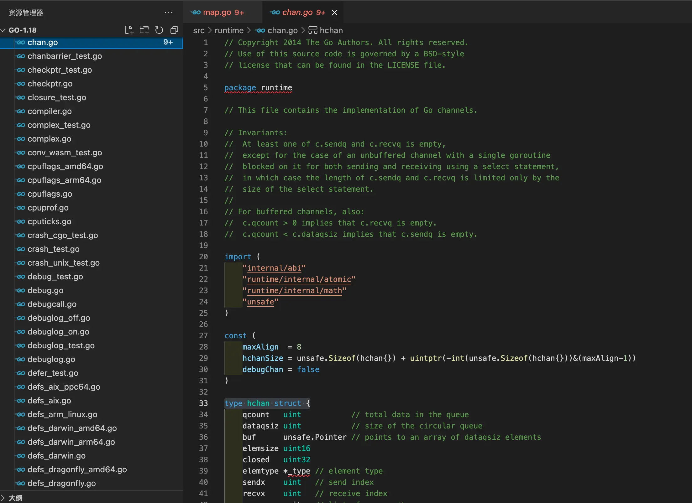
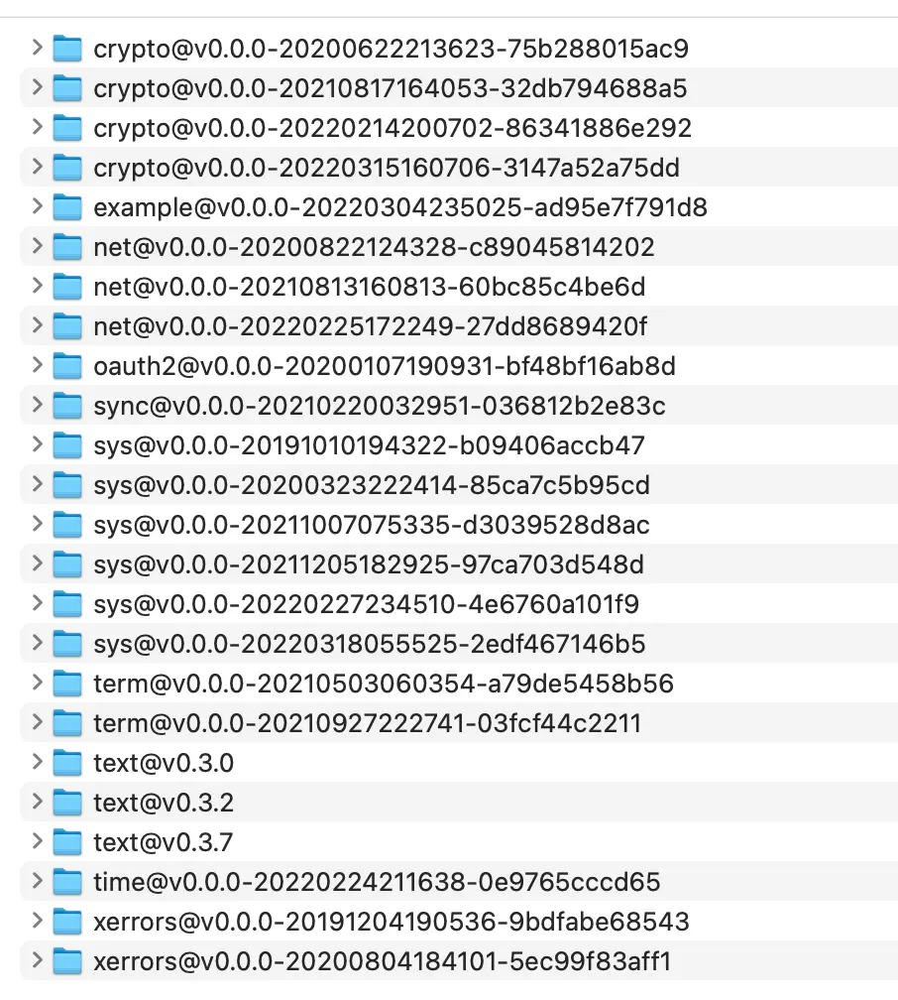
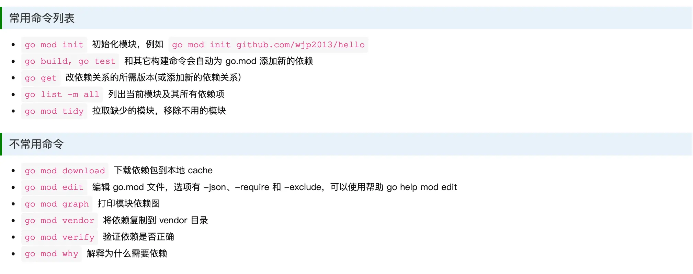
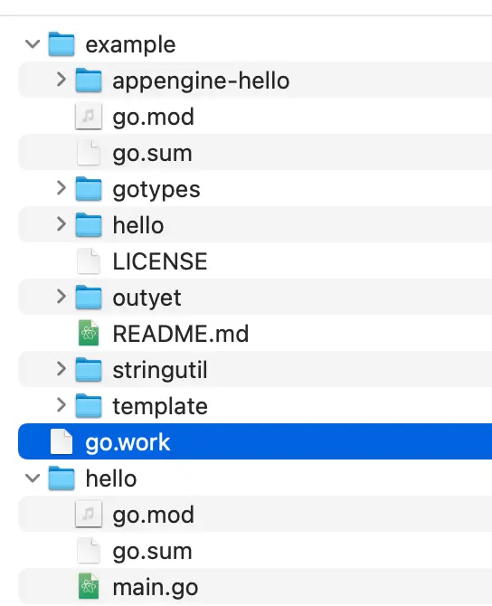
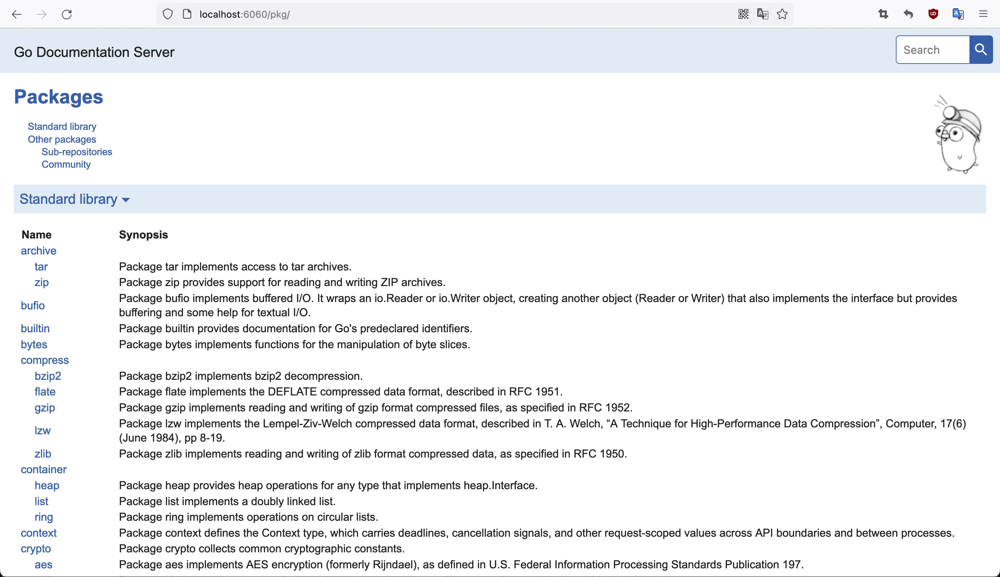
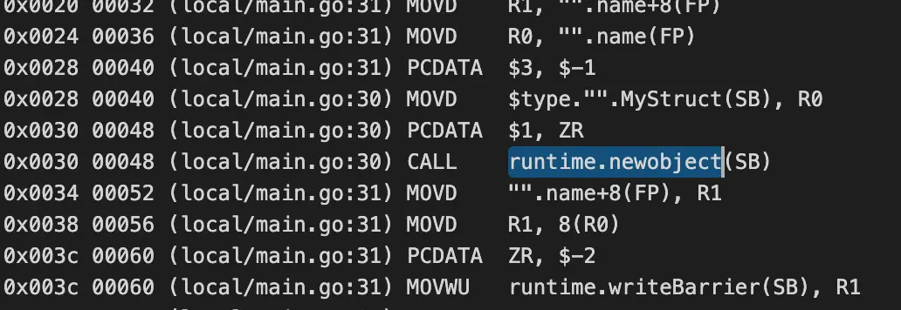

---
# golang
---

### [官网](https://go.dev/)

***

* [Go Search Extension](https://go.extension.sh/)浏览器扩展, 地址栏输入go+空格启用

* golang.org国内经常访问不了
* 通过go bulid -tags 实现编译控制
* 内置数据类型定义在runtime包,如下图所示

* 吐槽一下
  * 破坏注释不影响代码的传统,这类//go:注释,有特别含义,会影响代码作用,使用者非常容易误解
  * 强制mod方式管理第三方模块
    * 用代码库+版本解决依赖
    * 带来重大著名库大量重复存在,GOPATH成垃圾桶
    
    * 带来更多名词,增加心智负担,精力分散在语言之外过多
    * 严重偏向开源开发模式,对闭源开发不友好

### 环境变量

***

```sh
# 安装到默认目录
rm -rf /usr/local/go && tar -C /usr/local -xzf go1.19.linux-amd64.tar.gz
# 导出环境变量
export PATH=$PATH:/usr/local/go/bin
# 查看安装成功否
go version

#列出环境变量
go env

#GOPATH环境变量,如果没有手动设置,默认为$HOME/go
GOPATH=$HOME/go

#模块缓存是 go 命令存储下载模块文件的目录,默认是$GOPATH/pkg/mod.
GOMODCACHE
#清除mod cache,pkg目录里面全没了
go clean --modcache

#Build Cache意思就是会把编译过程的中间结果cache下来，从而实现增量编译。
#Test cache，在内容没有变化的情况下，对于同样的参数的测试，会直接使用cache的测试结果
#cache默认的存储路径是操作系统所确定的用户缓存目录，但是可以通过GOCACHE环境变量修改
GOCACHE

#清除build cache
go clean -cache
#清除test cache
go clean -testcache

#GOPROXY(公共)修改为国内代理
#全球代理https://proxy.golang.com.cn(https://goproxy.io/)
#阿里云 https://mirrors.aliyun.com/goproxy/
#七牛云 https://goproxy.cn
#direct表示直接从包路径下载
go env -w GOPROXY=https://goproxy.cn,direct

#GOPRIVATE设置私有库
#还可以设置不走 proxy 的私有仓库或组，多个用逗号相隔（可选）
#允许通配符
go env -w GOPRIVATE=git.mycompany.com,github.com/my/private,*.example.com

#GOVCS变量
#可以使用git下载带有 github.com 路径的模块；无法使用任何版本控制命令下载 evil.com上的路径
#使用 git 或 hg 下载所有其他路径（* 匹配所有内容）的模块。
GOVCS=github.com:git,evil.com:off,*:git|hg

#GOSUMDB变量
#默认的GOSUMDB=sum.golang.org验证包的有效性,经常访问不了
go env -w GOSUMDB=off
#使用国内代理
go env -w GOSUMDB=https://goproxy.cn/sumdb/sum.golang.org,sum.golang.org
 ```

* GOPROXY说明
  * You can set the variable to URLs for other module proxy servers, separating URLs with either a comma or a pipe.
  * When you use a comma, Go tools will try the next URL in the list only if the current URL returns an HTTP 404 or 410.

  ```sh
  GOPROXY="https://proxy.example.com,https://proxy2.example.com"
  ```

  * When you use a pipe, Go tools will try the next URL in the list regardless of the HTTP error code.

  ```sh
  GOPROXY="https://proxy.example.com|https://proxy2.example.com"
  ```

* GOPRIVATE说明
  * The GOPRIVATE or GONOPROXY environment variables may be set to lists of glob patterns matching module prefixes that are private and should not be requested from any proxy.

* GOVCS说明
  * 版本控制工具中的错误可能被恶意服务器利用来运行恶意代码
  * 如果未设置环境变量GOVCS,或者不匹配,GOVCS的默认处理:允许 git 和 hg 用于公共模块,并且允许所有工具用于私有模块。

### [go mod命令指南](https://go.dev/doc/modules/gomod-ref)

***


```sh
#最后结果都是写入go.mod文件
go mod init path
go mod edit --replace modulepath=otherpath
go mod edit --exclude modulepath
#tidy整理依赖,增加没有添加或移除未引用等
go mod tidy
#整检依赖是否正解
go mod verify
```

* **采用mod方式管理依赖,则没有gopath/src,改到gopath/mod**
* **go.sum不需要手工维护,也不要手工改动**
* **所有的子目录里的依赖都组织在根目录的go.mod文件**
* replace指令场景
  * 替换无法下载的包
  * 替换本地自己的包
  * 替换 fork 包
* exclude显式的排除某个包的某个版本,例如某个版本有严重bug,如果其他包引用这个版本,就会自动跳过这个版本
* [文章](<https://zhuanlan.zhihu.com/p/126561786>)介绍较直白
* [文章](https://segmentfault.com/a/1190000039359906)介绍**retract**指令


### [工作区-多模块](https://go.dev/ref/mod#workspaces)

***

```sh
#最后结果都是写入go.work文件
Usage:
 go work <command> [arguments]
The commands are:
 edit        edit go.work from tools or scripts
 init        initialize workspace file
 sync        sync workspace build list to modules
 use         add modules to workspace file
```

* workspace目录



* go.work内容

```sh
#go work use ./hello
#go work use ./example
#./hello,./example是本地路径,不是example,hello的module名
go 1.18

use (
 ./example
 ./hello
)
```

* hello/main.go内容

```golang
package main

import (
 "fmt"

 "golang.org/x/example/stringutil"
)

func main() {
 fmt.Println(stringutil.ToUpper("Hello"))
}

```

* hello/go.mod内容

```sh
module example.com/hello
go 1.18
require golang.org/x/example v0.0.0-20220304235025-ad95e7f791d8 // indirect
```

* 1. 在workspace目录下运行go run example.com/hello
* 2. 不用改动go.mod,使得golang.org/x/example由本工作区的example替代
* 3. 可实现多模块同时开发

### 相关工具go tools

***

#### get/install下载包过程

```golang
// import "example.org/pkg/foo"
//
// will result in the following requests:
//
// https://example.org/pkg/foo?go-get=1 (preferred)
// http://example.org/pkg/foo?go-get=1  (fallback, only with use of correctly set GOINSECURE)
//
// If that page contains the meta tag
//
// <meta name="go-import" content="example.org git https://code.org/r/p/exproj">
//
// the go tool will verify that https://example.org/?go-get=1 contains the
// same meta tag and then git clone https://code.org/r/p/exproj into
// GOPATH/src/example.org.
// go get/install当服务器支持多种协议优先使用https://, 然后git+ssh://.
```


```sh
#包括godoc等工具
#./godoc -http :6060
go install golang.org/x/tools/...@latest.

#浏览器本地文档，如果起启目录有go.mod会继续分析提供文档,但是增加启动时间
godoc -http :6060

#安装pprof,如果不在mod目录下运行,就指明@latest最近版本
go install github.com/google/pprof@latest

#下载最新版本
go get example.com/theirmodule@vlatest
#下载指定版本
go get example.com/theirmodule@v1.3.4
go get example.com/theirmodule@4cf76c2
go get example.com/theirmodule@bugfixes
#移除指定版本模块
go get example.com/theirmodule@none
#查看所有依赖模块的最新版本
go list -m -u all
#查看指定模块的最新版本
go list -m -u example.com/theirmodule

#升级后会将新的依赖版本更新到go.mod
go get -u need-upgrade-package
#升级所有依赖
go get -u 


go tool pprof

go tool trace

#获取当前git hash
Cgithash=$(git rev-parse --short HEAD)
#获取当前时间
Ctime=$(date '+%Y-%m-%d_%H:%M:%S')

# 交叉编译
# 禁止cgo
# 设置编译目标平台
# 设置编译芯片体系
#-s: 去掉符号表; -w:去掉调试信息，不能gdb调试了;
CGO_ENABLED=0 GOARCH=amd64 GOOS=linux go build -o ${target} -ldflags "-s -w -X main.GitHash=${Cgithash} -X main.CompileTime=${Ctime}" main.go


#获取程序更多信息(包括-ldflags参数设置)
go version -m 二进制可执行文件

#新增inittrace指令, 用于init调试和启动时间的概要分析
GODEBUG=inittrace=1 go run main.go 

#简化代码
gofmt -s -w xxx.go
```



* [文章](https://eddycjy.com/posts/go/tools/2018-09-15-go-tool-pprof/)介绍pprof
* [文章](https://eddycjy.com/posts/go/tools/2019-07-12-go-tool-trace/)介绍trace
* [创建protoc插件](https://taoshu.in/go/create-protoc-plugin.html)

##### [golangci-lint](https://github.com/golangci/golangci-lint),替代品[lint-静态检查库](https://github.com/mgechev/revive)

```sh
#快速安装,会自动下载依赖安装对应的go版本,如果系统安装有go,那么注意搜索PATH
brew install golangci-lint

#手动下载,选择最新及相应的平台,最新版本在go1.18有部分lint不支持,需要适时更新
https://github.com/golangci/golangci-lint/releases


#较大规模项目,或第一次运行应该增加超时选择
#golangci-lint会采用缓存,如果环境变没有设置,则采用系统默认设置
golangci-lint run --timeout=1h

#GolangCI-Lint looks for config files in the following paths from the current working directory:

.golangci.yml
.golangci.yaml
.golangci.toml
.golangci.json

#这几个参数比较有用
  skip-dirs:
    - src/external_libs
    - autogenerated_by_my_lib
  # Enables skipping of directories:
  # - vendor$, third_party$, testdata$, examples$, Godeps$, builtin$
  # Default: true
  skip-dirs-use-default: false
  # Which files to skip: they will be analyzed, but issues from them won't be reported.
  # Default value is empty list,
  # but there is no need to include all autogenerated files,
  # we confidently recognize autogenerated files.
  # If it's not please let us know.
  # "/" will be replaced by current OS file path separator to properly work on Windows.
  skip-files:
    - ".*\\.my\\.go$"
    - lib/bad.go
```

##### [小米出品-Soar-sql优化改写](<https://github.com/XiaoMi/soar>)

```sh

#手动下载,选择最新及相应的平台,老黄历版本啦!
https://github.com/XiaoMi/soar/releases

#源码安装,报gopath/pkg/mod/github.com/!xiao!mi/soar@v0.8.1/ast/tidb.go:24:2: ambiguous import:
#解决办法:跳过此种方式，估计没有指到最新版本,没心情找原因
go install github.com/XiaoMi/soar/cmd/soar@latest

#最原始办法
git clone https://github.com/XiaoMi/soar.git
cd soar
make

#测试使用
echo 'select * from film' | ./soar
```

### go generate命令

* 当运行go generate时,它将扫描与当前包相关的源代码文件,找出所有包含"//go:generate"的特殊注释
* 提取并执行该特殊注释后面的命令,命令为可执行程序，形同shell下面执行

  * 该特殊注释必须在.go源码文件中。
  * 每个源码文件可以包含多个generate特殊注释时。
  * 显示运行go generate命令时，才会执行特殊注释后面的命令。
  * 命令串行执行的，如果出错，就终止后面的执行。
  * 特殊注释必须以"//go:generate"开头，双斜线后面没有空格。

* 应用
  * yacc：从 .y 文件生成 .go 文件。
  * protobufs：从 protocol buffer 定义文件（.proto）生成 .pb.go 文件。
  * Unicode：从 UnicodeData.txt 生成 Unicode 表

```sh
go generate [-run regexp] [-n] [-v] [-x] [build flags] [file.go... | packages]
```

* 参数说明如下：

  * -run 正则表达式匹配命令行，仅执行匹配的命令；
  * -v 输出被处理的包名和源文件名；
  * -n 显示不执行命令；
  * -x 显示并执行命令；
  * command 可以是在环境变量 PATH 中的任何命令。

### 核心语法

***

* 逃逸分析
  * 目标:减轻堆内存分配开销，减少gc压力，提高运行性能
  * 编译器会做逃逸分析(escape analysis),变量的作用域没有跑出函数范围，在栈上，反之在堆上。
  * 实践

    ```sh
    #输出分析结果
    go build -gcflags '-m -l' main.go
    #反汇编查看,出现runtime.newobject,就发现逃逸行为
    go tool compile -S main.go
    ```

    

  * 结论
    * 常见逃逸
      * 在某个函数中new或字面量创建出的变量，将其指针作为函数返回值，则该变量一定发生逃逸（构造函数返回的指针变量一定逃逸）；
        >建议:调用方传入参，被调用方直接把结果存进去
        >
        >比如 read 函数的签名是 read([]byte)，而不是 read() []byte，就是为了避免堆分配.

      * 被已经逃逸的变量引用的指针，一定发生逃逸；
      * 被指针类型的slice、map和chan引用的指针,一定发生逃逸,所以slice,map,chan尽管传值,不使用传指针,除非超大复制量；
      * 申请超大容量变量,栈空间是有限的
      * 作为fmt.printxxx参数,没事少用点
      * make,new,字面量初始化变量都一样要逃逸分析

    * 常见不逃逸
      * 指针被未发生逃逸的变量引用；
      * 仅仅在函数内对变量做取址操作，而未将指针传出；

    * 可能发生逃逸
      * 将指针作为入参传给别的函数；这里还是要看指针在被传入的函数中的处理过程，如果发生了上边的三种情况，则会逃逸；否则不会逃逸；

* 泛型
  * 类型参数：泛型的抽象数据类型。

  ```sh
  TypeParameters  = "[" TypeParamList [ "," ] "]" .
  TypeParamList   = TypeParamDecl { "," TypeParamDecl } .
  TypeParamDecl   = IdentifierList TypeConstraint .
  ```

  * 类型约束：确保调用方能够满足接受方的程序诉求。

  ```sh
  TypeConstraint = TypeElem .
  TypeElem       = TypeTerm { "|" TypeTerm } .
  TypeTerm       = Type | UnderlyingType .
  UnderlyingType = "~" Type .
  ```

  ```golang
  /*
  内置comparable类型约束
  comparable is an interface that is implemented by all comparable types (booleans, numbers, strings, pointers, channels, arrays of comparable types, structs whose fields are all comparable types). The comparable interface may only be used as a type parameter constraint, not as the type of a variable.*/
  type comparable interface{ comparable }
  ```

  * 类型推导：避免明确地写出一些或所有的类型参数。

  * 为保证GO1兼容性,标准库并没有引入泛型,试验性在golang.org/x/exp里

* Go 1.15 增加了一个新程序包，time/tzdata。该程序包允许将时区数据库嵌入程序中
* Go1.16 开始禁止 import 导入的模块以 . 开头，模块路径中也不允许出现任何非 ASCII 字符
* Go 1.16 新增的 embed 包支持资源嵌入

```golang
//把资源文件打包到二进制文件中
import (
 "fmt"
 //go1.16引入新的标准库
 _ "embed"
 "runtime/debug"
)
//golang特有编译器指示,类似//go:noinline,go:build
//go:embed hello.txt
var hello string

func main() {
  //调试好帮手,打印出调用栈
  debug.PrintStack()
  fmt.Println("hello:", hello)
}
```

* 弃用 io/ioutil,已移至其他程序包
* timer性能提升,defer的性能，几乎是零开销
* 合并结构体标签tag设置标识

```golang
type MyStruct struct {
  Field1 string `json:"field_1,omitempty" bson:"field_1,omitempty" xml:"field_1,omitempty" form:"field_1,omitempty" other:"value"`
}
// 就可以通过合并的
type MyStruct struct {
  Field1 string `json,bson,xml,form:"field_1,omitempty" other:"value"`
}
```

* context 主要用来在 goroutine 之间传递上下文信息，包括：取消信号、超时时间、截止时间、k-v 等.这篇[文章](https://zhuanlan.zhihu.com/p/425199722)解释清楚.
  * 上游的信息共享给下游任务
  * 上游可发送取消信号给所有下游任务,不会直接干涉和中断下游任务的执行,下游任务自行决定后续的处理操作.
  * 下游任务自行取消不会影响上游任务
  * 源码不理解?
  
  

* 字符串,只读的切片,写入操作都是通过拷贝实现的。

```golang
// 原始,特别适合不要转义
var rawString  = `\n \b \s \u`
// 带转义
normalStr := "aabbcc"

// 从string转[]byte，从[]byte转string,都是拷贝数据
// 而内存拷贝的性能损耗会随着字符串和 []byte 长度的增长而增长。
```

* 数字字面量,下划线只为美观

```golang
// 二进制110
var binary = 0b1_1_0
// 十进制712
var digit = 7_1_2
// 向下取整,div=3
var div = 7 / 2 
```

* 数组

```golang
//明确指出
arr1 := [3]int{1, 2, 3}
//编译器推定
arr2 := [...]int{1, 2, 3}

/*
数组元素+数组大小相同才是同一类型，才能相等
*/
```

* 切片

```golang
//使用下标初始化切片不会拷贝原数组或者原切片中的数据，它只会创建一个指向原数组的切片结构体，所以修改新切片的数据也会修改原切片
arr[0:3] or slice[0:3]
//最终转化为上面方式
slice := []int{1, 2, 3}
//如果len/cap较小，最终转化为上面方式,否则运行时处理
slice := make([]int, 10)

/*
make([]type, len) 相当于 make([]type, len, len)

b ;= a[low : high : max]
b[0] = a[low]
len(b) = high-low
cap(b) = max - low

a[low:high] 相当于 a[low : high : cap(a)]
a[:high] 相当于 a[0:high]
a[low:] 相当于 a[low:len(a)]
a[:] 相当于 a[0:len(a)]
*/
```

* map
  * cap理论上都是无穷的,使用自动扩容
  * 内置的map多协程操作不安全
  * sync.map是多协程安全

```golang
//len是0
firstMap := make(map[string]int)
//len是0,10只是帮助初次cap大小
secMap := make(map[string]int, 10)
//len是2,
threeMap := map[string]int{
  "one": 1,
  "two": 2,
 }

// 一般建议这种访问,区别val是否有效
val, exist := threeMap["one"] 
delete(threeMap, "two")
```

* 函数

  * 参数的计算是从左到右
  * 参数是**值传递**,返回值也是**值传递**,影响深远
  

  * slice,make,chan底层实现struct中包括指针,从而实现引用效果

* 接口

  * runtime.iface带方法,runtime.eface不带方法,两种不同.

  ```golang

  type eface struct {

  _type *_type
  data  unsafe.Pointer

  }

    type iface struct {
  tab  *itab
  data unsafe.Pointer
  }

  type itab struct {
  inter *interfacetype
  _type*_type
  // 类型断言时使用,复制_type中hash
  hash  uint32
  ...
  fun   [1]uintptr
  }

  type _type struct {
  ...
  ptrdata    uintptr
  // 类型断言时使用
  hash       uint32
  ...
  equal      func(unsafe.Pointer, unsafe.Pointer) bool
  ...
  }

  ```
  
  * 隐式实现,区别其他语言
  * 接口本身为nil,和接口值为nil是两回事
  * 直接调用OR动态派发?编译器优化会把动态派发改为直接调用,以减少性能的额外开销.

  ```golang
  type Person interface {

  Speak()
  }

  type Man struct {
  Voice string
  }

  func (m *Man) Speak() {
  fmt.Println("Voice:", m.Voice)
  }

  func main() {
  m := &Man{Voice: "firstMan"}
  var p Person = m
  //直接调用,类型转换是编译期完成
  p.(*Man).Speak()
  //动态派发,比直接调用多取出data和fun两个动作
  p.Speak()
  }

  ```

* gc

  * 暂停程序（Stop the world，STW），随着程序申请越来越多的内存，系统中的垃圾也逐渐增多；当程序的内存占用达到一定阈值时，整个应用程序就会全部暂停，垃圾收集器会扫描已经分配的所有对象并回收不再使用的内存空间，当这个过程结束后，用户程序才可以继续执行.

  * 垃圾收集可以分成清除终止、标记、标记终止和清除

  * 用户程序,分配器,gc收集器,head关系图
```mermaid

  sequenceDiagram
      actor m as 用户程序
      actor a as 分配器
      actor h as heap堆内存
      actor c as gc收集器
      m->>a: make/new等申请内存
      a->>h: malloc申请,初始化
      c-->>h: free释放内存

```

  * 栈空间,不用码农操作心, 大致了解连续栈,栈扩容,栈收缩一下

* 反射,影响性能,不必要不使用.

  * 第一原则,任意类型变量转换成反射对象

```mermaid

  flowchart LR
  int(int) --类型转换--> i(interface对象)
  float(float) --类型转换--> i
  bool(bool) --类型转换--> i
  string(string) --类型转换--> i
  struct(struct) --类型转换--> i
  slice(slice) --类型转换--> i
  array(array) --类型转换--> i
  subgraph 反射对象
  subgraph TypeOf
    ri(reflect.Type)
  end
  subgraph ValueOf
    rv(reflect.Value)
  end
  i --类型转换--> ri
  i --类型转换--> rv
  end

```

  * 第二原则,反射对象可以获取 interface{} 变量

  ```golang
  v := reflect.ValueOf("st")
  v.Interface().(string)
  ```

```mermaid

  flowchart LR
  rv(reflect.Value) --Interface方法--> i(interface对象)
  i --类型断言--> string(string)
```

* 第三原则,通过反射对象修改值,要传指针

 ```golang
  mystr := "old"
   //直接传mystr是不行的
 vo := reflect.ValueOf(&mystr)
 vo.Elem().SetString("new")
 fmt.Println(mystr)
 ```

* for

  ```golang
  for  {  } 相当于 for true  {  }
  for cond { }  相当于   for ; cond ; { }

  // RangeClause = [ ExpressionList "=" | IdentifierList ":=" ] "range" Expression .
  ```

  * for-range
    * 遍历之前都有copy数组/切片/map/chan,
    * golang里面一切都是值拷贝,注意值拷贝带来的影响
    * 循环变量每次都重新copy

* channel
  * 只有make一种创建方式,要不为nil,要不为有效chan

  * 有无缓冲?
  
  ```golang
  // 无缓冲
  make(chan Type)
  // 有缓冲
  make(chan Type, Len(buf))
  ```

  * 读取
    * 读取nil channel永远阻塞,Receiving from a nil channel blocks forever.
    * 第二值为true,表示第一值为发送值,否则表示第一值zero value,系统构造的,暗示channel已经close
    * channel关闭是指不能再写入,不影响读取.已经关闭的channel仍然能被读取

  * 先入先出,先写入数据先被读取出来
  
  * close一个空指针或者已经被关闭channel,运行时都会直接崩溃并抛出异常：

* select
  * 每个case一个Channel上非阻塞的收发操作；
  * 多个case同时响应时，会随机执行一种情况；
  * 如果default存在,则在case不响应时立即执行，否则阻塞等待case响应

* defer
  * 退出函数之前执行
  * 多次调用 defer执行顺序:先进后出,后进先出
  * defer func参数在调用时求值,仍旧是值传递

* panic
  * panicc后会立刻停止执行当前函数的剩余代码
  * 仅执行本Goroutine中的defer
  * 如果defer中没有recover处理,则整个程序退出(os.exit)
  * 允许多次panic---在执行defer时,还可以再次panic

* recover
  * 只有在 defer 中调用才会生效,其他地方无效
  * 可以中止 panic 造成的程序崩溃
  * 返回值为最近的panic参数,返回值为nil情况
    * panic's argument was nil;
    * the goroutine is not panicking;
    * recover was not called directly by a deferred function.
  * 一次recover只能恢复一个panic

    ```golang
    func main() {

    defer println("main exit")
    go func() {
      defer func() {
      if reply := recover(); reply != nil {
        println("recover:", reply.(string))
      }
      }()

      panic("panic another")
    }()

    go func() {
      defer func() {
      defer func() {
        if reply := recover(); reply != nil {
        println("recover:", reply.(string))
        }
      }()

      if reply := recover(); reply != nil {
        println("recover:", reply.(string))
      }
      panic("panic continue")
      }()
      panic("panic begin")
    }()

    time.Sleep(1 * time.Second)
    ```
  
  * sync
    * Mutex,RWMutex

```mermaid

    flowchart LR
    l(Locker) --实现接口--> m(Mutex)
    m --继承--> rw(RWMutex)

```

    * WaitGroup
      * 一些扩展使用
        * golang/sync/errgroup.Group带错误传播
        * golang/sync/singleflight.Group限制同时产生大量相同请求
  
    * pool临时对象复用池

    * Map 多协程安全操作map,对内置map扩展

    * Once 保证只执行一次

    * Cond 信号量
      * 扩展使用
        * golang/sync/semaphore.Weighted带权重信号量

  * 协程调度
    * G-M-P模型
      * M是操作系统线程,由操作系统管理,GOMAXPROCS(一般是当前机器的核数)个活跃线程
      * G是Go运行时中用户态提供的线程,代表待执行的任务,表现为函数执行
      * P是线程和G的中间层,一个线程一个P,一个P一个本地G的队列,优先取本地的运行队列,然后取全局的运行队列
  
  * time
    * Timer-->单次事件,The Timer type represents a single event.
    * Ticker-->定时器,A Ticker holds a channel that delivers “ticks” of a clock at intervals.
    * Duration-->时间长度,例如:1分钟,10天
    * Time-->时间点,例如:2022年1月2日03点4分15秒
    * Location-->时区,例如:北京时间
    * tzdata-->子包,打包时区数据库到程序,会增加程序二进制大小
    * 每个处理器单独管理计时器并通过网络轮询器触发
    * golang.org/x/time/rate扩展包带了一个令牌桶限流算法

    ```golang
    // token自动按速率产生,通过Wait/Allow消费token
    // 10是每秒可以向 Token 桶中产生多少 token
    // 100是 代表 Token 桶的容量大小
    limiter := rate.NewLimiter(10, 100);

    ```

  * json
    * JSON 本身就是一种树形的数据结构，无论是序列化还是反序列化，都会遵循自顶向下的编码和解码过程，使用递归的方式处理 JSON 对象。
    * 采用反射完成序列化/反序列化逻辑
    * struct对象可以tag调整json序列化/反序列化行为

  * net
    * listen(network, address string)
      * The network must be "tcp", "tcp4", "tcp6", "unix" or "unixpacket".
      For TCP networks, if the host in the address parameter is empty or a literal unspecified IP address, Listen listens on all available unicast and anycast IP addresses of the local system. To only use IPv4, use network "tcp4". The address can use a host name, but this is not recommended, because it will create a listener for at most one of the host's IP addresses. If the port in the address parameter is empty or "0", as in "127.0.0.1:" or "[::1]:0", a port number is automatically chosen. The Addr method of Listener can be used to discover the chosen port.
    * Dial(network, address string)
      * Known networks are "tcp", "tcp4" (IPv4-only), "tcp6" (IPv6-only), "udp", "udp4" (IPv4-only), "udp6" (IPv6-only), "ip", "ip4" (IPv4-only), "ip6" (IPv6-only), "unix", "unixgram" and "unixpacket".
      For TCP and UDP networks, the address has the form "host:port".

    * 扩展包golang.org/x/net有不少好功能实现

  * http
    * 客户端,核心两个结构-Request,Response
      * net/http.Client
      * net/http.Transport
      * net/http.persistConn
```mermaid

      flowchart LR
      c(Client) --调用--> t(Transport)
      t --调用-->c(persistConn)

```

    * 服务端,核心两个结构-Request,ResponseWriter
      * net/http.Server
      * net/http.ServeMux
      * net/http.Handler
```mermaid

      flowchart LR
      c(Server) --调用--> t(ServeMux)
      t --调用-->c(Handler)

```

    * RoundTripper,代表一个http事务,给一个请求返回一个响应,可以自定义功能,例如:缓存responses

    ```golang
    type RoundTripper interface {
      RoundTrip(*Request) (*Response, error)
    }
    ```

    * net/http/httptrace,net/http/httptrace

  * golang.org/x/image扩展bmp,webp等功能实现

  * golang.org/x/text扩展不少像gbk转utf8,高级文本搜索等功能

  * io.Reader/Writer
    * net.Conn: 表示网络连接。
    * os.Stdin, os.Stdout, os.Stderr: 标准输入、输出和错误。
    * os.File: 网络,标准输入输出,文件的流读取。
    * strings.Reader: 字符串抽象成 io.Reader 的实现。
    * bytes.Reader: []byte抽象成 io.Reader 的实现。
    * bytes.Buffer: []byte抽象成 io.Reader 和 io.Writer 的实现。
    * bufio.Reader/Writer: 带缓冲的流读取和写入（比如按行读写）。

  * sql

  ```golang
  type Driver interface {
    ...
  }

  type Conn interface {
    ...
  }

  type DB struct {
    // contains filtered or unexported fields
  }

  type Stmt struct {
    // contains filtered or unexported fields
  }

  type Tx struct {
    // contains filtered or unexported fields
  }
  ```

  * 测试
  
    * 功能测试

    ```golang
    // 文件名格式xxx_test.go
    // 函数名格式TestXxx,Test开头,第一个字母必须大写
    // 函数参数必须是t *testing.T
    // 失败采用t.Fatalxxx,t.Errorxx输出
    func TestAdd(t *testing.T) {
        if Add(10, 20) == 12 {
          t.Fatal("failure")
        }
      }
    ```

    ```sh
    # 启动
    go test
    ```

    * 压力测试

    ```golang
    // 文件名格式xxx_test.go
    // 函数名格式BenchmarkXxx,Benchmark开头,第一个字母必须大写
    // 函数参数必须是b *testing.B
    // 测试性能前提是功能正确,所以没有失败一说
    func BenchmarkAdd(b *testing.B) {
      for i := 0; i < b.N; i++ {
        Add(rand.Int(), rand.Int())
      }
    }
    ```

    ```sh
    # 启动, -bench pattern正则表达式，测试目标
    go test -bench .
    ```

    * 随机测试

    ```golang
    // 文件名格式xxx_test.go
    // 函数名格式FuzzXxx,Fuzz开头,第一个字母必须大写
    // 函数参数必须是f *testing.F
    // 失败采用t.Fatalxxx,t.Errorxx输出
    func FuzzAdd(f *testing.F) {
      for i := 0; i < 10; i++ {
        // 随机种子语料
        // f.Add参数个数及类型及顺序，必须和后面一样
        f.Add(rand.Int(), rand.Int())
      }

      // func(t *testing.T, left, right int), 参数除t之外, 参数个数及类型及顺序，必须和f.Add一样
      f.Fuzz(func(t *testing.T, left, right int) {
        if Add(left, right) != left+right {
          t.Errorf(
            "%v+%v=%v, result:%v",
            left, right, Add(left, right), left+right)
        }
      })
    }
    ```

    ```sh
    # 启动,会一直执行下去,除非加上 -fuzztime 30s 指定运行时间
    go test -fuzz Fuzz
    ```
