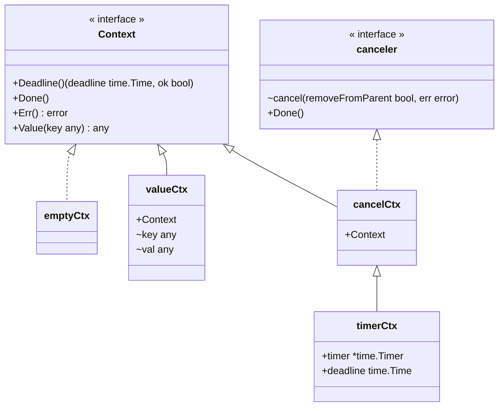

# context

### 未完待续

```mermaid

classDiagram
    class Context{
        << interface >>
        +Deadline() (deadline time.Time, ok bool)
        +Done()
        +Err() error
        +Value(key any) any
    }
    Context <|.. emptyCtx

    Context <|-- valueCtx

    class valueCtx{
        +Context
        ~key any
        ~val any
    }
    
    class canceler{
        << interface >>
        ~cancel(removeFromParent bool, err error)
        +Done()
    }
    
    canceler <|.. cancelCtx

    Context <|-- cancelCtx
    

    class cancelCtx{
        +Context
    }

    cancelCtx <|-- timerCtx

    class timerCtx{
        +timer *time.Timer
        +deadline time.Time
    }
```
