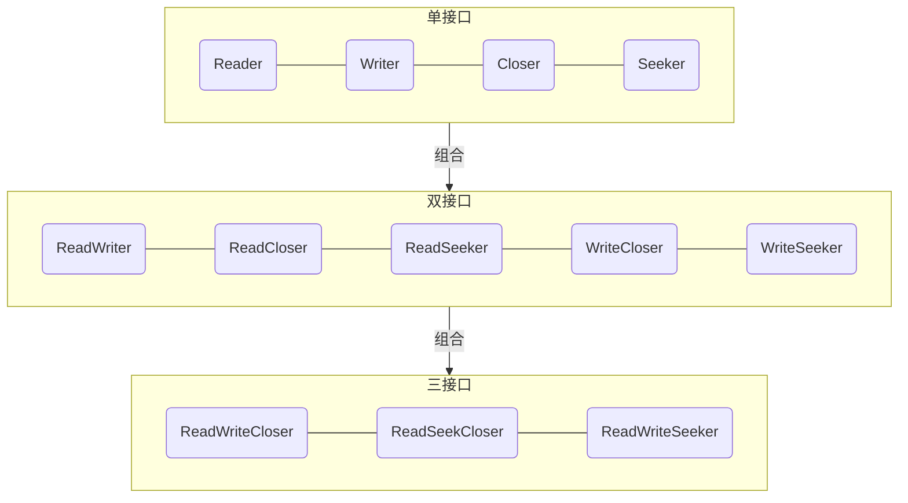
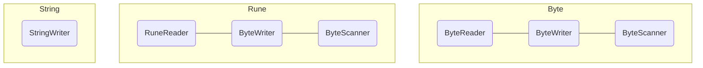
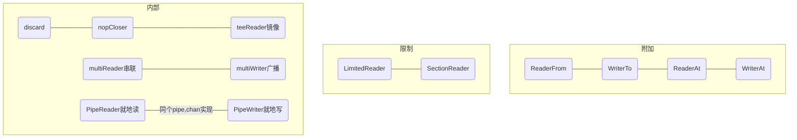

# io

### 基础



* Reader

```golang
type Reader interface {
    // 读取len(p)字节到p里面
    // 返回读取成功字节数
    // eof表示正常结束
    Read(p []byte) (n int, err error)
}
```

* Writer

```golang
type Writer interface {
    // 写入p里面内容,len(p)字节
    // 返回写入成功字节数
    Write(p []byte) (n int, err error)
}
```

### 类型



### 扩展



### 便利函数

```golang
WriteString(w Writer, s string) (n int, err error)
ReadAll(r Reader) ([]byte, error)
ReadFull(r Reader, buf []byte) (n int, err error)
ReadAtLeast(r Reader, buf []byte, min int) (n int, err error)
CopyN(dst Writer, src Reader, n int64) (written int64, err error)
Copy(dst Writer, src Reader) (written int64, err error)
CopyBuffer(dst Writer, src Reader, buf []byte) (written int64, err error)

//扩展close接口
NopCloser(r Reader)ReadCloser
//把r读出来内容写一份到w,镜像r到w
TeeReader(r Reader, w Writer) Reader
//最多读n个字节,达到就返回eof
LimitReader(r Reader, n int64) Reader
//串联起多个源头,按顺序依次读完
MultiReader(readers ...Reader) Reader
//把w写入内容广播多个writers中
MultiWriter(writers ...Writer) Writer
//就地成双读写,通过chan []byte实现
Pipe() (*PipeReader, *PipeWriter)

// 切片扩容
if len(b) == cap(b) {
    // Add more capacity (let append pick how much).
    b = append(b, 0)[:len(b)]
}
```
