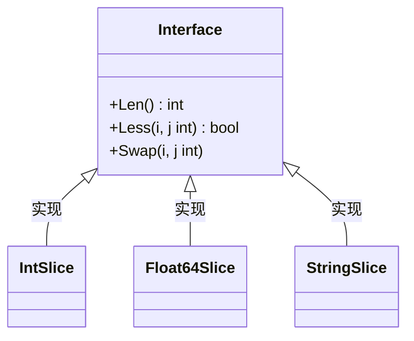
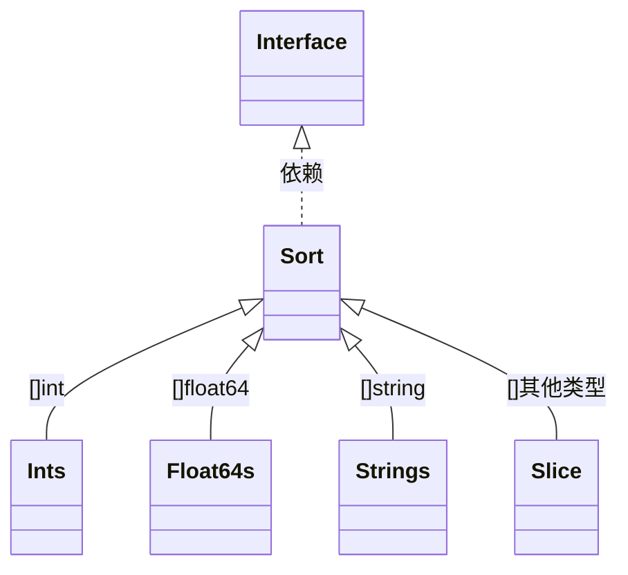
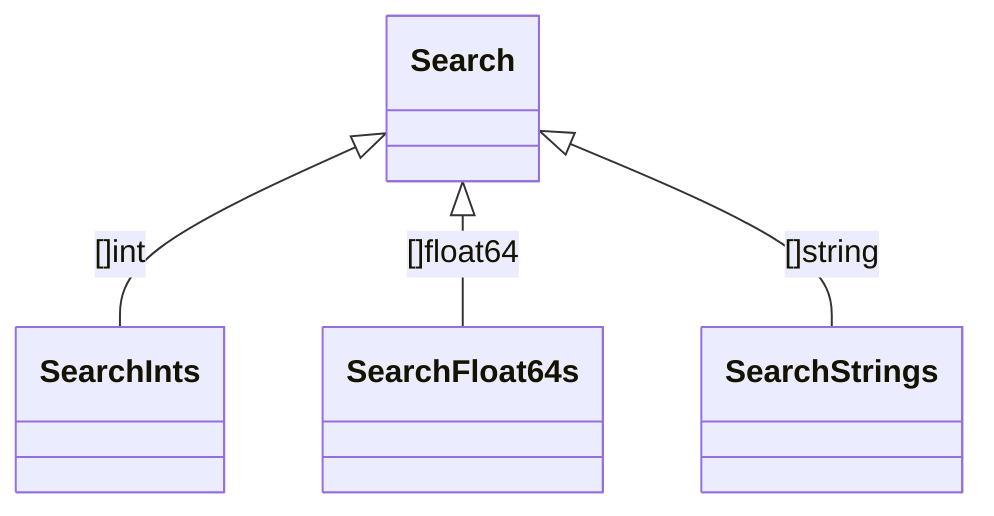

---
# sort包
---







```golang
type Interface interface {
    Len() int
    Less(i, j int) bool
    Swap(i, j int)
}

// 采用快排/堆排/插排组合
func Sort(data Interface)
func Ints(x []int)
func Float64s(x []float64)
func Strings(x []string)
//采用反射自动实现Swap(i, j int)
func Slice(x any, less func(i, j int) bool)


// 稳排采用分段插排+合并组合
func Stable(data Interface)
func SliceStable(x any, less func(i, j int) bool)

// 二分搜索有序序列
func Search(n int, f func(int) bool) int
func SearchInts(a []int, x int) int
func SearchFloat64s(a []float64, x float64) int
func SearchStrings(a []string, x string) int
```

```golang
// 通用排序函数（支持升序/降序）
func SortMapByValue[K comparable, V Ordered](m map[K]V, ascending bool) []struct {
 Key   K
 Value V
} {
 // 创建键值对切片
 pairs := make([]struct {
  Key   K
  Value V
 }, 0, len(m))

 for k, v := range m {
  pairs = append(pairs, struct {
   Key   K
   Value V
  }{k, v})
 }

 // 定义排序逻辑
 sort.Slice(pairs, func(i, j int) bool {
  if ascending {
   return pairs[i].Value < pairs[j].Value
  }
  return pairs[i].Value > pairs[j].Value
 })

 return pairs
}

// 定义有序类型约束
type Ordered interface {
 ~int | ~float64 | ~string | ~uint // 可扩展其他数值类型
}
```
