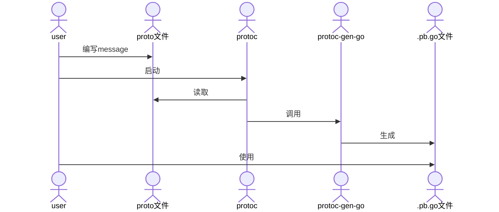
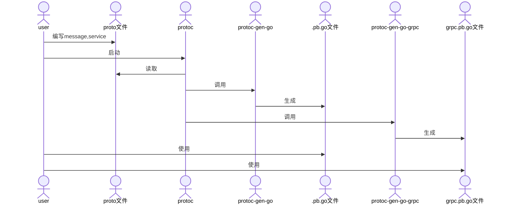
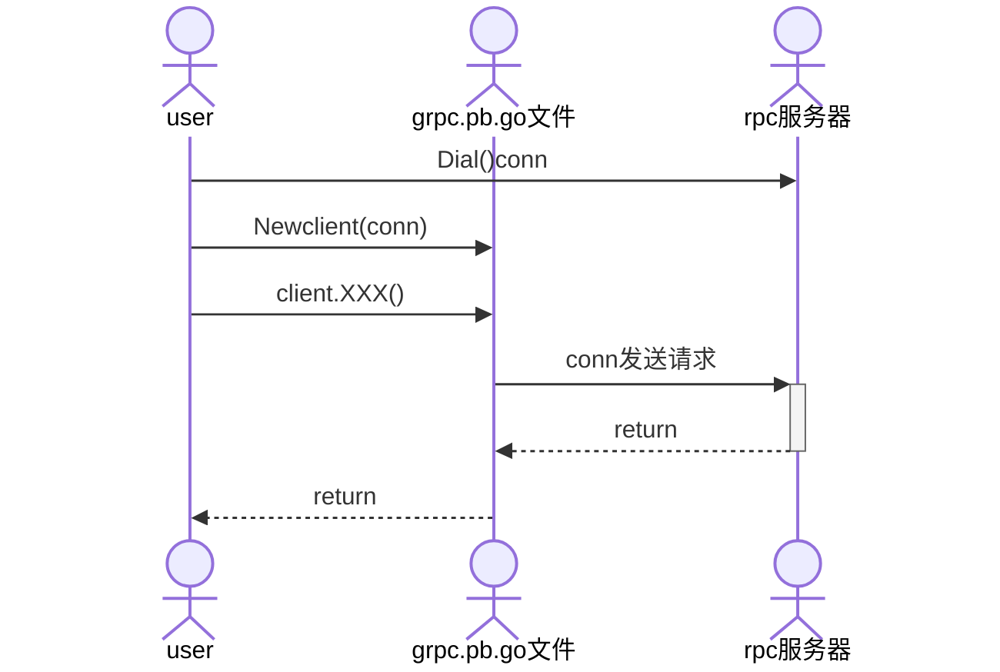
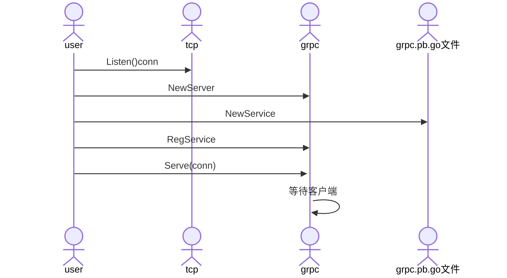

---
# grpc
---

### 相关网站

***

* [官网](https://developers.google.com/protocol-buffers/)
* [github下载](https://github.com/protocolbuffers/protobuf/releases)
* [protobuf-go插件](https://github.com/protocolbuffers/protobuf-go/releases/)
* [grpc-gateway-http转grpc](https://github.com/grpc-ecosystem/grpc-gateway)
* [swagger.json-根据api接口client](https://github.com/swagger-api/swagger-codegen)
* [buf-强化pb生成](https://docs.buf.build/)
* [rk-golang微服务框架](https://www.rkdev.info/)
* [grpc-swift语言实现](https://github.com/grpc/grpc-swift)
* [capnp-更快的protobuf](https://capnproto.org)

```sh
#mac系统中采用brew,很可能已安装过
brew list | grep protobuf
brew info protobuf
```

### golang使用图示

***



* 生成文件



* 客户端使用



* 服务端使用



### 实践示例

***

```sh
protoc --proto_path=IMPORT_PATH \
--cpp_out=DST_DIR \
--java_out=DST_DIR \
--python_out=DST_DIR \ 
--go_out=DST_DIR \
--ruby_out=DST_DIR \ 
--objc_out=DST_DIR \
--csharp_out=DST_DIR \
path/to/file.proto

#--go_out表示启动protoc-gen-go插件
#proto文件和本脚本在同一目录,执行前要cd到本目录,防止出现各种相对路径找不到
#Could not make proto path relative: *.proto: No such file or directory
protoc --cpp_out=../cpp --python_out=../python --go_out=../event *.proto

#--go-grpc_out表示启动protoc-gen-go-grpc插件
protoc --go_out=../event --go-grpc_out=../event *.proto
```

* user.proto内容

```protobuf
syntax = "proto3";

option go_package = "./;event";

import "person.proto";

service User {
    rpc Reg(Person)returns(Person){}
}
```

* example.proto内容

```protobuf
syntax = "proto3";

package example;

//protoc-gen-go The import path must contain at least one period ('.') or forward slash ('/') character.
//https://developers.google.com/protocol-buffers/docs/reference/go-generated
//表示直接生成文件到go_out目录
option go_package = "./;event";

//vscode中vscode-proto3插件import提示无法找到other.proto
//vscode直接打开other.proto所在目录,不要打开父目录
import "other.proto";

//单行注释
message Person {
    string name = 1;
    int32 id = 2;
    repeated string emails = 3;
    map<string, int32> dict = 4;
    repeated Order orders = 5;
  }
  
  /*
  多行注释
  */
  message SearchResponse {
    message Result {
      string url = 1;
      string title = 2;
      repeated string snippets = 3;
    }
    repeated Result results = 1;
  }
```

* other.proto内容

```protobuf
syntax = "proto3";

package example;

option go_package = "./;event";

message Order {
    int64 id = 1;
    uint64 date = 2;
    string customer = 3;
    double price = 4;
    string goods = 5;
    string remark = 6;
}
```

### 数据类型

***


### 更多

***

* gRPC + Opentracing + Zipkin 分布式链路追踪系统
