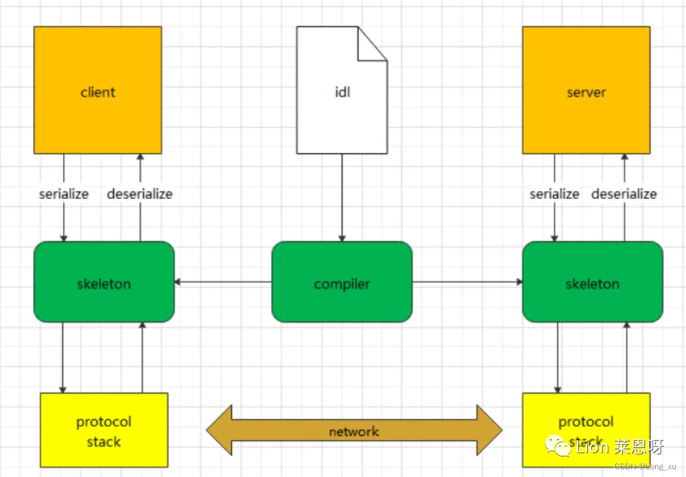
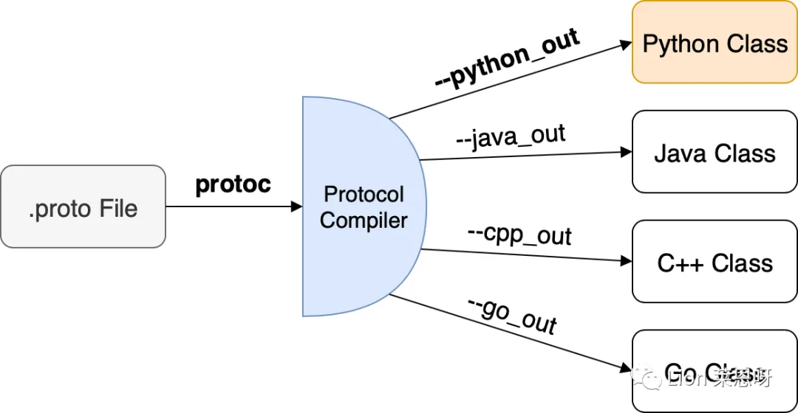
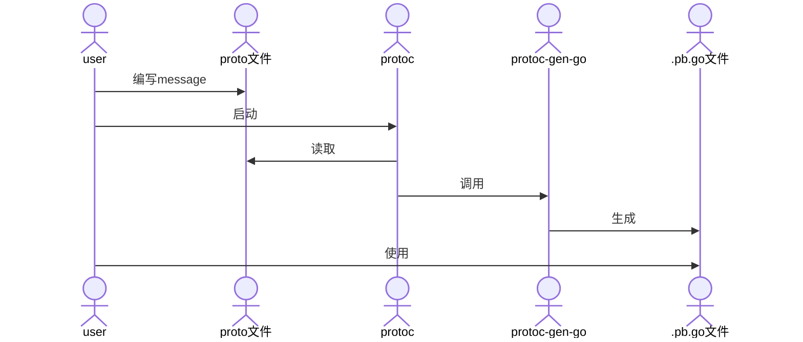
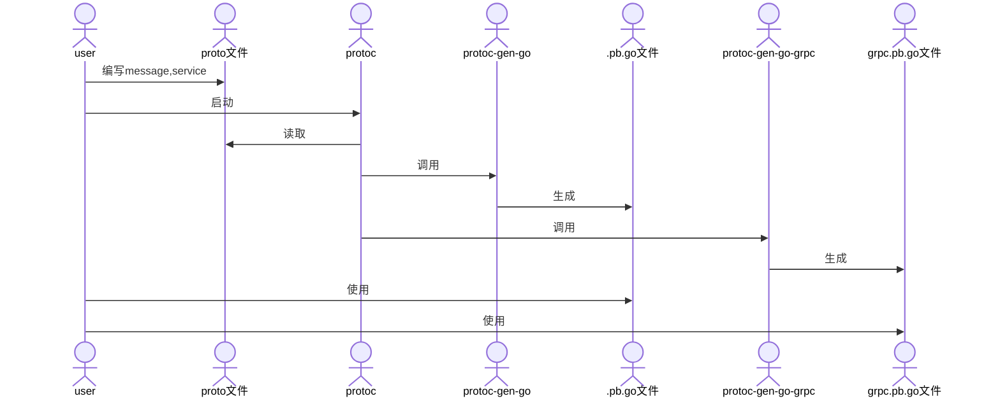
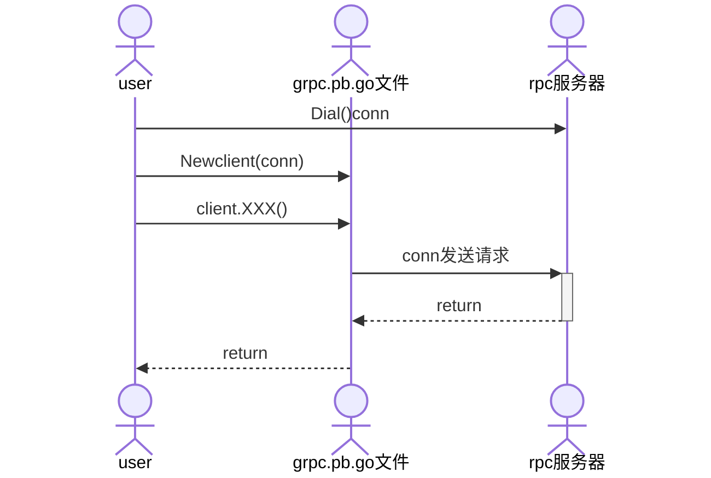
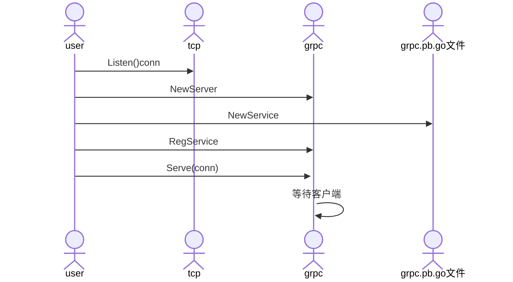
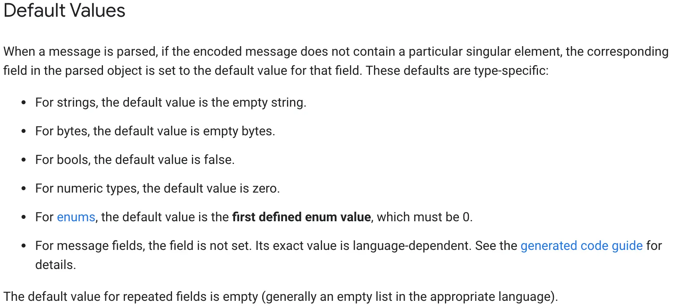

---
# grpc
---

# 相关网站

***

* [官网](https://developers.google.com/protocol-buffers/)
* [github下载](https://github.com/protocolbuffers/protobuf/releases)
* [protobuf-go插件](https://github.com/protocolbuffers/protobuf-go/releases/)
* [grpc-gateway-http转grpc](https://github.com/grpc-ecosystem/grpc-gateway)
* [swagger.json-根据api接口client](https://github.com/swagger-api/swagger-codegen)
* [buf-强化pb生成](https://docs.buf.build/)
* 
* 
* [rk-golang微服务框架](https://www.rkdev.info/)
* [grpc-swift语言实现](https://github.com/grpc/grpc-swift)
* [capnp-更快的protobuf](https://capnproto.org)

```sh
#mac系统中采用brew,很可能已安装过
brew list | grep protobuf
brew info protobuf
```

## golang使用图示

***



* 生成文件



* 客户端使用



* 服务端使用



### 实践示例

***

```sh
protoc --proto_path=IMPORT_PATH \
--cpp_out=DST_DIR \
--java_out=DST_DIR \
--python_out=DST_DIR \ 
--go_out=DST_DIR \
--ruby_out=DST_DIR \ 
--objc_out=DST_DIR \
--csharp_out=DST_DIR \
path/to/file.proto

#--go_out表示启动protoc-gen-go插件
#proto文件和本脚本在同一目录,执行前要cd到本目录,防止出现各种相对路径找不到
#Could not make proto path relative: *.proto: No such file or directory
protoc --cpp_out=../cpp --python_out=../python --go_out=../event *.proto

#--go-grpc_out表示启动protoc-gen-go-grpc插件
protoc --go_out=../event --go-grpc_out=../event *.proto
```

* user.proto内容

```protobuf
syntax = "proto3";

option go_package = "./;event";

import "person.proto";

service User {
    rpc Reg(Person)returns(Person){}
}
```

* example.proto内容

```protobuf
syntax = "proto3";

package example;

//protoc-gen-go The import path must contain at least one period ('.') or forward slash ('/') character.
//https://developers.google.com/protocol-buffers/docs/reference/go-generated
//表示直接生成文件到go_out目录
option go_package = "./;event";

//vscode中vscode-proto3插件import提示无法找到other.proto
//vscode直接打开other.proto所在目录,不要打开父目录
import "other.proto";

//单行注释
message Person {
    string name = 1;
    int32 id = 2;
    repeated string emails = 3;
    map<string, int32> dict = 4;
    repeated Order orders = 5;
  }
  
  /*
  多行注释
  */
  message SearchResponse {
    message Result {
      string url = 1;
      string title = 2;
      repeated string snippets = 3;
    }
    repeated Result results = 1;
  }
```

* other.proto内容

```protobuf
syntax = "proto3";

package example;

option go_package = "./;event";

message Order {
    int64 id = 1;
    uint64 date = 2;
    string customer = 3;
    double price = 4;
    string goods = 5;
    string remark = 6;
}
```

### 数据类型

***




### golang专用

在 Golang 中使用 Protocol Buffers (protobuf) 时，以下插件可以帮助提升开发效率：

#### 1. **protoc-gen-go**

- **功能**: 生成 Go 代码，将 `.proto` 文件转换为 Go 结构体和序列化代码。
* **安装**: `go install google.golang.org/protobuf/cmd/protoc-gen-go@latest`
* **使用**: `protoc --go_out=. your_proto_file.proto`

#### 2. **protoc-gen-go-grpc**

- **功能**: 生成 gRPC 服务代码，用于 gRPC 服务端和客户端。
* **安装**: `go install google.golang.org/grpc/cmd/protoc-gen-go-grpc@latest`
* **使用**: `protoc --go-grpc_out=. your_proto_file.proto`

#### 3. **protoc-gen-gogo**

- **功能**: `protoc-gen-go` 的增强版，提供更多功能和优化。
* **安装**: `go install github.com/gogo/protobuf/protoc-gen-gogo@latest`
* **使用**: `protoc --gogo_out=. your_proto_file.proto`

#### 4. **protoc-gen-validate**

- **功能**: 生成字段验证代码，基于 `validate.proto` 文件中的规则。
* **安装**: `go install github.com/envoyproxy/protoc-gen-validate@latest`
* **使用**: `protoc --validate_out="lang=go:. your_proto_file.proto`

#### 5. **protoc-gen-doc**

- **功能**: 生成 `.proto` 文件的文档，支持多种格式。
* **安装**: `go install github.com/pseudomuto/protoc-gen-doc/cmd/protoc-gen-doc@latest`
* **使用**: `protoc --doc_out=. your_proto_file.proto`

#### 6. **protoc-gen-grpc-gateway**

- **功能**: 生成 gRPC-Gateway 代码，将 gRPC 服务转换为 RESTful API。
* **安装**: `go install github.com/grpc-ecosystem/grpc-gateway/v2/protoc-gen-grpc-gateway@latest`
* **使用**: `protoc --grpc-gateway_out=. your_proto_file.proto`

#### 7. **protoc-gen-swagger**

- **功能**: 生成 Swagger/OpenAPI 文档，通常与 gRPC-Gateway 配合使用。
* **安装**: `go install github.com/grpc-ecosystem/grpc-gateway/v2/protoc-gen-openapiv2@latest`
* **使用**: `protoc --openapiv2_out=. your_proto_file.proto`

#### 8. **protoc-gen-gotag**

- **功能**: 为生成的 Go 结构体添加自定义标签。
* **安装**: `go install github.com/srikrsna/protoc-gen-gotag@latest`
* **使用**: `protoc --gotag_out=. your_proto_file.proto`

#### 9. **protoc-gen-gorm**

- **功能**: 生成 GORM 模型代码，便于数据库操作。
* **安装**: `go install github.com/infobloxopen/protoc-gen-gorm@latest`
* **使用**: `protoc --gorm_out=. your_proto_file.proto`

#### 10. **protoc-gen-inject-tag**

- **功能**: 为生成的 Go 结构体注入自定义标签。
* **安装**: `go install github.com/favadi/protoc-gen-inject-tag@latest`
* **使用**: `protoc --inject-tag_out=. your_proto_file.proto`

#### 11. **protoc-gen-go-grpc-http**

- **功能**: 生成支持 HTTP/JSON 的 gRPC 服务代码。
* **安装**: `go install github.com/grpc-ecosystem/grpc-gateway/v2/protoc-gen-grpc-http@latest`
* **使用**: `protoc --grpc-http_out=. your_proto_file.proto`

#### 12. **protoc-gen-twirp**

- **功能**: 生成 Twirp 服务代码，Twirp 是另一种 RPC 框架。
* **安装**: `go install github.com/twitchtv/twirp/protoc-gen-twirp@latest`
* **使用**: `protoc --twirp_out=. your_proto_file.proto`

#### 13. **protoc-gen-go-binary**

- **功能**: 生成二进制序列化和反序列化代码。
* **安装**: `go install github.com/golang/protobuf/protoc-gen-go-binary@latest`
* **使用**: `protoc --go-binary_out=. your_proto_file.proto`

#### 14. **protoc-gen-grpc-web**

- **功能**: 生成 gRPC-Web 客户端代码，适用于浏览器环境。
* **安装**: `go install github.com/grpc/grpc-web/protoc-gen-grpc-web@latest`
* **使用**: `protoc --grpc-web_out=. your_proto_file.proto`

#### 15. **protoc-gen-grpc-gateway-ts**

- **功能**: 生成 TypeScript 客户端代码，适用于 gRPC-Gateway。
* **安装**: `go install github.com/grpc-ecosystem/grpc-gateway/v2/protoc-gen-grpc-gateway-ts@latest`
* **使用**: `protoc --grpc-gateway-ts_out=. your_proto_file.proto`

### 更多

***

* [protoc-gen-doc生成文档插件](https://github.com/pseudomuto/protoc-gen-doc)

* [protoc-gen-gotag增加struct任意tag插件](https://github.com/srikrsna/protoc-gen-gotag)

* [protoc-go-inject-tag类似的gen-gotag](https://github.com/favadi/protoc-go-inject-tag)

* [protoc-gen-gotags类似的gen-gotag](https://github.com/eirueirufu/protoc-gen-gotags)

* gRPC + Opentracing + Zipkin 分布式链路追踪系统

### 常用的插件

1. **protoc-gen-python**: 与`protoc-gen-go`类似，这是为Python语言准备的一个官方插件，可以生成适用于Python环境的代码。

2. **protoc-gen-swagger**: 这个插件可以从你的.proto文件生成Swagger（现称为OpenAPI）文档。这对于想要提供RESTful API接口并需要良好API文档支持的项目来说非常有用。

3. **protoc-gen-nats**: 针对NATS消息系统的插件，它可以帮助你从.proto定义中生成适用于NATS的消息格式和处理逻辑，方便集成NATS作为你的消息传递层。

4. **protoc-gen-ts**: 一个用于生成TypeScript代码的插件。随着前端应用越来越复杂，这个插件允许你使用protobuf直接在TypeScript或JavaScript环境中定义数据结构，从而保持前后端数据模型的一致性。

5. **protoc-gen-as3**: 为ActionScript 3开发者提供的插件，使他们能够利用protobuf进行数据序列化和反序列化。

6. **protoc-gen-rbi**: 为Ruby开发者设计的插件，生成强类型的RBI（Ruby Interface）文件，以便更好地支持静态类型检查工具如Sorbet。

7. **protoc-gen-mypy**: 提供了为Python项目生成mypy兼容类型注解的能力，使得在Python中使用protobuf时可以获得更好的类型安全保证。

8. **protoc-gen-starlark**: 一个比较新颖的插件，允许用户通过Starlark脚本定制protobuf编译过程。Starlark是一种Python风格的配置语言，最初是为Bazel构建系统开发的。

9. **protoc-gen-gorm**: 为GORM（Go语言的ORM库）用户设计的插件，可以从.proto文件自动生成GORM模型，简化数据库操作。

10. **protoc-gen-grpc-web**: 这个插件允许从`.proto`文件生成适用于gRPC-Web客户端的代码。gRPC-Web使得可以直接从浏览器通过HTTP/2调用gRPC服务，这对于构建现代化的Web应用非常有用。

11. **protoc-gen-gofast**: 一个高性能的Go语言插件，旨在比官方的`protoc-gen-go`提供更快的序列化/反序列化速度。它优化了内存使用并减少了反射操作，适合性能敏感的应用场景。

12. **protoc-gen-buf-breaking** 和 **protoc-gen-buf-lint**: Buf工具集的一部分，这些插件用于检查protobuf定义中的潜在问题。`buf-breaking`用于检测API兼容性破坏的变化，而`buf-lint`则用于确保遵循最佳实践和风格指南。

13. **protoc-gen-openapiv2**: 此插件可以从你的`.proto`文件生成OpenAPI v2（以前称为Swagger）文档。这有助于创建RESTful API接口，并且可以集成到API网关或开发者门户中。

14. **protoc-gen-micro**: Micro是一个微服务生态系统，这个插件允许你为Micro服务生成客户端和服务端代码。它简化了微服务架构下的开发流程。

15. **protoc-gen-jsonschema**: 允许从`.proto`文件生成JSON Schema，这对于需要与非protobuf系统交互的应用程序来说是非常有价值的，因为它们可能期望以JSON格式进行数据交换。

16. **protoc-gen-doc**: 提供了一个便捷的方式来生成协议缓冲区的文档。它可以输出多种格式的文档，包括Markdown、HTML等，帮助团队成员更好地理解和维护协议缓冲区定义。

17. **protoc-gen-gateway**: 类似于grpc-gateway，但它专注于生成基于HTTP/1.1的反向代理服务器，而不是gRPC Gateway使用的HTTP/2。这对于需要支持旧版HTTP协议的环境特别有用。

18. **protoc-gen-validate**: 提供了在.proto文件中指定验证规则的能力，并生成相应的验证逻辑。这对于确保数据完整性至关重要，尤其是在分布式系统中。

19. **protoc-gen-natsrpc**: 如果你在使用NATS作为消息队列或事件驱动架构的一部分，那么这个插件可以帮助你快速实现基于protobuf的消息传输机制。
