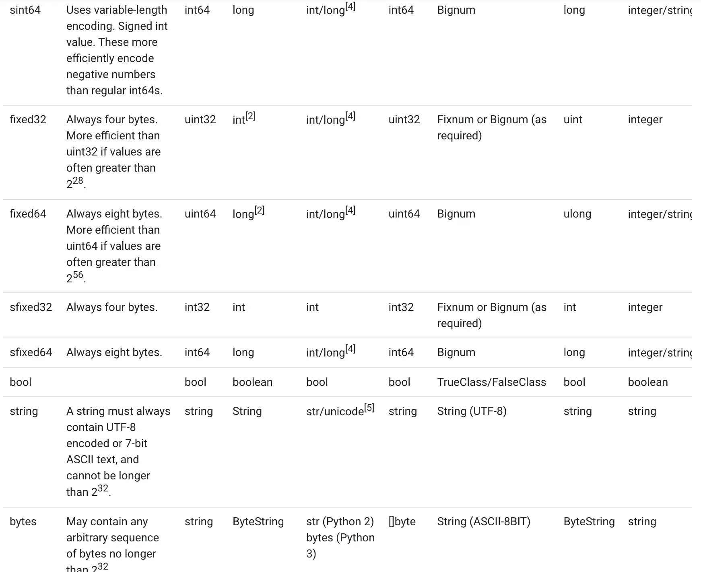

---
# grpc
---

# 相关网站

***

* [官网](https://developers.google.com/protocol-buffers/)
* [github下载](https://github.com/protocolbuffers/protobuf/releases)
* [protobuf-go插件](https://github.com/protocolbuffers/protobuf-go/releases/)
* [grpc-gateway-http转grpc](https://github.com/grpc-ecosystem/grpc-gateway)
* [swagger.json-根据api接口client](https://github.com/swagger-api/swagger-codegen)
* [buf-强化pb生成](https://docs.buf.build/)
* 
* 
* [rk-golang微服务框架](https://www.rkdev.info/)
* [grpc-swift语言实现](https://github.com/grpc/grpc-swift)
* [capnp-更快的protobuf](https://capnproto.org)

```sh
#mac系统中采用brew,很可能已安装过
brew list | grep protobuf
brew info protobuf
```

## golang使用图示

***


* 生成文件


* 客户端使用


* 服务端使用


### 实践示例

***

```sh
protoc --proto_path=IMPORT_PATH \
--cpp_out=DST_DIR \
--java_out=DST_DIR \
--python_out=DST_DIR \ 
--go_out=DST_DIR \
--ruby_out=DST_DIR \ 
--objc_out=DST_DIR \
--csharp_out=DST_DIR \
path/to/file.proto

#--go_out表示启动protoc-gen-go插件
#proto文件和本脚本在同一目录,执行前要cd到本目录,防止出现各种相对路径找不到
#Could not make proto path relative: *.proto: No such file or directory
protoc --cpp_out=../cpp --python_out=../python --go_out=../event *.proto

#--go-grpc_out表示启动protoc-gen-go-grpc插件
protoc --go_out=../event --go-grpc_out=../event *.proto
```

* user.proto内容

```protobuf
syntax = "proto3";

option go_package = "./;event";

import "person.proto";

service User {
    rpc Reg(Person)returns(Person){}
}
```

* example.proto内容

```protobuf
syntax = "proto3";

package example;

//protoc-gen-go The import path must contain at least one period ('.') or forward slash ('/') character.
//https://developers.google.com/protocol-buffers/docs/reference/go-generated
//表示直接生成文件到go_out目录
option go_package = "./;event";

//vscode中vscode-proto3插件import提示无法找到other.proto
//vscode直接打开other.proto所在目录,不要打开父目录
import "other.proto";

//单行注释
message Person {
    string name = 1;
    int32 id = 2;
    repeated string emails = 3;
    map<string, int32> dict = 4;
    repeated Order orders = 5;
  }
  
  /*
  多行注释
  */
  message SearchResponse {
    message Result {
      string url = 1;
      string title = 2;
      repeated string snippets = 3;
    }
    repeated Result results = 1;
  }
```

* other.proto内容

```protobuf
syntax = "proto3";

package example;

option go_package = "./;event";

message Order {
    int64 id = 1;
    uint64 date = 2;
    string customer = 3;
    double price = 4;
    string goods = 5;
    string remark = 6;
}
```

### 数据类型

***




### golang专用

在 Golang 中使用 Protocol Buffers (protobuf) 时，以下插件可以帮助提升开发效率：

#### 1. **protoc-gen-go**

* **功能**: 生成 Go 代码，将 `.proto` 文件转换为 Go 结构体和序列化代码。

* **安装**: `go install google.golang.org/protobuf/cmd/protoc-gen-go@latest`
* **使用**: `protoc --go_out=. your_proto_file.proto`

#### 2. **protoc-gen-go-grpc**

* **功能**: 生成 gRPC 服务代码，用于 gRPC 服务端和客户端。

* **安装**: `go install google.golang.org/grpc/cmd/protoc-gen-go-grpc@latest`
* **使用**: `protoc --go-grpc_out=. your_proto_file.proto`

#### 3. **protoc-gen-gogo**

* **功能**: `protoc-gen-go` 的增强版，提供更多功能和优化。

* **安装**: `go install github.com/gogo/protobuf/protoc-gen-gogo@latest`
* **使用**: `protoc --gogo_out=. your_proto_file.proto`

#### 4. **protoc-gen-validate**

* **功能**: 生成字段验证代码，基于 `validate.proto` 文件中的规则。

* **安装**: `go install github.com/envoyproxy/protoc-gen-validate@latest`
* **使用**: `protoc --validate_out="lang=go:. your_proto_file.proto`

#### 5. **protoc-gen-doc**

* **功能**: 生成 `.proto` 文件的文档，支持多种格式。

* **安装**: `go install github.com/pseudomuto/protoc-gen-doc/cmd/protoc-gen-doc@latest`
* **使用**: `protoc --doc_out=. your_proto_file.proto`

#### 6. **protoc-gen-grpc-gateway**

* **功能**: 生成 gRPC-Gateway 代码，将 gRPC 服务转换为 RESTful API。

* **安装**: `go install github.com/grpc-ecosystem/grpc-gateway/v2/protoc-gen-grpc-gateway@latest`
* **使用**: `protoc --grpc-gateway_out=. your_proto_file.proto`

#### 7. **protoc-gen-swagger**

* **功能**: 生成 Swagger/OpenAPI 文档，通常与 gRPC-Gateway 配合使用。

* **安装**: `go install github.com/grpc-ecosystem/grpc-gateway/v2/protoc-gen-openapiv2@latest`
* **使用**: `protoc --openapiv2_out=. your_proto_file.proto`

#### 8. **protoc-gen-gotag**

* **功能**: 为生成的 Go 结构体添加自定义标签。

* **安装**: `go install github.com/srikrsna/protoc-gen-gotag@latest`
* **使用**: `protoc --gotag_out=. your_proto_file.proto`

#### 9. **protoc-gen-gorm**

* **功能**: 生成 GORM 模型代码，便于数据库操作。

* **安装**: `go install github.com/infobloxopen/protoc-gen-gorm@latest`
* **使用**: `protoc --gorm_out=. your_proto_file.proto`

#### 10. **protoc-gen-inject-tag**

* **功能**: 为生成的 Go 结构体注入自定义标签。

* **安装**: `go install github.com/favadi/protoc-gen-inject-tag@latest`
* **使用**: `protoc --inject-tag_out=. your_proto_file.proto`

#### 11. **protoc-gen-go-grpc-http**

* **功能**: 生成支持 HTTP/JSON 的 gRPC 服务代码。

* **安装**: `go install github.com/grpc-ecosystem/grpc-gateway/v2/protoc-gen-grpc-http@latest`
* **使用**: `protoc --grpc-http_out=. your_proto_file.proto`

#### 12. **protoc-gen-twirp**

* **功能**: 生成 Twirp 服务代码，Twirp 是另一种 RPC 框架。

* **安装**: `go install github.com/twitchtv/twirp/protoc-gen-twirp@latest`
* **使用**: `protoc --twirp_out=. your_proto_file.proto`

#### 13. **protoc-gen-go-binary**

* **功能**: 生成二进制序列化和反序列化代码。

* **安装**: `go install github.com/golang/protobuf/protoc-gen-go-binary@latest`
* **使用**: `protoc --go-binary_out=. your_proto_file.proto`

#### 14. **protoc-gen-grpc-web**

* **功能**: 生成 gRPC-Web 客户端代码，适用于浏览器环境。

* **安装**: `go install github.com/grpc/grpc-web/protoc-gen-grpc-web@latest`
* **使用**: `protoc --grpc-web_out=. your_proto_file.proto`

#### 15. **protoc-gen-grpc-gateway-ts**

* **功能**: 生成 TypeScript 客户端代码，适用于 gRPC-Gateway。

* **安装**: `go install github.com/grpc-ecosystem/grpc-gateway/v2/protoc-gen-grpc-gateway-ts@latest`
* **使用**: `protoc --grpc-gateway-ts_out=. your_proto_file.proto`

### 更多

***

* [protoc-gen-doc生成文档插件](https://github.com/pseudomuto/protoc-gen-doc)

* [protoc-gen-gotag增加struct任意tag插件](https://github.com/srikrsna/protoc-gen-gotag)

* [protoc-go-inject-tag类似的gen-gotag](https://github.com/favadi/protoc-go-inject-tag)

* [protoc-gen-gotags类似的gen-gotag](https://github.com/eirueirufu/protoc-gen-gotags)

* gRPC + Opentracing + Zipkin 分布式链路追踪系统

### 常用的插件

1. **protoc-gen-python**: 与`protoc-gen-go`类似，这是为Python语言准备的一个官方插件，可以生成适用于Python环境的代码。

2. **protoc-gen-swagger**: 这个插件可以从你的.proto文件生成Swagger（现称为OpenAPI）文档。这对于想要提供RESTful API接口并需要良好API文档支持的项目来说非常有用。

3. **protoc-gen-nats**: 针对NATS消息系统的插件，它可以帮助你从.proto定义中生成适用于NATS的消息格式和处理逻辑，方便集成NATS作为你的消息传递层。

4. **protoc-gen-ts**: 一个用于生成TypeScript代码的插件。随着前端应用越来越复杂，这个插件允许你使用protobuf直接在TypeScript或JavaScript环境中定义数据结构，从而保持前后端数据模型的一致性。

5. **protoc-gen-as3**: 为ActionScript 3开发者提供的插件，使他们能够利用protobuf进行数据序列化和反序列化。

6. **protoc-gen-rbi**: 为Ruby开发者设计的插件，生成强类型的RBI（Ruby Interface）文件，以便更好地支持静态类型检查工具如Sorbet。

7. **protoc-gen-mypy**: 提供了为Python项目生成mypy兼容类型注解的能力，使得在Python中使用protobuf时可以获得更好的类型安全保证。

8. **protoc-gen-starlark**: 一个比较新颖的插件，允许用户通过Starlark脚本定制protobuf编译过程。Starlark是一种Python风格的配置语言，最初是为Bazel构建系统开发的。

9. **protoc-gen-gorm**: 为GORM（Go语言的ORM库）用户设计的插件，可以从.proto文件自动生成GORM模型，简化数据库操作。

10. **protoc-gen-grpc-web**: 这个插件允许从`.proto`文件生成适用于gRPC-Web客户端的代码。gRPC-Web使得可以直接从浏览器通过HTTP/2调用gRPC服务，这对于构建现代化的Web应用非常有用。

11. **protoc-gen-gofast**: 一个高性能的Go语言插件，旨在比官方的`protoc-gen-go`提供更快的序列化/反序列化速度。它优化了内存使用并减少了反射操作，适合性能敏感的应用场景。

12. **protoc-gen-buf-breaking** 和 **protoc-gen-buf-lint**: Buf工具集的一部分，这些插件用于检查protobuf定义中的潜在问题。`buf-breaking`用于检测API兼容性破坏的变化，而`buf-lint`则用于确保遵循最佳实践和风格指南。

13. **protoc-gen-openapiv2**: 此插件可以从你的`.proto`文件生成OpenAPI v2（以前称为Swagger）文档。这有助于创建RESTful API接口，并且可以集成到API网关或开发者门户中。

14. **protoc-gen-micro**: Micro是一个微服务生态系统，这个插件允许你为Micro服务生成客户端和服务端代码。它简化了微服务架构下的开发流程。

15. **protoc-gen-jsonschema**: 允许从`.proto`文件生成JSON Schema，这对于需要与非protobuf系统交互的应用程序来说是非常有价值的，因为它们可能期望以JSON格式进行数据交换。

16. **protoc-gen-doc**: 提供了一个便捷的方式来生成协议缓冲区的文档。它可以输出多种格式的文档，包括Markdown、HTML等，帮助团队成员更好地理解和维护协议缓冲区定义。

17. **protoc-gen-gateway**: 类似于grpc-gateway，但它专注于生成基于HTTP/1.1的反向代理服务器，而不是gRPC Gateway使用的HTTP/2。这对于需要支持旧版HTTP协议的环境特别有用。

18. **protoc-gen-validate**: 提供了在.proto文件中指定验证规则的能力，并生成相应的验证逻辑。这对于确保数据完整性至关重要，尤其是在分布式系统中。

19. **protoc-gen-natsrpc**: 如果你在使用NATS作为消息队列或事件驱动架构的一部分，那么这个插件可以帮助你快速实现基于protobuf的消息传输机制。

### 自定义插件

```proto
syntax = "proto3";
package test;
option go_package = "/test";
​
​
message User {
  //用户名
  string Name = 1;
  //用户资源
  map<int32,string> Res=2 ;
}
```

```golang
package main
​
import (
    "bytes"
    "fmt"
    "google.golang.org/protobuf/compiler/protogen"
    "google.golang.org/protobuf/types/pluginpb"
    "google.golang.org/protobuf/proto"
    "io/ioutil"
    "os"
)
​
func main()  {
    //1.读取标准输入，接收proto 解析的文件内容，并解析成结构体
    input, _ := ioutil.ReadAll(os.Stdin)
    var req pluginpb.CodeGeneratorRequest
    proto.Unmarshal(input, &req)
    //2.生成插件
    opts := protogen.Options{}
    plugin, err := opts.New(&req)
    if err != nil {
        panic(err)
    }
​
    // 3.在插件plugin.Files就是demo.proto 的内容了,是一个切片，每个切片元素代表一个文件内容
    // 我们只需要遍历这个文件就能获取到文件的信息了
    for _, file := range plugin.Files {
        //创建一个buf 写入生成的文件内容
        var buf bytes.Buffer
​
        // 写入go 文件的package名
        pkg := fmt.Sprintf("package %s", file.GoPackageName)
        buf.Write([]byte(pkg))
​
        //遍历消息,这个内容就是protobuf的每个消息
        for _, msg := range file.Messages {
            //接下来为每个消息生成hello 方法
            
            buf.Write([]byte(fmt.Sprintf(`
             func (m*%s)Hello(){
​
                }
             `,msg.GoIdent.GoName)))
        }
        //指定输入文件名,输出文件名为demo.foo.go
        filename := file.GeneratedFilenamePrefix + ".foo.go"
        file := plugin.NewGeneratedFile(filename, ".")
// 将内容写入插件文件内容
        file.Write(buf.Bytes())
    }
​
    // 生成响应
    stdout := plugin.Response()
    out, err := proto.Marshal(stdout)
    if err != nil {
        panic(err)
    }
​
    // 将响应写回 标准输入, protoc会读取这个内容
    fmt.Fprintf(os.Stdout, string(out))
}
​
```

在 Protocol Buffers (Protobuf) 中，**扩展（Extensions）** 是一种机制，允许你在不修改原始消息定义的情况下，向消息中添加额外的字段。这在需要扩展第三方或已定义的消息类型时非常有用。

在 **proto3** 中，扩展的功能有所限制，但仍然可以通过 `Any` 类型或自定义选项来实现类似的功能。以下是一个详细的示例，展示如何在 proto3 中使用扩展。

### 1. 扩展的基本概念

在 proto2 中，扩展是通过 `extend` 关键字实现的。但在 proto3 中，`extend` 关键字被移除了，官方推荐使用 `Any` 类型或自定义选项来实现扩展。

#### 1.1 使用 `Any` 类型

`Any` 类型是 proto3 提供的一种通用类型，可以存储任意序列化的 Protobuf 消息。通过 `Any` 类型，你可以动态地将附加数据嵌入到消息中。

#### 1.2 使用自定义选项

自定义选项是通过定义 `google.protobuf.FieldOptions` 或其他选项类型来实现的。你可以为字段添加自定义元数据。

### 2. 示例：使用 `Any` 类型实现扩展

以下是一个使用 `Any` 类型实现扩展的示例。

#### 2.1 定义 `.proto` 文件

```proto
syntax = "proto3";

import "google/protobuf/any.proto";

// 定义一个基础消息
message BaseMessage {
  string id = 1;
  google.protobuf.Any extension = 2; // 用于存储扩展数据
}

// 定义一个扩展消息
message ExtendedMessage {
  int32 extra_field = 1;
}
```

#### 2.2 使用扩展

在代码中，你可以将 `ExtendedMessage` 嵌入到 `BaseMessage` 的 `Any` 字段中。

```go
package main

import (
 "fmt"
 "log"

 "google.golang.org/protobuf/proto"
 "google.golang.org/protobuf/types/known/anypb"

 "github.com/yourusername/yourproject/proto" // 替换为你的模块路径
)

func main() {
 // 创建一个 ExtendedMessage
 extendedMsg := &proto.ExtendedMessage{
  ExtraField: 42,
 }

 // 将 ExtendedMessage 打包为 Any 类型
 anyMsg, err := anypb.New(extendedMsg)
 if err != nil {
  log.Fatalf("Failed to pack ExtendedMessage into Any: %v", err)
 }

 // 创建一个 BaseMessage 并设置扩展字段
 baseMsg := &proto.BaseMessage{
  Id:        "123",
  Extension: anyMsg,
 }

 // 序列化 BaseMessage
 data, err := proto.Marshal(baseMsg)
 if err != nil {
  log.Fatalf("Failed to marshal BaseMessage: %v", err)
 }

 // 反序列化 BaseMessage
 newBaseMsg := &proto.BaseMessage{}
 if err := proto.Unmarshal(data, newBaseMsg); err != nil {
  log.Fatalf("Failed to unmarshal BaseMessage: %v", err)
 }

 // 从 Any 字段中提取 ExtendedMessage
 newExtendedMsg := &proto.ExtendedMessage{}
 if err := newBaseMsg.GetExtension().UnmarshalTo(newExtendedMsg); err != nil {
  log.Fatalf("Failed to unpack ExtendedMessage from Any: %v", err)
 }

 // 打印结果
 fmt.Printf("BaseMessage ID: %s\n", newBaseMsg.GetId())
 fmt.Printf("ExtendedMessage ExtraField: %d\n", newExtendedMsg.GetExtraField())
}
```

### 3. 示例：使用自定义选项实现扩展

以下是一个使用自定义选项实现扩展的示例。

#### 3.1 定义自定义选项

首先，定义一个自定义选项：

```proto
syntax = "proto3";

import "google/protobuf/descriptor.proto";

// 定义自定义选项
extend google.protobuf.FieldOptions {
  string custom_option = 50000;
}

// 使用自定义选项
message MyMessage {
  string field1 = 1 [(custom_option) = "custom_value"];
}
```

#### 3.2 使用自定义选项

在代码中，你可以通过反射访问自定义选项的值。

```go
package main

import (
 "fmt"
 "log"
 "reflect"

 "google.golang.org/protobuf/proto"
 "google.golang.org/protobuf/reflect/protoreflect"
 "google.golang.org/protobuf/types/descriptorpb"

 "github.com/yourusername/yourproject/proto" // 替换为你的模块路径
)

func main() {
 // 获取 MyMessage 的描述符
 msgType := proto.MessageType("proto.MyMessage").Elem()
 msgDescriptor := msgType.New().Interface().(protoreflect.ProtoMessage).ProtoReflect().Descriptor()

 // 获取字段描述符
 fieldDescriptor := msgDescriptor.Fields().ByName("field1")

 // 获取字段选项
 options := fieldDescriptor.Options().(*descriptorpb.FieldOptions)

 // 获取自定义选项的值
 customOptionValue := proto.GetExtension(options, proto.E_CustomOption).(string)
 fmt.Printf("Custom option value: %s\n", customOptionValue)
}
```

### 4. 总结

在 proto3 中，扩展的功能主要通过以下方式实现：

1. **使用 `Any` 类型**：动态嵌入任意消息类型。
2. **使用自定义选项**：为字段添加元数据。

这两种方式都可以在不修改原始消息定义的情况下扩展消息的功能。根据具体需求选择合适的方式即可。

### 参考文档

* [Protocol Buffers 官方文档](https://developers.google.com/protocol-buffers)

* [Any 类型文档](https://pkg.go.dev/google.golang.org/protobuf/types/known/anypb)
* [自定义选项文档](https://developers.google.com/protocol-buffers/docs/proto3#customoptions)

作为 Protobuf 专家，`MethodOptions` 的自定义选项在定义 RPC 方法时非常有用，能够为方法添加额外的元数据或行为控制。以下是一些经典的 `MethodOptions` 自定义选项应用场景：

作为 Protobuf 专家，`MethodOptions` 的自定义选项在定义 RPC 方法时非常有用，能够为方法添加额外的元数据或行为控制。以下是一些经典的 `MethodOptions` 自定义选项应用场景：

---

### 1. **方法超时配置**

* **用途**: 为 RPC 方法配置超时时间，确保方法在指定时间内完成。
* **示例**: 标记方法的超时时间。

   ```protobuf
   import "google/protobuf/descriptor.proto";

   extend google.protobuf.MethodOptions {
     int32 timeout_ms = 50000;
   }

   service MyService {
     rpc MyMethod(MyRequest) returns (MyResponse) {
       option (timeout_ms) = 5000; // 5 seconds
     }
   }
   ```

---

### 2. **方法重试策略**

* **用途**: 为 RPC 方法配置重试策略，如重试次数和重试间隔。
* **示例**: 标记方法的最大重试次数和重试间隔。

   ```protobuf
   extend google.protobuf.MethodOptions {
     int32 max_retries = 50001;
     int32 retry_interval_ms = 50002;
   }

   service MyService {
     rpc MyMethod(MyRequest) returns (MyResponse) {
       option (max_retries) = 3;
       option (retry_interval_ms) = 1000; // 1 second
     }
   }
   ```

---

### 3. **方法安全性配置**

* **用途**: 为 RPC 方法配置安全性要求，如是否需要身份验证或加密。
* **示例**: 标记方法是否需要身份验证。

   ```protobuf
   extend google.protobuf.MethodOptions {
     bool requires_authentication = 50003;
   }

   service MyService {
     rpc SecureMethod(SecureRequest) returns (SecureResponse) {
       option (requires_authentication) = true;
     }
   }
   ```

---

### 4. **方法权限控制**

* **用途**: 为 RPC 方法配置权限要求，如用户角色或权限级别。
* **示例**: 标记方法所需的用户角色。

   ```protobuf
   extend google.protobuf.MethodOptions {
     string required_role = 50004;
   }

   service MyService {
     rpc AdminMethod(AdminRequest) returns (AdminResponse) {
       option (required_role) = "ADMIN";
     }
   }
   ```

---

### 5. **方法性能优化**

* **用途**: 为 RPC 方法配置性能优化选项，如是否启用压缩或缓存。
* **示例**: 标记方法是否启用响应缓存。

   ```protobuf
   extend google.protobuf.MethodOptions {
     bool enable_caching = 50005;
   }

   service MyService {
     rpc GetData(DataRequest) returns (DataResponse) {
       option (enable_caching) = true;
     }
   }
   ```

---

### 6. **方法日志配置**

* **用途**: 为 RPC 方法配置日志记录行为，如是否记录详细日志。
* **示例**: 标记方法是否启用详细日志记录。

   ```protobuf
   extend google.protobuf.MethodOptions {
     bool enable_detailed_logging = 50006;
   }

   service MyService {
     rpc LoggedMethod(LoggedRequest) returns (LoggedResponse) {
       option (enable_detailed_logging) = true;
     }
   }
   ```

---

### 7. **方法路由配置**

* **用途**: 为 RPC 方法配置路由信息，便于在分布式系统中进行消息分发。
* **示例**: 标记方法的路由键或目标服务。

   ```protobuf
   extend google.protobuf.MethodOptions {
     string routing_key = 50007;
   }

   service MyService {
     rpc RoutedMethod(RoutedRequest) returns (RoutedResponse) {
       option (routing_key) = "service_a";
     }
   }
   ```

---

### 8. **方法负载均衡策略**

* **用途**: 为 RPC 方法配置负载均衡策略。
* **示例**: 标记方法的负载均衡策略（如 `ROUND_ROBIN`, `LEAST_CONNECTIONS`）。

   ```protobuf
   extend google.protobuf.MethodOptions {
     string load_balancing_strategy = 50008;
   }

   service MyService {
     rpc BalancedMethod(BalancedRequest) returns (BalancedResponse) {
       option (load_balancing_strategy) = "ROUND_ROBIN";
     }
   }
   ```

---

### 9. **方法扩展插件支持**

* **用途**: 为 RPC 方法添加插件支持的配置，如自定义代码生成插件。
* **示例**: 为自定义插件提供配置选项。

   ```protobuf
   extend google.protobuf.MethodOptions {
     string plugin_option = 50009;
   }

   service MyService {
     rpc PluginMethod(PluginRequest) returns (PluginResponse) {
       option (plugin_option) = "custom_value";
     }
   }
   ```

---

### 10. **方法优先级**

* **用途**: 为 RPC 方法配置优先级，便于在任务调度或资源分配中处理。
* **示例**: 标记方法的优先级（如 `HIGH`, `MEDIUM`, `LOW`）。

   ```protobuf
   extend google.protobuf.MethodOptions {
     string priority = 50010;
   }

   service MyService {
     rpc HighPriorityMethod(HighPriorityRequest) returns (HighPriorityResponse) {
       option (priority) = "HIGH";
     }
   }
   ```

---

### 11. **方法跨平台兼容性**

* **用途**: 为 RPC 方法配置跨平台兼容性选项。
* **示例**: 标记方法在特定平台上的行为。

   ```protobuf
   extend google.protobuf.MethodOptions {
     string platform_specific = 50011;
   }

   service MyService {
     rpc PlatformMethod(PlatformRequest) returns (PlatformResponse) {
       option (platform_specific) = "windows";
     }
   }
   ```

---

### 12. **方法生命周期管理**

* **用途**: 为 RPC 方法配置生命周期状态，如是否已弃用。
* **示例**: 标记方法的状态（如 `ACTIVE`, `DEPRECATED`, `REMOVED`）。

   ```protobuf
   extend google.protobuf.MethodOptions {
     string lifecycle_status = 50012;
   }

   service MyService {
     rpc DeprecatedMethod(DeprecatedRequest) returns (DeprecatedResponse) {
       option (lifecycle_status) = "DEPRECATED";
     }
   }
   ```

---

### 13. **方法流量控制**

* **用途**: 为 RPC 方法配置流量控制策略，如限流或速率限制。
* **示例**: 标记方法的速率限制（如每秒请求数）。

   ```protobuf
   extend google.protobuf.MethodOptions {
     int32 rate_limit = 50013;
   }

   service MyService {
     rpc RateLimitedMethod(RateLimitedRequest) returns (RateLimitedResponse) {
       option (rate_limit) = 100; // 100 requests per second
     }
   }
   ```

### 14. **方法监控配置**

* **用途**: 为 RPC 方法配置监控选项，如是否启用性能监控。
* **示例**: 标记方法是否启用性能监控。

   ```protobuf
   extend google.protobuf.MethodOptions {
     bool enable_performance_monitoring = 50014;
   }

   service MyService {
     rpc MonitoredMethod(MonitoredRequest) returns (MonitoredResponse) {
       option (enable_performance_monitoring) = true;
     }
   }
   ```

### 总结

`MethodOptions` 的自定义选项为 Protobuf 的 RPC 方法提供了强大的扩展能力，能够满足各种复杂的应用场景。通过合理使用这些选项，可以增强方法的元数据管理、行为控制、跨平台兼容性以及与其他系统的集成能力。这些选项在微服务架构、API 管理和分布式系统中尤其有用。

### 1. **方法超时配置**

* **用途**: 为 RPC 方法配置超时时间，确保方法在指定时间内完成。
* **示例**: 标记方法的超时时间。

   ```protobuf
   import "google/protobuf/descriptor.proto";

   extend google.protobuf.MethodOptions {
     int32 timeout_ms = 50000;
   }

   service MyService {
     rpc MyMethod(MyRequest) returns (MyResponse) {
       option (timeout_ms) = 5000; // 5 seconds
     }
   }
   ```

### 2. **方法重试策略**

* **用途**: 为 RPC 方法配置重试策略，如重试次数和重试间隔。
* **示例**: 标记方法的最大重试次数和重试间隔。

   ```protobuf
   extend google.protobuf.MethodOptions {
     int32 max_retries = 50001;
     int32 retry_interval_ms = 50002;
   }

   service MyService {
     rpc MyMethod(MyRequest) returns (MyResponse) {
       option (max_retries) = 3;
       option (retry_interval_ms) = 1000; // 1 second
     }
   }
   ```

### 3. **方法安全性配置**

* **用途**: 为 RPC 方法配置安全性要求，如是否需要身份验证或加密。
* **示例**: 标记方法是否需要身份验证。

   ```protobuf
   extend google.protobuf.MethodOptions {
     bool requires_authentication = 50003;
   }

   service MyService {
     rpc SecureMethod(SecureRequest) returns (SecureResponse) {
       option (requires_authentication) = true;
     }
   }
   ```

### 4. **方法权限控制**

* **用途**: 为 RPC 方法配置权限要求，如用户角色或权限级别。
* **示例**: 标记方法所需的用户角色。

   ```protobuf
   extend google.protobuf.MethodOptions {
     string required_role = 50004;
   }

   service MyService {
     rpc AdminMethod(AdminRequest) returns (AdminResponse) {
       option (required_role) = "ADMIN";
     }
   }
   ```

### 5. **方法性能优化**

* **用途**: 为 RPC 方法配置性能优化选项，如是否启用压缩或缓存。
* **示例**: 标记方法是否启用响应缓存。

   ```protobuf
   extend google.protobuf.MethodOptions {
     bool enable_caching = 50005;
   }

   service MyService {
     rpc GetData(DataRequest) returns (DataResponse) {
       option (enable_caching) = true;
     }
   }
   ```

### 6. **方法日志配置**

* **用途**: 为 RPC 方法配置日志记录行为，如是否记录详细日志。
* **示例**: 标记方法是否启用详细日志记录。

   ```protobuf
   extend google.protobuf.MethodOptions {
     bool enable_detailed_logging = 50006;
   }

   service MyService {
     rpc LoggedMethod(LoggedRequest) returns (LoggedResponse) {
       option (enable_detailed_logging) = true;
     }
   }
   ```

### 7. **方法路由配置**

* **用途**: 为 RPC 方法配置路由信息，便于在分布式系统中进行消息分发。
* **示例**: 标记方法的路由键或目标服务。

   ```protobuf
   extend google.protobuf.MethodOptions {
     string routing_key = 50007;
   }

   service MyService {
     rpc RoutedMethod(RoutedRequest) returns (RoutedResponse) {
       option (routing_key) = "service_a";
     }
   }
   ```

### 8. **方法负载均衡策略**

* **用途**: 为 RPC 方法配置负载均衡策略。
* **示例**: 标记方法的负载均衡策略（如 `ROUND_ROBIN`, `LEAST_CONNECTIONS`）。

   ```protobuf
   extend google.protobuf.MethodOptions {
     string load_balancing_strategy = 50008;
   }

   service MyService {
     rpc BalancedMethod(BalancedRequest) returns (BalancedResponse) {
       option (load_balancing_strategy) = "ROUND_ROBIN";
     }
   }
   ```

### 9. **方法扩展插件支持**

* **用途**: 为 RPC 方法添加插件支持的配置，如自定义代码生成插件。
* **示例**: 为自定义插件提供配置选项。

   ```protobuf
   extend google.protobuf.MethodOptions {
     string plugin_option = 50009;
   }

   service MyService {
     rpc PluginMethod(PluginRequest) returns (PluginResponse) {
       option (plugin_option) = "custom_value";
     }
   }
   ```

### 10. **方法优先级**

* **用途**: 为 RPC 方法配置优先级，便于在任务调度或资源分配中处理。
* **示例**: 标记方法的优先级（如 `HIGH`, `MEDIUM`, `LOW`）。

   ```protobuf
   extend google.protobuf.MethodOptions {
     string priority = 50010;
   }

   service MyService {
     rpc HighPriorityMethod(HighPriorityRequest) returns (HighPriorityResponse) {
       option (priority) = "HIGH";
     }
   }
   ```

### 11. **方法跨平台兼容性**

* **用途**: 为 RPC 方法配置跨平台兼容性选项。
* **示例**: 标记方法在特定平台上的行为。

   ```protobuf
   extend google.protobuf.MethodOptions {
     string platform_specific = 50011;
   }

   service MyService {
     rpc PlatformMethod(PlatformRequest) returns (PlatformResponse) {
       option (platform_specific) = "windows";
     }
   }
   ```

### 12. **方法生命周期管理**

* **用途**: 为 RPC 方法配置生命周期状态，如是否已弃用。
* **示例**: 标记方法的状态（如 `ACTIVE`, `DEPRECATED`, `REMOVED`）。

   ```protobuf
   extend google.protobuf.MethodOptions {
     string lifecycle_status = 50012;
   }

   service MyService {
     rpc DeprecatedMethod(DeprecatedRequest) returns (DeprecatedResponse) {
       option (lifecycle_status) = "DEPRECATED";
     }
   }
   ```

### 13. **方法流量控制**

* **用途**: 为 RPC 方法配置流量控制策略，如限流或速率限制。
* **示例**: 标记方法的速率限制（如每秒请求数）。

   ```protobuf
   extend google.protobuf.MethodOptions {
     int32 rate_limit = 50013;
   }

   service MyService {
     rpc RateLimitedMethod(RateLimitedRequest) returns (RateLimitedResponse) {
       option (rate_limit) = 100; // 100 requests per second
     }
   }
   ```

### 14. **方法监控配置**

* **用途**: 为 RPC 方法配置监控选项，如是否启用性能监控。
* **示例**: 标记方法是否启用性能监控。

   ```protobuf
   extend google.protobuf.MethodOptions {
     bool enable_performance_monitoring = 50014;
   }

   service MyService {
     rpc MonitoredMethod(MonitoredRequest) returns (MonitoredResponse) {
       option (enable_performance_monitoring) = true;
     }
   }
   ```

### 总结

`MethodOptions` 的自定义选项为 Protobuf 的 RPC 方法提供了强大的扩展能力，能够满足各种复杂的应用场景。通过合理使用这些选项，可以增强方法的元数据管理、行为控制、跨平台兼容性以及与其他系统的集成能力。这些选项在微服务架构、API 管理和分布式系统中尤其有用。
