---
# 源码安装剖析
---


## 1.下载

***

```sh

    wget https://nginx.org/download/nginx-1.21.6.tar.gz

    tar -zxvf nginx-1.21.6.tar.gz

    cd nginx-1.21.6

```

> 源代码目录,如下图所示:

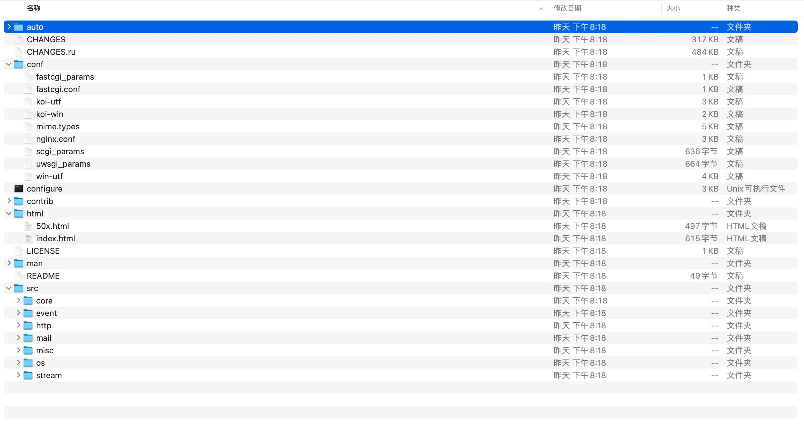

## 2. 配置

***

```sh

    # prefix参数指定默认路径(安装，配置文件，日志目录, 临时目录等等)
    # with-debug参数增加调试日志,正式运行强烈建议不要此参数

    ./configure --prefix=/Users/Shared/nginx --with-debug

    # 更多参数及详细说明见 ./configure --help
```

* 生成makefile文件,如下图所示:

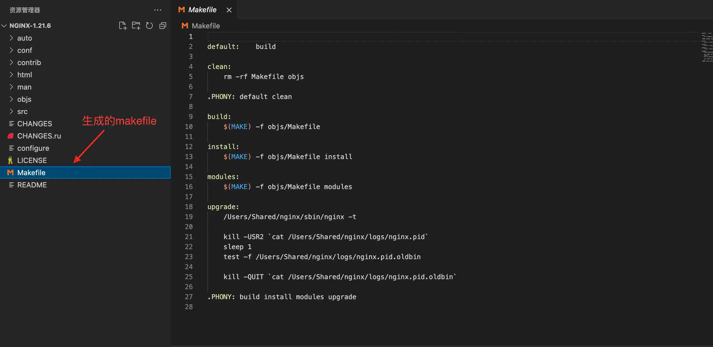

* 生成objs子目录,如下图所示

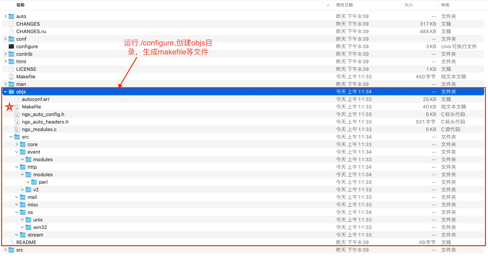

* 生成ngx_modules.c文件,如下图所示:

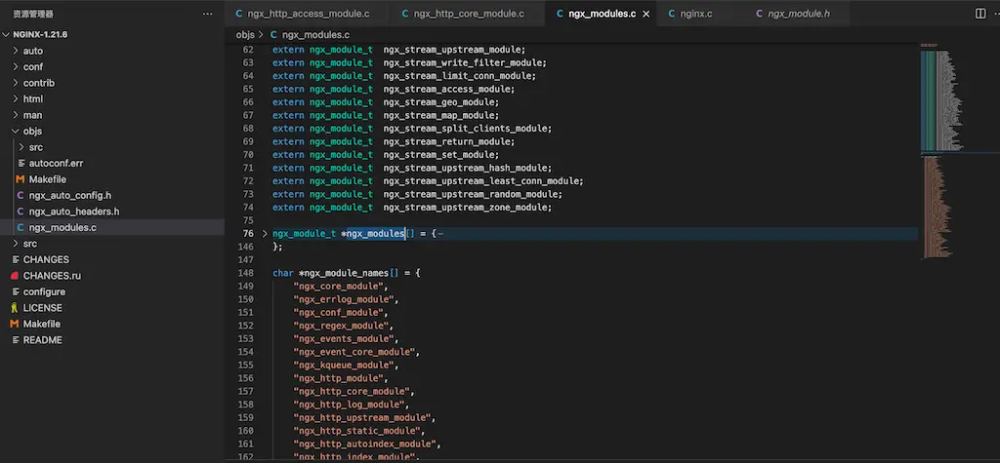

## 3. 编译

***

```sh

    # 实际上执行上一步生成的objs/makefile
    make

```

* 生成启用模块目标文件,如下图所示:

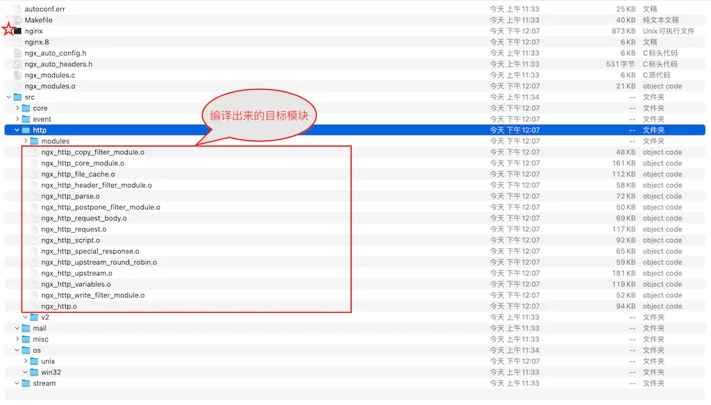

## 4. 安装

***

```sh

    # 实际上执行上一步生成的objs/makefile
    make install

```

* 安装执行代码,如下所示:

```sh

install: build 
test -d '$(DESTDIR)/Users/Shared/nginx' || mkdir -p '$(DESTDIR)/Users/Shared/nginx'

test -d '$(DESTDIR)/Users/Shared/nginx/sbin' \
|| mkdir -p '$(DESTDIR)/Users/Shared/nginx/sbin'
test ! -f '$(DESTDIR)/Users/Shared/nginx/sbin/nginx' \
|| mv '$(DESTDIR)/Users/Shared/nginx/sbin/nginx' \
'$(DESTDIR)/Users/Shared/nginx/sbin/nginx.old'
cp objs/nginx '$(DESTDIR)/Users/Shared/nginx/sbin/nginx'

test -d '$(DESTDIR)/Users/Shared/nginx/conf' \
|| mkdir -p '$(DESTDIR)/Users/Shared/nginx/conf'

....

test -d '$(DESTDIR)/Users/Shared/nginx/logs' \
|| mkdir -p '$(DESTDIR)/Users/Shared/nginx/logs'

```

* 安装目录,如下图所示:

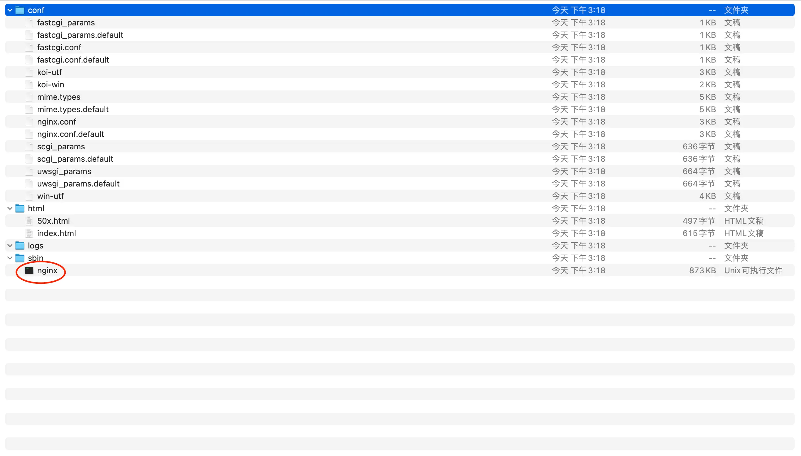

## 5.运行

***

```sh

    # /Users/Shared/nginx为configure中prefix参数指定
    cd /Users/Shared/nginx/sbin

    # -t 表示检查配置文件是否正确
    ./nginx -t

    ./nginx

```

* 日志目录,如下图所示:

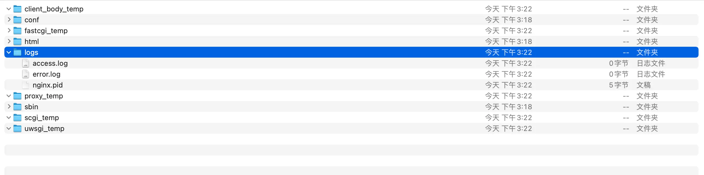

* 查看帮助,如下图所示:

```sh

    ./nginx -h

```

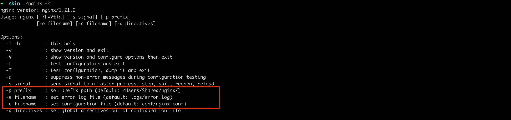

* 查看调试日志,如下图所示:

```nginx
    http {
        ...
        server {
            listen       80;
            server_name  localhost;
            # 编译时需要带上--with-debug
            # 如果仅看http过程,则指定等级为debug_http
            error_log logs/error.log debug;
            location / {
                root   html;
                index  index.html index.htm;
            }
        }
        ...
    }

```

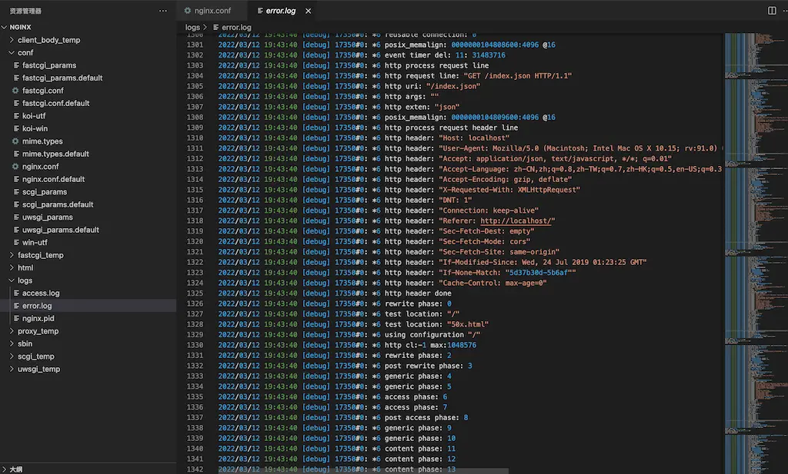

## 6. 进阶

***

### 1. 安装第三方模块及禁/启用自带模块

```sh

    # ../nginx-party-module/echo-nginx-module是echo-nginx-module模块源代码目录

    ./configure \
    --prefix=/Users/Shared/nginx \
    --without-http_empty_gif_module \
    --with-stream \
    --add-module=../nginx-party-module/echo-nginx-module

```

* --without参数禁用自带模块
* --with参数启用自带模块
* --add-module参数安装第三方模块

### 2. 编译安装

```sh

    make && make install

```

* make时在objs目录产生一个addon子目录,保存echo-nginx-module模块相关文件,如下图所示:

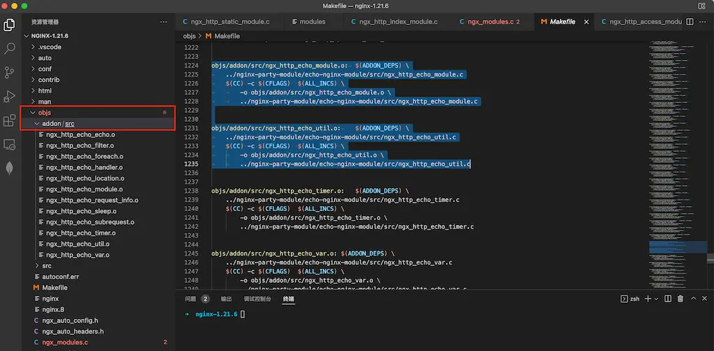

### 3. 编辑nginx.conf,运行

```sh
    cd /Users/Shared/nginx/conf
    vim nginx.conf

        ....
        # echo-nginx-module模块详细见项目网址
        location /hello {
            echo "hello, world!";
        }
        ...

    cd ../sbin
    ./nginx
```

### 4. 测试

```sh

    curl http://localhost/hello
    hello,world!

```

### 5. 原理分析

1. configure脚本先引用auto目录下的options脚本,如下图所示:
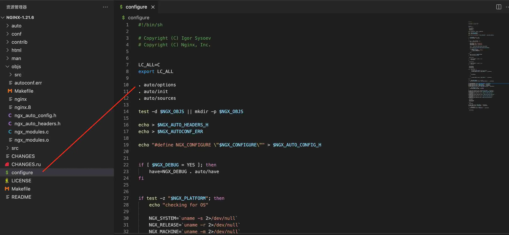

2. options脚本设参数默认值,如下图所示:
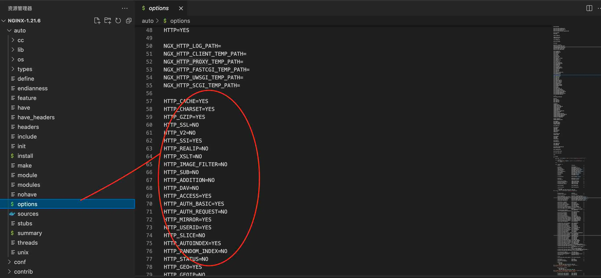

3. configure脚本再引用auto目录下的modules脚本,如下图所示:
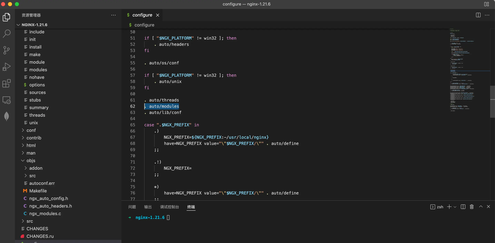

4. modules脚本如果参数为yes则引入编译,如下图所示:
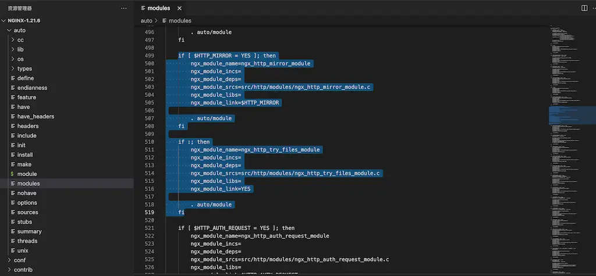

5. objs目录的ngx_modules.c文件就会增加引入的模块名,如下所示:

```c

    ...
    ngx_module_t *ngx_modules[] = {
        &ngx_core_module,
        &ngx_errlog_module,
        &ngx_conf_module,
        &ngx_regex_module,
        &ngx_events_module,
        &ngx_event_core_module,
        &ngx_kqueue_module,
        &ngx_http_module,
        ...
        &ngx_stream_upstream_zone_module,
        NULL
    };
    ...

```

6. ngx_modules.h的声明引用ngx_modules.c中ngx_modules,如下图所示:
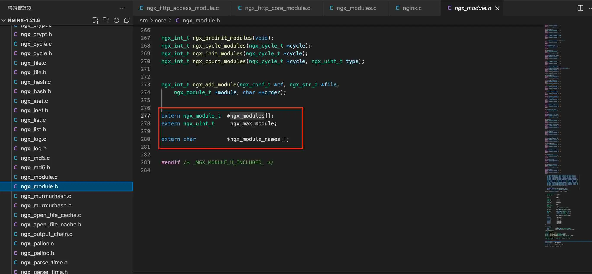

7. nginx.c的main函数调用nginx_module.c中ngx_preinit_modules函数,如下图所示:
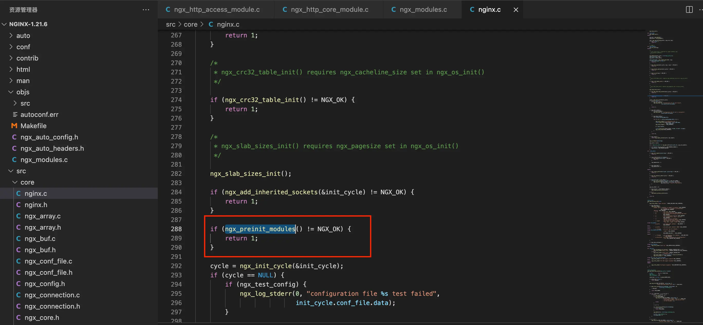

8. nginx_module.c中ngx_preinit_modules函数使用ngx_modules.c中ngx_modules,如下所示:

```c

    ngx_int_t
    ngx_preinit_modules(void)
    {
        ngx_uint_t  i;

        /* 
        ngx_modules变量为ngx_modules.c中定义
        */
        for (i = 0; ngx_modules[i]; i++) {
            ngx_modules[i]->index = i;
            ngx_modules[i]->name = ngx_module_names[i];
        }

        ngx_modules_n = i;
        ngx_max_module = ngx_modules_n + NGX_MAX_DYNAMIC_MODULES;

        return NGX_OK;
    }

```

9. 动态配置和静态编译执行在此完美结合起来

## 7. 后记

***

* [这里](https://www.nginx.com/resources/wiki/modules/index.html)有很多优秀的nginx第三方模块,可供下载使用

* [echo-nginx-module模块网址](https://github.com/openresty/echo-nginx-module/)

* 安装ssl

```sh
    ./configure --prefix=/Users/Shared/nginx \
             --add-module=../nginx-party-module/ngx_http_redis-module \
             --with-http_v2_module \
             --with-http_ssl_module \
             --with-openssl=/opt/homebrew/Cellar/openssl@1.1/1.1.1m\
             --with-debug
```

* http_v2_module不一定需要ssl,浏览器一般强制需要
* http_ssl_module需要ssl目录,在linux一般指ssl-devel,需要include/lib目录
 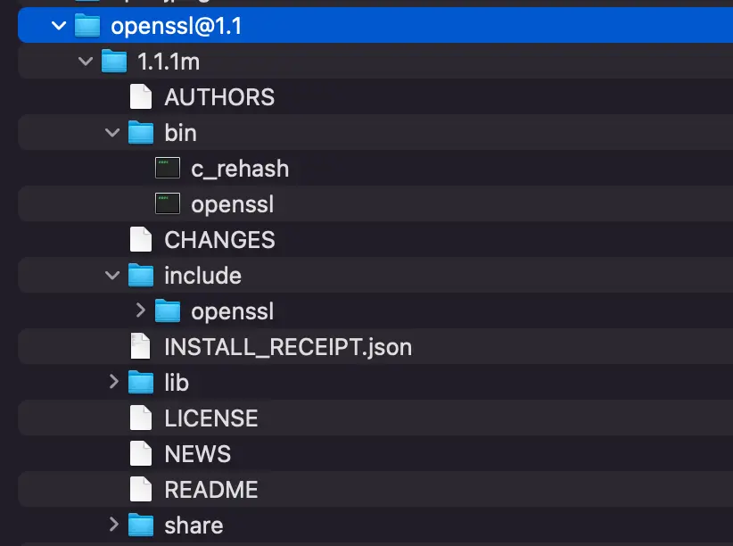
* 如果make仍然出错,移除掉路径中.openssl/,默认和系统中路径不同,多了一级.openssl/
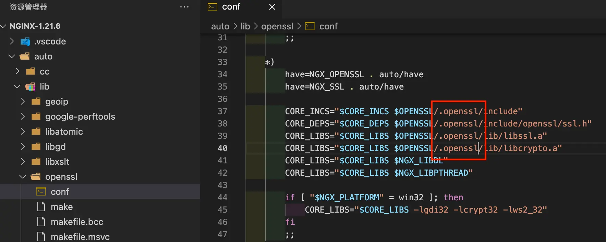
