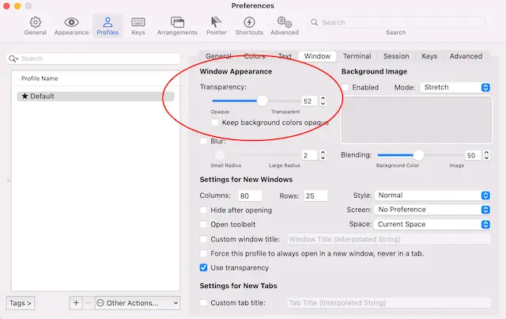
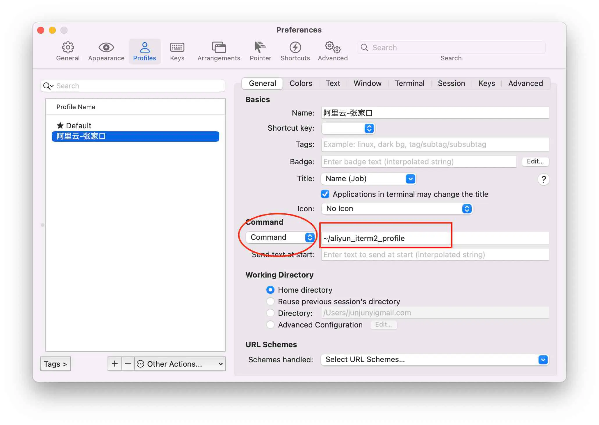
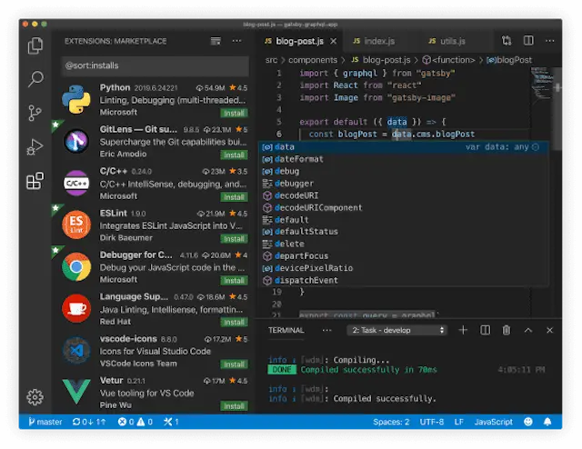
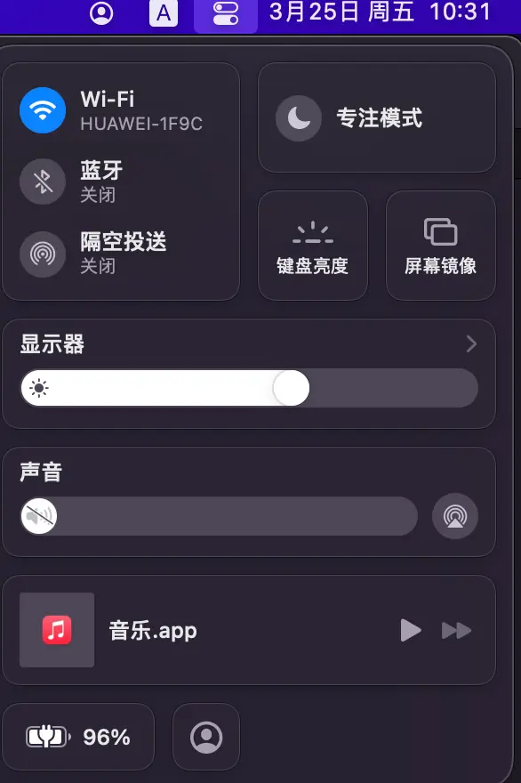

# mac
<!-- toc --> 

## 码农必备

***

### 1. iTerm2

   1. [官网](https://iterm2.com)
      

   2. 配置cmd+u切换窗口透明
      
      

   3. 快速ssh
      1. 创建一个profile脚本

         ```sh
         vim aliyun_iterm2_profile

         #填写模板内容,替换主机地址和密码,有可能第一次需要手动ssh root@xxxx,添加信任主机
         #!/usr/bin/expect -f
         set user root
         set host ip
         set password pwd
         set timeout -1

         spawn ssh $user@$host
         expect "*password:*"
         send "$password\r"
         interact
         expect eof

         #增加可执行权限
         chmod a+x aliyun_iterm2_profile
         ```

      2. 增加profile配置
      
         >command要从login shell->command,上图中红色圈圈
         >
         >上图中红色方框填入第一步profile路径

      3. 选择执行profile
      

   4. 替代品[wrap](https://www.warp.dev/)
      * 安装时需要注册帐户,目前采用github授权,最好翻墙，否则会完成不了整个过程

### 2. [brew](/other/brew)


### 3.oh-my-zsh

   1. [官网](https://ohmyz.sh)
      

   2. 安装命令

      ```sh
      # 如果github访问不了,导致安装不了.则采用国内源安装
      # /bin/zsh -c "$(curl -fsSL https://gitee.com/cunkai/HomebrewCN/raw/master/Homebrew.sh)"
      sh -c "$(curl -fsSL https://raw.github.com/ohmyzsh/ohmyzsh/master/tools/install.sh)"
      ```

   3. 常用插件

      ```bashrc
      plugins=(
       git
         docker
         extract
         dnf
         colored-man-pages
         command-not-found
         zsh-syntax-highlighting
         zsh-autosuggestions
      )
      历史记录采用年月日
      HIST_STAMPS="yyyy-mm-dd"
      在~/.zshrc配置文件里设置ZSH_THEME为你的主题名称
      ZSH_THEME="robbyrussell"

      alias cd="z"
      alias ping="gping"
      alias ps="procs -tree"
      alias du="dust"
      alias df="duf"
      alias ls="exa -l --header --git"
      alias cat="bat"
      eval "$(mcfly init zsh)"
      eval "$(zoxide init zsh)"
      ```

      * zsh-syntax-highlighting
      * zsh-autosuggestions
      * extract 所有类型的文件解压一个命令x全搞定，再也不需要去记tar后面到底是哪几个参数了。
      * command-not-found 当你输入一条不存在的命令时，会自动查询这条命令可以如何获得
      * zoxide代替cd,可能不用启动z
      * 提供一个 z 命令，在常用目录之间跳转。类似 autojump，但是不需要额外安装软件。
      * gping图形化显示ping结果
      * colored-man-pages 给你带颜色的 man 命令
      * docker 自带插件，可以实现docker命令补全和自动提示。
      * [difft](https://difftastic.wilfred.me.uk/git.html) 自带语法比较,可以替代diff

      ```bash
      # Set git configuration for the current repository.
      git config diff.external difft

      # Set git configuration for all repositories
      git config --global diff.external difft
      ```

      * 官方还提供了大量插件，大部分是针对某些功能的命令补全，如golang, python, pip, ruby, vagrant等。

      ```bash
      # 显示最近10条历史命令
      history [start]  [end],正数从头,负数从尾
      history -E -10
      ```

      * 禁止自动更新

      ```bash
      打开ohmyzsh(zsh) 的配置文件: ~/.zshrc
      找到DISABLE_AUTO_UPDATE一行，将行首的注释'#'去掉，则可禁用ohmyzsh 自动检查更新。
      ```

### 4. vscode

> Visual Studio Code 有一个广泛的扩展市场，可以增加你的便利度。但在安装其中一个之前，最好先看看它是否还没有原生支持。随着时间的推移，包含改进和功能的每月发布更新，越来越多的 Visual Studio Code 扩展将不再需要。“有一堆扩展是 bulitin 的，你可以禁用所有你不需要的。进入扩展面板，搜索 @builtin”

   1. [官网](https://code.visualstudio.com)
      

   2. 优秀插件

      * **tabnine** 有免费的AI助手编码,必须强赞一下

      * **CodeGeex** 另一个自动生成代码 <https://codegeex.cn/>

      * shellman shellcheck shell-format(Alt+Shift+F) Code Runner

      * NGINX Configuration Language Support

      * Go for Visual Studio Code 支持一键生成单元测试

      * Python

      * MongoDB for VS Code

      * Redis For VS Code

      * MySQL

      * vscode-drawio 直接在vscode中画图

      * docker

      * toml

      * yaml

      * vscode-pdf

      * Markdown PDF

      * Markdown Preview Mermaid Support

      * vscode-proto3 在.vscode里面的settings.json设置protoc及相关路径

      * JumpProtobuf 在.proto文件跳转f12键

      * Git History

      * **GitLens — Git supercharged**

      * **indent-rainbow**

      * **vscode-icons**用icon标识不同文件

      * **Better Comments**用不同色彩展示注释

      * **Error Lens**加强错误显示

      * Project Dashboard把经常使用project固定到仪盘表中

      * CodeSnap 是一个代码截图插件，只需选中项目中相应的代码段，即可快速创建代码的截图。

      * tabnine-AI写代码帮助<https://www.tabnine.com/>

      * Copilot-AI写代码帮助<https://github.com/features/copilot/>,tabnine类似

      * Output Colorizer *.log文件彩色输出

      * vscode-database-client 高级使用需要收费 <https://github.com/cweijan/vscode-database-client>

      * swagger preview-可以设置端口,直接测试接口

      * Hex Editor 以16进制格式查看文件

      * Rainbow CSV

      * Rainbow Brackets

      * Excel Viewer

      * Prettify JSON

      * Path Autocomplete

      * SQL Formatter

      * Regex Previewer

      * Code Spelling checker

      * English word hint

      * Peacock 自定义标题栏及左侧的颜色，同时打开多个vscode有用

      * vscode-fileheader 插入文件头注释,并且自动更新时间及作者

   3. 自带markdown preview功能,cmd+shift+v

   4. tab/shift+tab整体正/反缩进,cmd+click跳进,ctrl+-跳回

   5. 已知bug

      * vscode打开**目录层次不对**,应该直接打开工程目录,不能打开父目录,否则报下面错误

         ```sh
         could not import github.com/gomodule/redigo/redis (cannot find package "github.com/gomodule/redigo/redis" in any of
         /usr/local/go/src/github.com/gomodule/redigo/redis (from $GOROOT)
         /Users/.../gopath/src/github.com/gomodule/redigo/redis (from $GOPATH))
         ```

      * 自动保存可能会**自动插入空格**,在生成代码文件,需要注意,可能造成bug.
   6. 修改go test timeout超时
      * 点击左下角齿轮->设置 打开用户设置
      * 在搜索栏中输入 go test timeout
      * 可以找到 go.testTimeout为30s

   7. 工作空间 workspace多个目录一起打开，组合

   8. 命令行直接调用
      * 命令面板(shift+cmd+p)
      * 输入shell command
      * 选择Install ‘code' command in PATH
      * 命令行输入code .

   9. 代码片断
      * 打开vscode,file-->preference(首选项)--->user snippets(用户代码片断),输入python回车，添加如下代码：

      ```json
      "Print with space lines": {
            "prefix": "ppp",
            "body": [
               "print('\\n'*2, $1)",
               
            ],
            "description": "Print with space lines"
         }
      ```

   然后在编写python程序 时候，连续按ppp就可以快捷输出打印变量。

### 5. [fig](https://fig.io/)大幅度提高效率

   

   ```sh
   # 下载安装保存位置
   ~/.local/bin
   ```

* 需要**填写邮箱**用来同步设置,否则没有效果

### 6. webp converter批量转换webp格式,appstore免费

   

### 7. ~~[Atom](https://atom.io/)github开源免费文本编辑器~~,已死掉了

   

   

* 优秀插件
  * simplified-chinese-menu
  * go-plus
  * markdown-writer
  * platformio-ide-terminal
  * file-icons
  * regex-railroad-diagram

### 8. [sublimetext](https://www.sublimetext.com/),闭源可免费使用文本编辑器

   

* 安装打开终端插件 terminus
  * cmd+shift+p 然后输入 install package 输入 [terminus](<https://github.com/randy3k/Terminus>)
  * 配置key

      ```json
      { 
         "keys": ["ctrl+`"], 
         "command": "toggle_terminus_panel",

      },
      {
         "keys": ["ctrl+shift+`"],
         "command": "terminus_open",
         "args": {
            "cwd": "${file_path:${folder}}"
         }
      },
      ```

* 安装语法高亮nginx配置文件插件 sublime-nginx/Nginx Log Highlighter
  * cmd+shift+p 然后输入 install package 输入 [nginx](<https://github.com/brandonwamboldt/sublime-nginx>)

* 安装shell脚本语法高亮插件 Pretty Shell
  * cmd+shift+p 然后输入 install package 输入 [Pretty Shell](<https://packagecontrol.io/packages/PrettyShell>)

* 安装markdown插件 markdown Editing
  * cmd+shift+p 然后输入 install package 输入 [markdown Editing]

* Rainbow Brackets

* Git

* GitGutter 更进一步

* GitSyntaxes

* tabnine插件

* AutoFileName

* Pretty JSON

* Pretty Protocol buf

* Protocol Syntax Highlighting

* FileIcons

* SQL Formatter

* advanced CSV

* Rainbow CSV

* JsFormat

* HTMLBeautify

* docker file lint/ docker high light

* chinese localization----中文汉化

* chinese words cutter-中文分词

* 主题及color主题是两种，可以分开选择

* SideBar Enhancements

```sh
vim ~/.zshrc

# Set Sublime Text Alias
alias subl="'/Applications/Sublime Text.app/Contents/SharedSupport/bin/subl'"

# 使配置生效
source ~/.zshrc

# 打开sublime
subl

# 使用sublime打开当前目录
subl .
```

### 9. [chrome](https://github.com/Eloston/ungoogled-chromium),无google全家桶的chrome

```bash
brew install --cask eloston-chromium
```

### 10. [marktext](https://github.com/marktext/marktext),开源免费的markdown编辑器

```bash
brew install --cask eloston-chromium
```

## [利用蓝牙传输文件](https://support.apple.com/zh-cn/guide/mac-help/mchle7fa9e15/mac)

***

   1. 在"系统偏好设置"->“蓝牙”开启功能

   2. 等待发现蓝牙设备,连接设备,在设备上同意配对

   3. mac向设备传输文件使用“蓝牙文件交换”(位于“应用程序”文件夹的“实用工具”文件夹中)

   4. 设备向mac传输文件,则mac设置蓝牙共享,"系统偏好设置"->“共享”

   5. 蓝牙传输超慢,建议采用局域网sftp,mac自带sftp服务

## 无法验证开发者

***

   

   >解决办法:在Finder中找到应用程序,并找到该程序,右键->打开
   

## “xxx.app”已损坏，无法打开。 你应该将它移到废纸篓

* 终端执行,打开允许任意来源app

```sh
sudo spctl --master-disable
```

* 手动执行相信特定app

```sh
sudo xattr -rd com.apple.quarantine /Applications/xxx.app/
```

* 系统设置-->隐私性及安全-->调回只任信store及开发者,防止其他app误操作

## 开机启动

***

* Login Items
  * 在~/Library/Preferences/com.apple.loginitems.plist
  * 在系统偏好设置的“用户与群组”下面进行设置，可以删除、添加、开启和关闭;

* Launchd Daemon,launchd来负责启动
  * ~/Library/LaunchAgents
  * /Library/LaunchAgents
  * /System/Library/LaunchAgents
  * ~/Library/LaunchDaemons
  * /Library/LaunchDaemons
  * /System/Library/LaunchDaemons

* StartupItems
  * /System/Library/StartupItems
  * /Library/StartupItems

## 技巧

***

* 在命令行打开**访达**当前目录

```bash
open 特定目录
open .
```

* 截屏 shift+cmd+5 非常不错,谁用知道
* 朗读-读出所选内容(option+ecs),如果没有效果,则可能系统声音选择不对，本机器上反应有点慢，要等几秒才能读。

* mac字体路径 /System/Library/Fonts,/Library/Fonts,ttf是mac和freetype共同推出的字体文件,ttc是ttf的集合文件(<https://www.cnblogs.com/fortunely/p/16651504.html>)
* 目前苹果有intel和M1芯片两种,软件下载安装时,注意Mac silicon/arm64/aarch指明适用M1芯片
* xcode默认只有英文界面，不支持中文界面
* iphone采用数据线连上mac,在新版的mac上没有iTunes,在访达偏好设置中有一个显示ios设备选项，否则无法显示出来!
* AppleID网络iCloud同步,前面打勾就会自动上传或下载同步iCloud空间中,
  * iCloud云盘是iCloud空间一个目录,本地也有一个对应目录
  * 照片也是iCloud空间一个目录,本地也有一个对应目录
  * 其他华为,小米帐号iCloud空间都是类似的

* 查看端口

```sh
lsof -i tcp:8080
```

* 查看本机地址

```sh
# mac把Wi-Fi称为en0
ifconfig en0
```

* 修改hosts sudo vim /etc/hosts
* 深色模式,保护眼睛
   
   
* 删除Microsoft Auto Update,烦人的更新提示

   ```sh
   cd /Library/Application Support/Microsoft/MAU2.0
   sudo rm -rf Microsoft\ AutoUpdate.app
   ```

* 树状显示目录tree

   ```sh
   brew install tree
   tree
   ```

* 十六进制显示文件

   ```sh
   # xxd系统自带,-l只显示开头40字节
   xxd -l 40 filename
   ```

* 访达/系统按键
   | 名称 | 作用 |
   | -- | -- |
   | 回车键 | 重命名文件夹或文件 |
   | command + o | 打开文件 |
   | command + ↓ | 打开文件 |
   | command + ↑ | 进入当前目录的上一级目录 |
   | 空格键 | 预览 |

* [imagemagick](https://imagemagick.org/) 图像处理神器

```bash
brew install imagemagick

# 注意参数位置density是修饰pdf,否则会采用默认72dpi
magick convert -density 300 enroll-sch.pdf -resize 1330x1900 -quality 100 ./photo/enroll-sch.jpg
```

* ssh免密登录远程

```bash
# 输入密码就能实现远程免密登陆，本质上pub文件内容加到远程机器~/.ssh/authorized_keys文件中
ssh-copy-id -i /root/.ssh/id_rsa.pub root@192.168.0.104 
```

* 鼠标按windows滚动

  * 打开Mac系统偏好设置
  * 在系统偏好设置界面，点击"鼠标"
  * 进入鼠标的设置窗口，单击“光标与点按"标签
  * 在光标与点按设置面板，将"滚动方向：自然"的勾选去掉即可
  * 然后在滑动鼠标，即和windows的滚轮一样了

* 替换按键ctrl+alt
   

* mac电脑的默认字体-苹方字体，中文就是-苹方-简,有专门的"字体册"app管理

* 编程仅好字体 Menlo, Monaco, 'Courier New', monospace 12大小

* socket: operation not permitted - socket 无权限监听问题,一次性给root权限

```sh
sudo chown root:admin xxx
sudo chmod +sx xxx
```

# pip(3)error: externally-managed-environment解决办法,增加参数

```shell
pip install websocket
pip install --break-system-packages websocket


pip3 install -U uiautomator2 --break-system-packages
pip3 install -U uiautodev --break-system-packages
```