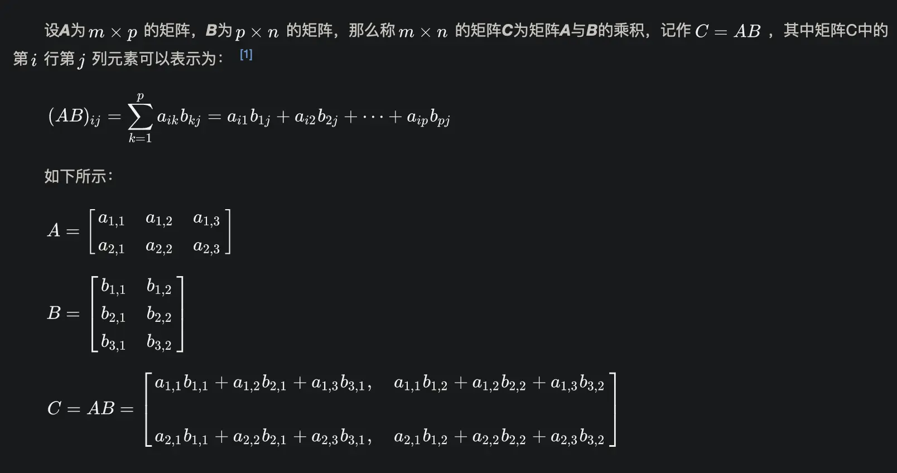

---
# 机器学习
---

### 常见框架

* [pytorch](https://pytorch.org/),1.12之后支持m1芯片

* [tensorflow](https://tensorflow.google.cn/),目前支持m1芯片，需要打补丁[tensorflow-plugin](https://developer.apple.com/metal/tensorflow-plugin/)

* [scikit-learn](https://scikit-learn.org/stable/index.html)

* [Core ML](https://developer.apple.com/cn/machine-learning/),苹果内置机器学习

### python机器学习包介绍

### 矩阵乘法

### 深度学习中图像为什么要归一化？

> 在神经网络里，输入RGB图片的时候，通常要除以255，把像素值对应到0和1之间

* 如果输入层 x 很大，在反向传播时候传递到输入层的梯度就会变得很大。梯度大，学习率就得非常小，否则会越过最优。在这种情况下，学习率的选择需要参考输入层数值大小，而直接将数据归一化操作，能很方便的选择学习率。

* 一般归一化还会做减去均值除以方差的操作, 这种方式可以移除图像的平均亮度值 (intensity)。很多情况下我们对图像的亮度并不感兴趣，而更多地关注其内容，比如在目标识别任务中，图像的整体明亮程度并不会影响图像中存在的是什么物体。此时，在每个样本上减去数据的统计平均值可以移除共同的部分，凸显个体差异。
