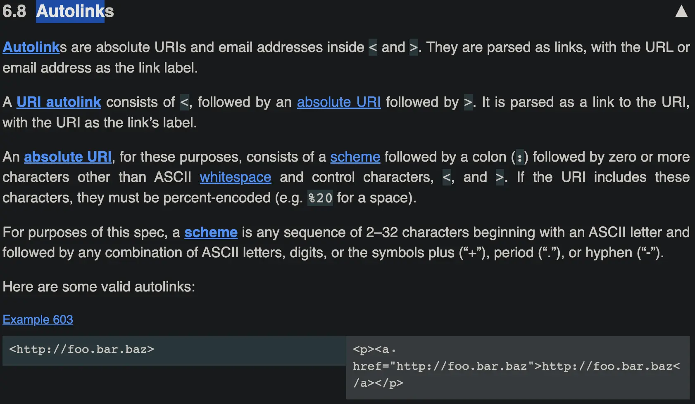

---
# markdown
---

### [标准化语法](<https://commonmark.org/help/>)

### [github的扩展GFM](https://github.github.com/gfm)

### [表情符号网站](https://emojipedia.org/)

> 语法： &#xCODE; 其中，CODE 可以从 Emoji Unicode Tables中查到。
例子： 查到了 表情对应的 Unicode 编码为 U+1F34E，则与此表情对应的 CODE 为 1F34E (舍弃前面的 U+)。
我们只需在 Markdown 文档中输入 &#x1F34E;

---

### 笔记

* ~~+1~~

* &#x1F34E;

* www.baidu.com

* gitbook写书工具，有各种插件

* markdown here写邮件

* pandoc 不同标记语言间格式转换工具

* markdown有工具直接生成ppt

* 有工具可以把markdown转成微信公众号需要的格式

* 石墨文档，腾讯文档，语雀文档在线多人协作工具

* gitbook写书工具，有各种插件

* [mdBook-rust实现的gitbook](https://github.com/rust-lang/mdBook)

* mkdocs,python开发的静态站点生成器
