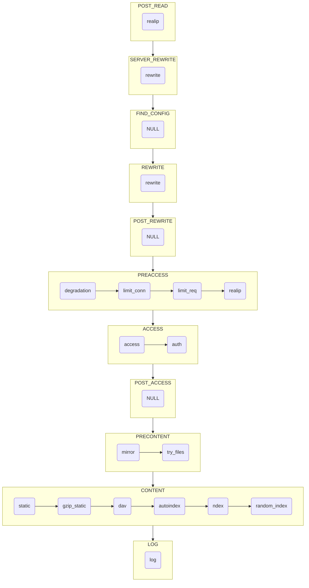
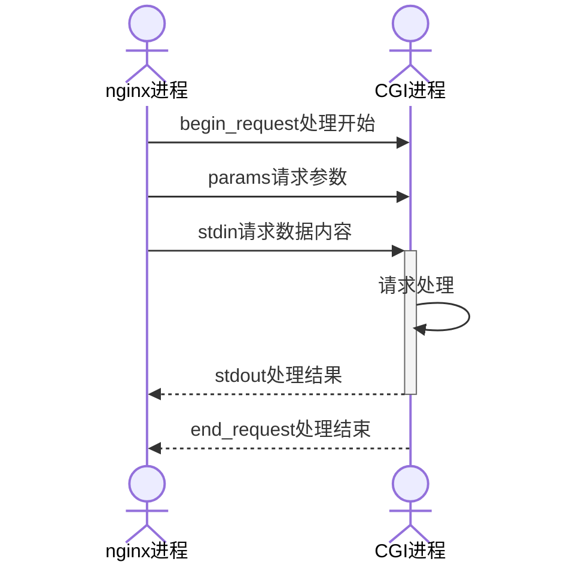

---
# HTTP模块
---

## 核心模块阶段

***



> * POST_REWRITE阶段如果有rewrite，则会跳回到FIND_CONFIG阶段
>
> * 源代码中定义,如下图所示:


## FastCGI模块

***



## static模块

***

> 把请求url中path映射本地路径,读取本地文件返回客户端
>
> 核心源代码,如下图所示:


## index模块

***

> 引入配置参数index,如下图所示:


> 请求url为目录时,把配置参数index值附加在url上,然后内部转跳

```c


static ngx_int_t
ngx_http_index_handler(ngx_http_request_t *r)
{
    ...
    if (index[i].name.data[0] == '/') {
                return ngx_http_internal_redirect(r, &index[i].name, &r->args);
            }
    ...

    ngx_log_debug1(NGX_LOG_DEBUG_HTTP, r->connection->log, 0,
                       "open index \"%V\"", &path);

    ...
    return ngx_http_internal_redirect(r, &uri, &r->args);
}

```

> 转跳调试日志,如下图所示:

