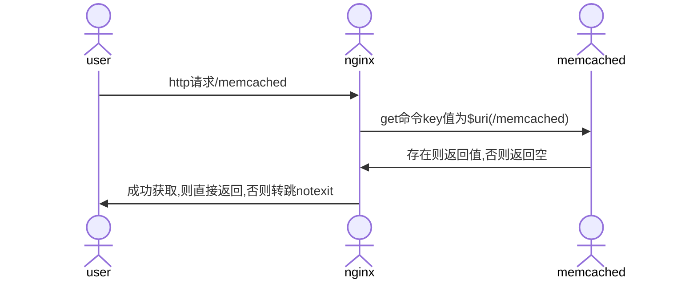
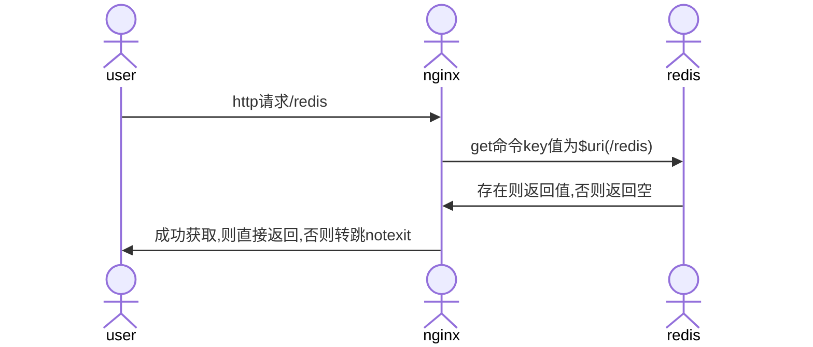
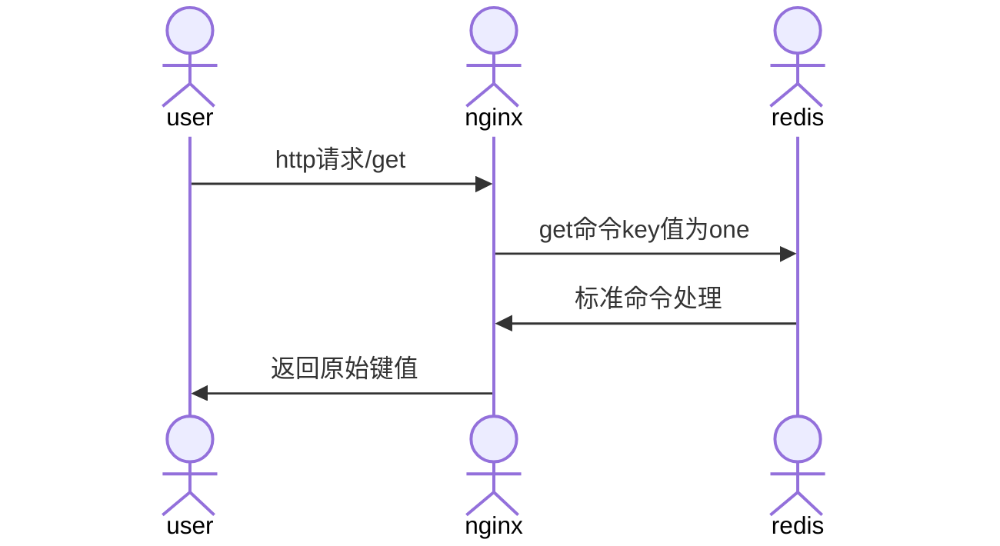

---
# 常用技巧
---

### 配置片段

***

* http转向https

    ```nginx

    rewrite ^(.*) https://$server_name$1 permanent;
    rewrite ^(.*) https://$host$1 permanent;

    ```

  * 两种写法,各有适合场合
  * $server_name, 由nginx配置决定
  * $host,由请求路径决定

* 正向代理

    ```nginx

    server {
        listen 80;
        location / {
            proxy_pass http://$host$request_uri;
        }
    }

    ```

  * 配合日志,可以用来调试
  * 可以过滤掉特定请求
  * 可以检查http请求是否被拦截  

* 解决无法加载样式表

    ```nginx
    # 否则无法加载样式表
    include /etc/nginx/mime.types;
    default_type application/octet-stream;
    ```

* 支持http2

  * 自定义安装带上v2,ssl

    ```sh
    ./configure --prefix=/Users/Shared/nginx \
                --with-http_v2_module \
                --with-http_ssl_module \
                --with-openssl=/opt/homebrew/Cellar/openssl@1.1/1.1.1m\
                --with-debug
    ```

  * 配置增加上http2

    ```nginx
    ...
    server {
            # 默认情况http2都走ssl,所以在ssl加上http2
            listen 443 ssl http2;
            ...
    }
    ...
    ```

* 支持http3

  * 自定义安装带上v3,ssl,brotli

    ```sh
    ./auto/configure --with-http_v3_module \
        --with-stream_quic_module      \
        --with-http_ssl_module \
        --with-http_v2_module \
        --add-module=../ngx_brotli \
        --with-cc-opt="-I../libressl/build/include" \
        --with-ld-opt="-L../libressl/build/lib"
    ```

  * 配置增加上http3

    ```nginx
    ...
    http {
        brotli on;
        brotli_comp_level 6;
        brotli_types text/plain text/css application/json application/x-javascript text/xml application/xml application/xml+rss text/javascript application/javascript image/svg+xml;
        server {
                # 默认情况http2都走ssl,所以在ssl加上http2
                listen 443 ssl http2;
                listen 443 http3 reuseport; # UDP listener for QUIC+HTTP/3,在主域名表示reuseport，否则会提示冲突
                ssl_protocols TLSv1.3; # QUIC requires TLS 1.3
                # 一定要添加头部，否则无法开启
                add_header alt-svc 'h3=":443"; ma=86400;quic=":443"; ma=2592000; v="46,43", h3-Q050=":443"; ma=2592000, h3-Q049=":443"; ma=2592000, h3-Q048=":443"; ma=2592000,h3-Q046=":443"; ma=2592000, h3-Q043=":443"; ma=2592000, h3-23=":443"; ma=2592000'; 
                ...
        }
        ...
    }
    ...
    ```


* 四层代理-stream

  * 自定义安装带上stream

    ```sh
    ./configure --prefix=/Users/Shared/nginx \
                --with-stream \
                --with-debug

    make && make install
    ```

  * 配置增加上stream

    ```nginx
    ...
    stream {
        server {
            listen 8411;
            proxy_timeout 3s;
            proxy_pass xxx:8411;
        }
    }
    ...
    ```

* gzip-压缩支持

    ```nginx
    ...
    http {
        # 打开gzip指令，否则后面不会生效
        gzip on;
        # 回包头部增加content-encoding: gzip
        gzip_vary on;
        # 压缩类型
        gzip_types text/plain text/css application/json application/x-javascript text/xml application/xml application/xml+rss text/javascript application/javascript image/svg+xml;
    }
    ...
    ```

* [映像/复制mirror](http://nginx.org/en/docs/http/ngx_http_mirror_module.html)

    ```nginx
    location / {
        #可以多次映像/复制,从而起到放大流量功能
        #产生一个http subrequest "/mirror?",跳转到相应location
        #所以mirror结果(包括超时,服务器关闭,50x,40x等等),不影响这个本身速度及结果
        #但是占用内存,消费conn连接池之类还是要的
        #mirror /mirror;
        #mirror /mirror;
        mirror /mirror;
        #允许丢掉body
        #mirror_request_body off;
        proxy_pass http://backend;
    }

    location = /mirror {
        # 判断请求方法，不是GET返回403,用其他类似手段缩小流量规模
        # if ($request_method != GET) {
        #     return 403;
        # }
        internal;
        #这里的回包是忽略
        proxy_pass http://test_backend$request_uri;
        #允许丢掉body
        #proxy_pass_request_body off;
        #proxy_set_header Content-Length "";
        proxy_set_header X-Original-URI $request_uri;
    }
    ```

* 利用日志调试

    ```nginx
    server {
        ...
        #降低错误日志等级,例如notice,如果编译带有--with-debug,则可以debug,debug_http
        error_log  logs/error.log  info;

        #不同路径不同access日志文件,确认哪个loc使用
        location /hello {
            ...
            access_log logs/hello_access.log;
            ...
        }

        location /world {
            ...
            access_log logs/world_access.log;
            ...
        }
        ...
    }
    ```

* root与alias区别

```nginx
# 请求/abc/123 ==> /var/www/app/static/abc/123
location /abc {
    # In case of the root directive, full path is appended to the root including the location part
    # 请求的path附加上root指定path,组合本地路径
    root /var/www/app/static;
    autoindex off;
}

# 请求/abc/123 ==> /var/www/app/static/123
location /abc {
    # only the portion of the path NOT including the location part is appended to the alias.
    # 请求的path移除掉location的path,再附加上alias指定path,组合本地路径
    alias /var/www/app/static;
    autoindex off;
}
```

### 常用模块

***

* http_memcached模块

    ```nginx
    ...
    location /memcached {
        set $memcached_key "$uri";
        memcached_pass 127.0.0.1:11211;
        #指示返回为html,方便浏览器直接显示
        default_type   text/html;
        error_page 404 502 504 = @notexit;
    }

    location @notexit {
        #echo为第三方模块引入指令,方便调试
        echo "noexit$uri";
    }
    ...
    ```



* ngx_http_redis第三方模块,类似http_memcached

    ```sh
    ./configure --prefix=/Users/Shared/nginx \
                --add-module=../nginx-party-module/ngx_http_redis-module \
                ...
                --with-debug

    make && make install

    ```

    ```nginx
    ...
    location /redis {
        set $redis_key "$uri";
        redis_pass     127.0.0.1:6379;
        #指示返回为html,方便浏览器直接显示
        default_type   text/html;
        error_page 404 502 504 = @notexit;
    }

    location @notexit {
        #echo为第三方模块引入指令,方便调试
        echo "noexit$uri";
    }
    ...
    ```



* redis2-nginx-module第三方模块,更强大更多操作

    ```sh
    ./configure --prefix=/Users/Shared/nginx \
                --add-module=../nginx-party-module/redis2-nginx-module \
                --with-debug


    make
    make install
    ```

    ```nginx
    ...
    location = /foo {
        set $value '<html><H1>From Nginx Redis</H1></html>';
        redis2_query set one $value;
        redis2_pass 127.0.0.1:6379;
    }


    location = /get {
        redis2_query get one;
        redis2_pass 127.0.0.1:6379;
    }
    ...
    ```



### 常见问题

***

* server_names_hash问题

    ```sh
    [emerg] could not build server_names_hash, you should increase server_names_hash_bucket_size: 32
    ```

* 解决办法

    ```nginx
    # 如果不够,继续增加,大小必须是32*n
    server_names_hash_bucket_size 64;
    ```

* invalid request问题

    ```sh
    # asscess.log 有这种提示
    "PRI * HTTP/2.0" 400 157 "-" "-"
    # error.log 有这种提示
    client sent invalid request while reading client request line
    ```

* 解决办法-客户端没有采用ssl,tls,但访问nginx配置需要ssl

* php-fpm出现Primary script unknown问题

  * 尝试修改nginx配置

    ```nginx

    # FastCGI sent in stderr: "Primary script unknown" while reading response header from upstream,
    # fastcgi_param  SCRIPT_FILENAME  /scripts$fastcgi_script_name;
    fastcgi_param SCRIPT_FILENAME $document_root$fastcgi_script_name;

    ```

  * 如果仍然不行,则打开php-fpm.conf日志配置

    ```nginx

    access.log = /var/log/php-fpm.$pool.access.log

    ```

  * 再打开nginx日志配置

    ```nginx

    # http
    log_format scripts '$document_root$fastcgi_script_name > $request';
    # server
    access_log /usr/local/nginx/scripts.log scripts;

    ```

  * 重启nginx,和php-fpm 查看日志,一般是路径不对和权限不对

* php-fpm出现无法连接数库,可能是编译参数不对

    ```sh

    ./configure --enable-fpm --prefix=/usr/local/php --with-mysqli=mysqlnd --with-pdo-mysql=mysqlnd

    ```

* 不知道当前nginx所用配置文件

    ```sh
    # 获取nginx进程号
    ps -ef | grep nginx
    # 获取nginx路径
    cd /proc/pid
    ls -a
    # 执行相应路径的语法测试,输出就能看到路径
    nginx -t
    ```

* 不知道当前nginx的编译参数

    ```sh
    # 获取nginx进程号
    ps -ef | grep nginx
    # 获取nginx路径
    cd /proc/pid
    ls -a
    # 执行相应路径的语法测试,输出就能看到路径
    nginx -V
    ```
