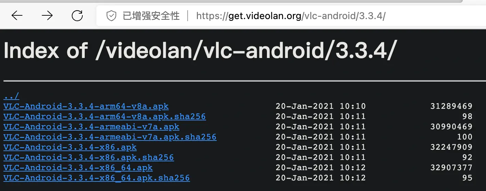
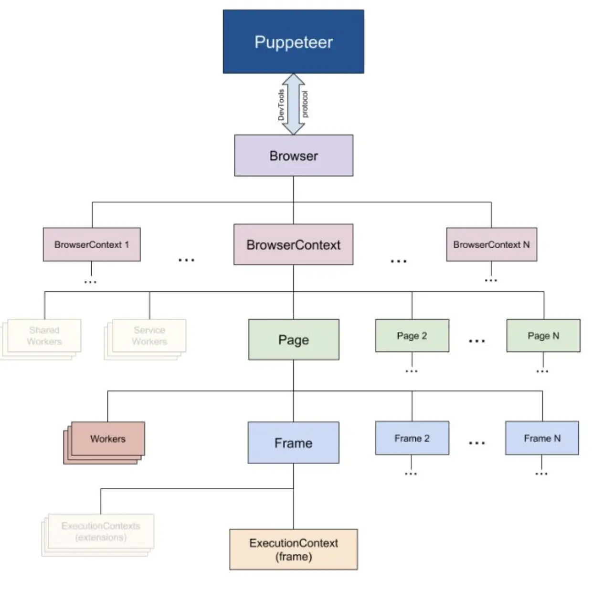
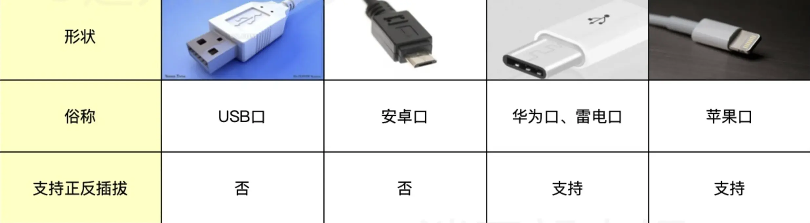

---
# 杂项
---

### STMP发邮件

***


### NewSQL

***


简述

* newSQL 就是在传统关系型数据库上集成了 noSQL 强大的可扩展性
* newSQL 生于云时代，天生就是分布式架构
* [CockroachDB](https://www.cockroachlabs.com)
* [TiDB](https://pingcap.com)

### 好用的搜索

***

* [whoogle-search-自建google元搜索](https://github.com/benbusby/whoogle-search)
* [searxng-另一个searx](https://github.com/searxng/searxng)
* [SEARX-开源元搜索](https://github.com/searx/searx)
* [百度开发者-搜索](https://kaifa.baidu.com/)
* [必应国际版-搜索](https://bing.com/)
* [goobe-程序员专用搜索](https://goobe.io/)
* [mengso-搜索引擎](<https://mengso.com/neice>),采用opensearch方式才能用
* [yandex-搜索引擎](https://yandex.com/),过滤得不够
* [专搜代码-source](https://sourcegraph.com/search)
* [专搜代码-search](https://searchcode.com/)
* [专搜代码-publicwww](https://publicwww.com/)

### chromium安装darkreader

***

* github下载


* chromium安装


### 写好博客/wiki有用参考

***

* 官方文档/教程
* github优秀项目的readme
* 搜索 Stackoverflow 「关于某个 Wiki 话题」，前 10 ~ 20 个问题；
* 阅读 Google 搜索「关于某个 Wiki 话题」，前 10 ~ 100 篇文章；
* 社区优秀的免费和付费书籍（如果有的话）；
* 优秀的出版书籍（如果有的话）

### 华为手机自定义安装VLC

***

* [电脑安装华为手机助手](https://consumer.huawei.com/cn/support/hisuite/)


* 用数据线连接电脑和手机,手机开启HDB


* 下载VLC安装包


* 复制到手机


* 手机->实用工具->文件管理->浏览->下载与接收->下载管理器->点击apk

### 小度音箱播放本地音乐

***

 1. 进入小度APP之后，点击上方配置的小度智能音箱

 2. 点击进入设备设置。

 3. 点击进入蓝牙设置。

 4. 打开音箱蓝牙的开关。

 5. 再打开手机的蓝牙功能，找到音箱的蓝牙名称。

 6. 成功连接音箱蓝牙后，打开手机音乐即可在小度音箱中播放

### 优秀工具

 ***

* [githubs中文社区](https://www.githubs.cn/)
* [alist-各种网盘分享](https://github.com/alist-org/alist)非常优秀,值得试试
* [腾讯兔小巢](https://txc.qq.com/)快速建立用户反馈系统,值得试试
* [wkhtmltopdf-html转pdf](https://wkhtmltopdf.org/)把html转化为pdf

```sh
brew install --cask wkhtmltopdf
```

* [riptutorial](https://riptutorial.com/)国内免费分享的书籍示例
* [无google全家桶的chromium](https://github.com/Eloston/ungoogled-chromium)
* [jenkins](https://www.jenkins.io/zh/)
* [jenkins-pipeline语法](https://www.jenkins.io/zh/doc/book/pipeline/syntax/)
* [jenkins-BlueOcean插件](可视化版pipeline，值得安装)
* [drone-轻量级的jenkins](https://www.drone.io/)
* [onedev-java版gogs](https://code.onedev.io/)
* [gogs本地代码托管](https://gogs.io)
* [gitea本地代码托管](https://gitea.io)
* [mermaid](https://mermaid-js.github.io/mermaid/)
* [中科大镜像](https://mirrors.ustc.edu.cn/)
* [阿里云镜像](https://developer.aliyun.com/mirror/)
* [清华大学镜像](https://mirror.tuna.tsinghua.edu.cn/)
* [类似hugo-文档建站工具](https://www.docusaurus.cn/)
* [cloc代码统计工具](https://github.com/AlDanial/cloc)
* [企业管理系统](https://github.com/getrebuild/rebuild/)
* [Discord社交软件](https://discord.onl/)
* [Slack社交软件](https://slack.com/)
* [odoo以前openERP](https://www.odoo.com/zh_CN)
* [禅道](https://www.zentao.net/)
* [LayaAirH5小游戏引擎](https://www.layabox.com/)
* [apijson](https://apijson.com/)
* [apifox](https://apifox.com/)
* [八爪鱼-自动爬虫](https://www.bazhuayu.com/)
* [clickhouse-联机分析(OLAP)的列式数据库管理系统(DBMS)](https://clickhouse.com/docs/zh/),用来分析现有数据,发现数据规律，商业模式好帮手.

> [Apache Doris](https://doris.apache.org/zh-CN)是由百度贡献的开源MPP分析型数据库产品，亚秒级查询响应时间，支持实时数据分析；分布式架构简洁，易于运维，可以支持10PB以上的超大数据集；可以满足多种数据分析需求，例如固定历史报表，实时数据分析，交互式数据分析和探索式数据分析等。
> ClickHouse是俄罗斯的搜索公司Yandex开源的MPP架构的分析引擎，号称比事务数据库快100-1000倍，团队有计算机体系结构的大牛，最大的特色是高性能的向量化执行引擎，而且功能丰富、可靠性高。

* [Rufus-优秀的启动盘制作](https://rufus.ie/zh/#)

### 小知识

***

* 国内dns地址

```sh
字节DNS
180.184.1.1
180.184.2.2

腾讯 DNS
119.29.29.29
182.254.116.116

阿里DNS
223.5.5.5
223.6.6.6
2400:3200::1

百度DNS
180.76.76.76
114.114.114.114

2400:da00::6666

下一代互联网国家工程中心
240c::6666
240c::6644
```

* 域名解析ipv6地址,是增加**AAAA记录**

```sh
#采用ipv6
ping -6 host
#mac
ping6 host
```

* [utm-虚拟机](https://mac.getutm.app/)
detian linux可以正常启动
Username: debian
Password: debian

centos-stream9
root
密码同mac的帐户密码

utm一个虚拟机对应一个utm文件,当初次创建可能需要iso,等iso安装完成了，编辑虚拟机属性，删除掉dvd就不会再安装

* [brave-另一个chromium](https://github.com/brave/brave-browser)
* [rockylinux-centos开源替代品](https://rockylinux.org/zh_CN/)
* [openEuler欧拉OS-linux发行版](https://docs.openeuler.org/zh/)
* [android studio-开发ide](https://flutter.cn/)
* [flutter-跨六个平台](https://flutter.cn/)-为每个平台生成对应的工程目录,从而达到支持多平台目录
* [菜鸟教程-入门必看](https://www.runoob.com/)
* [Consul-服务发现和配置](https://www.consul.io/)
* [优质chrome插件-国内下载离线安装](https://www.crxfun.com)
* [fastlane-自动部署工具](https://docs.fastlane.tools/)
* [BUG监控-开发者报警](https://Fundebug/)
* [tesseract-谷歌的ocr开源](https://github.com/tesseract-ocr/tesseract)
* [paddle-百度的ocr开源](https://www.paddlepaddle.org.cn/)
* [PPOCRLabel-百度开源标注系统](https://github.com/PaddlePaddle/PaddleOCR/blob/release/2.5/PPOCRLabel/README_ch.md)
* [chineseocr_lite-ocr开源](https://github.com/DayBreak-u/chineseocr_lite)
* [EasyOCR-ocr开源,基于tesseract](https://github.com/ushelp/EasyOCR)
* [chineseocr-ocr开源](https://github.com/chineseocr/chineseocr)
* [cvat-开源标注系统](https://github.com/opencv/cvat)
* [VoTT-微软开源标注系统](https://github.com/microsoft/VoTT)
* [labelme-开源标注系统](https://github.com/wkentaro/labelme)
* [labelImg-开源标注系统](https://github.com/tzutalin/labelImg)
* [via-开源标注系统](https://gitlab.com/vgg/via)
* [copilot-AI写代码](https://github.com/features/copilot/)
* [开源公司介绍-oschina](https://www.oschina.net/company)
* [Fabric-python自动化运维](https://www.fabfile.org/)
* [dperf-百度开源压测工具](https://github.com/baidu/dperf)
* [traefik-开源的边缘路由器,类似于nginx](https://www.traefik.tech/)
* [tensorflow-谷歌的人工智能开源](https://tensorflow.google.cn/)
* [极验-交互式验证码](https://www.geetest.com/)
* [720-VR全景制作](https://720yun.com/)
* [upx-免费程序打包压缩神器](https://upx.github.io/)
* [蓝湖](https://lanhuapp.com/)
  > 蓝湖是一款产品文档和设计图的共享平台，帮助互联网团队更好地管理文档和设计图。蓝湖可以在线展示Axure，自动生成设计图标注，与团队共享设计图，展示页面之间的跳转关系
* OCSP-在线证书状态协议 目的：验证SSL证书的有效性，以确保它未被吊销。
* [腾讯开源](https://opensource.tencent.com/)
* [百度开源](https://opensource.baidu.com/)
* [百度AI](https://ai.baidu.com/)
* [阿里开源](https://opensource.alibaba.com/)
* [腾讯-开发者社区](https://cloud.tencent.com/developer/)
* [百度-开发者社区](https://developer.baidu.com/)
* [阿里云-开发者社区](https://developer.aliyun.com/)
* [IBM-开发者社区](https://developer.ibm.com/)
* [gitlab-开源gitlab](https://gitlab.com/)
* [dodefever-蒲公英托管平台](https://codefever.pgyer.com/),[github开源地址](github.com/PGYER/codefever)
* [gitee-百度投资托管平台](https://gitee.com/)
* [coding-腾讯投资托管平台](https://coding.net/)
* [工蜂-腾讯托管平台](https://developer.tencent.com/)
* [云效-阿里云托管平台](https://codeup.aliyun.com/)
* 企业微信添加机器人,实现接受webhook
* 钉钉添加机器人,实现接受webhook,[钉钉开放平台](https://open.dingtalk.com/)
* [Tapd-让协作更敏捷](https://www.tapd.cn/)
* 介绍[不需要碎片整理](https://draveness.me/whys-the-design-linux-macos-fragmentation/)
  * 文件系统基于区块分配的设计使得磁盘上出现碎片的概率很低，延迟分配和自动的整理策略解放了操作系统的使用者，在多数情况下不需要考虑磁盘的碎片化；
  * 固态硬盘的随机读写性能远远好于机械硬盘，随机读写和顺序读写虽然也有性能差异，但是没有机械硬盘的差异巨大，而频繁的碎片整理也会影响固态硬盘的使用寿命；
* 存在ipv0,ipv1,ipv2,ipv3,ipv5协议
* ipv6难取代ipv4,IPv6的回环地址是：0:0:0:0:0:0:0:0或::,ipv4使用32bit/4字节,每组一个字节,4组,ipv6采用128bit/16字节,每组2个字节,8组.
  * IPv6 协议在设计时没有考虑与 IPv4 的兼容性问题
  * NAT 技术很大程度上缓解了 IPv4 地址短缺的问题
  * 更细粒度的管控 IPv4 地址并回收闲置的资源
  * 谁有能力强制推行大家支持?国家虽有文件要求,但设备厂商、运营商、互联网服务提供商、软件开发者、用户这整个链路中，所有的人都把IPv4当必选方案，IPv6当可选方案。所有的人都有非常一致的思维：既然IPv4 100%能访问，IPv6不确定因素那么多，那我就直接全部用IPv4多好多省事。
  * [这里测试ipv6](http://www.test-ipv6.com/)
* tcp粘包因为是传输字节流,解决办法是协议自定义消息边界
  * 消息长度固定
  * 消息中有包括长度的字段
  * 采用特定字符串作为消息边界
* Google perftools
  * 它的主要功能就是通过采样的方式，给程序中cpu的使用情况进行“画像”，通过它所输出的结果，我们可以对程序中各个函数（得到函数之间的调用关系）耗时情况一目了然。
  * 在对程序做性能优化的时候，这个是很重要的，先把最耗时的若干个操作优化好，程序的整体性能提升应该十分明显.
* [HMM(隐马尔科夫模型)](https://www.bbsmax.com/A/mo5kZmX4Jw/)
* [webtorrent-直接看p2p](https://webtorrent.io/)
* [开源工作流](https://github.com/apache/dolphinscheduler)
* [开源免费的-pilot](https://github.com/moyix/fauxpilot)
* [eoapi-postman开源替代品](https://github.com/eolinker/eoapi)
* [almalinux-centos社区版]（<https://almalinux.org/zh-hans/>）
* 转换pdf为jpg图片

```shell
# -density 300设置渲染PDF的dpi。
# -trim删除与角像素颜色相同的所有边缘像素。
# -quality 100将JPEG压缩质量设置为最高质量。
magick convert -density 300 -trim a.pdf -quality 100 a.jpg
```

### 英特尔的NUC迷你电脑

* 二手服务器主机(无尘机房下来的,质量较好)-费电，响声大
* NUC-性能低

### AppImage(Linux apps that run anywhere)

* AppImage 是一个压缩的镜像文件，它包含所有运行所需要的依赖和库文件.你可以直接执行AppImage 文件不需要安装。. 当你把AppImage 文件删除，整个软件也被删除了。. 你可以把它当成windows系统中的那些免安装的exe文件。

### jsonl(JSON Lines)

JSON Lines 是一种文本格式，适用于存储大量结构相似的嵌套数据、在协程之间传递信息等。
它有如下特点：

每一行都是完整、合法的 JSON 值；采用 \n 或 \r\n 作为行分隔符；
采用 UTF-8 编码；
使用 jsonl 作为文件扩展名；建议使用 gzip 或 bzip2 压缩并生成 .jsonl.gz 或 .jsonl.bz2 文件，以便节省空间。

### gitlab

* gitlab->偏好设置->中文

### wps

#### WPS加载网页表格

* 第一步：在网页上找到自己想要的表格，如果不能复制粘贴的话，那么就勾选其网址，然后复制
* 第二步：打开Excel表格，在菜单中的数据选项卡中找到“自网站”，然后点击进入。
* 第三步：在弹出的页面中，选择“基本”，然后在下方的空格中粘贴刚刚复制好的网址，点击确定。
* 第四步：稍等一会儿，就会弹出导航器，里面就有刚刚网页上的表格，选择你想要的表格，然后点击下方的加载。
* 第五步：最后表格就会很完美的加载在你的Excel中，而且格式都是网页上一样的，避免你再次挑战格式的麻烦

#### 快速选中多行、多列

* 鼠标选中某个单元格，按住 shift 键，然后鼠标点击另外一个单元单元格

### kcp/quic/enet协议的区别

* quic 是一个完整固化的 http 应用层协议，目前已经更名 http/3，指定使用 udp（虽然本质上并不一定需要 udp）。其主要目的是为了整合TCP协议的可靠性和udp协议的速度和效率，其主要特性包括：避免前序包阻塞、减少数据包、向前纠错、会话重启和并行下载等，然而QUIC对标的是TCP+TLS+SPDY，相比其他方案更重，目前国内用于网络游戏较少

* kcp 只是一套基于无连接的数据报文之上的连接和拥塞控制协议，对底层【无连接的数据报文】没有具体的限制，可以基于 udp，也可以基于伪造的 tcp/icmp 等，也可以基于某些特殊环境的非 internet 网络（比如各种现场通信总线）,KCP协议就是在保留UDP快的基础上，提供可靠的传输，应用层使用更加简单.

* enet: 有ARQ协议。收发不用自己实现，提供连接管理，心跳机制。支持人数固定。自己实现跨平台。支持可靠无序通道。没有拥塞控制。线程不安全

### [理解socks5协议的工作过程和协议细节](https://wiyi.org/socks5-protocol-in-deep.html)


### [全球ip地址查询](https://github.com/lionsoul2014/ip2region)

### [luminati中国](http://www.luminati-cn.net/)

* Luminati是全球最大的代理服务，全球拥有3500万IP的住宅代理网络和零编码代理管理接口。爬取任何网络数据， 从不被屏蔽，从不被掩盖。Luminati是道德代理网络。

### 无界面浏览器

* [playwright-微软出品](https://playwright.dev/)(<https://github.com/microsoft/playwright>)
* [puppeteer-谷歌出品](https://github.com/puppeteer/puppeteer/)

* [phantomjs-停止开发](https://phantomjs.org)

### [openwrite-次编写markdown多个平台发布](https://openwrite.cn)

### 检测vps的ip是否被封,有人检测到http代理或socks5,则会临时被封几分钟

* [中国站长工具](https://tool.chinaz.com/),同时采用国内及国外ping，如果都不行，则肯定是vps问题，否则就极可能被封.

* traceroute(linux/mac),tracert(windows) xxx 追踪一下

* 查看路由表
  * mac系统
  
  ```bash
  netstat -r Routing tables
  ```

  * linux系统

  ```bash
  route -n
  ```

  * windows系统

  ```bash
  route print
  ```

### 各大厂商的ocr接口

* 华为没有免费的
* 阿里和腾讯都有免费额度
* baidu的效果最好
* window10/11自带ocr api接口

<https://blogs.windows.com/windowsdeveloper/2016/02/08/optical-character-recognition-ocr-for-windows-10/>

<https://cloud.tencent.com/document/product/866/35945>

<https://help.aliyun.com/document_detail/330957.html>

<https://ai.baidu.com/ai-doc/REFERENCE/Ck3dwjhhu#%E8%8E%B7%E5%8F%96-access-token>

### 开源代码库可以通过关键字在 GitHub 中查找；教程博客可以在 Medium 这样的平台上搜索；API 则可在官方文档翻阅

### 埋点

* 是数据采集领域（尤其是用户行为数据采集领域）的术语,指的是针对特定用户行为或事件进行捕获、处理和发送的相关技术及其实施过程。比如用户某个icon点击次数、观看某个视频的时长等等。埋点的技术实质，是先监听软件应用运行过程中的事件，当需要关注的事件发生时进行判断和捕获

### 便宜的海外服务器

* [腾讯云](https://buy.cloud.tencent.com)孟买-特惠

### 代码相似度检查[NiCad](http://www.txl.ca/txl-nicaddownload.html)

### ocr错别字都是形近字,根据语义能否提示错别字?

### 常见usb接口



### [阿里云智能插件,仅支持java](https://alibaba-cloud-toolkit.github.io/cosy/#/zh-cn/README)

### [Antlr - 强大的开源语法分析工具](https://github.com/antlr)

### HAR

  HAR（HTTP档案规范），是一个用来储存HTTP请求/响应信息的通用文件格式，基于JSON。这种格式的数据可以使HTTP监测工具以一种通用的格式导出所收集的数据，这些数据可以被其他支持HAR的HTTP分析工具（包括Firebug、httpwatch、Fiddler等）所使用，来分析网站的性能瓶颈。

### [开源的聊天应用RocketChat-替代微信](https://www.rocket.chat/)

### [toml文件格式](https://toml.io/cn/v1.0.0)

### [开源替换Google Analytics-umami](https://umami.is/)Own your website analytics 开源替换Google Analytics 应该是当今互联网使用最广泛的网站流量分析服务

### 次世代图片格式 JPEG XL、AVIF、WebP 2

* AVIF 有损压缩效果最好，无损压缩非常糟糕。编码速度很慢。
* JPEG XL 无损压缩效果最好，有损压缩较 AVIF 有些许差距。编码速度快。
* WebP 2 无损压缩效果优秀，有损压缩的上限达到了 AVIF 的水平，但下限很低，不稳定。编码速度很慢

### 这里是 Ant Design 的 Vue 实现，开发和服务于企业级后台产品(<https://2x.antdv.com/docs/vue/introduce-cn>)

### [github-404项目](https://github.com/knownsec/404StarLink)

gimp 颜色拾取工具 按住shift点击指定位置，弹出颜色拾取对话框，就会有像素值
wps开始，排序，自定义排序，可以多重排序
<https://www.zhihu.com/question/496033808> opencv中的霍夫线变换，ρ取负值时怎么理解
<https://blog.csdn.net/WZZ18191171661/article/details/101116949>

### 内网服务发布到公网---ngrok，类似以前的花生壳

### 在加密的情况下，文档只能阅读而不能修改、添加注释

1.把pdf文件在Chrome浏览器/WPS/Adobe acrobat打开

2.点击打印机，“另存为PDF”

3.保存在任意位置
