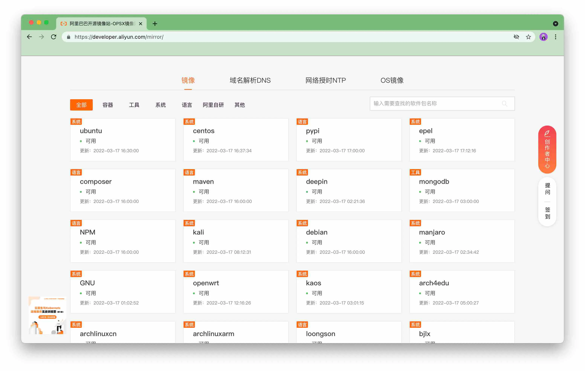
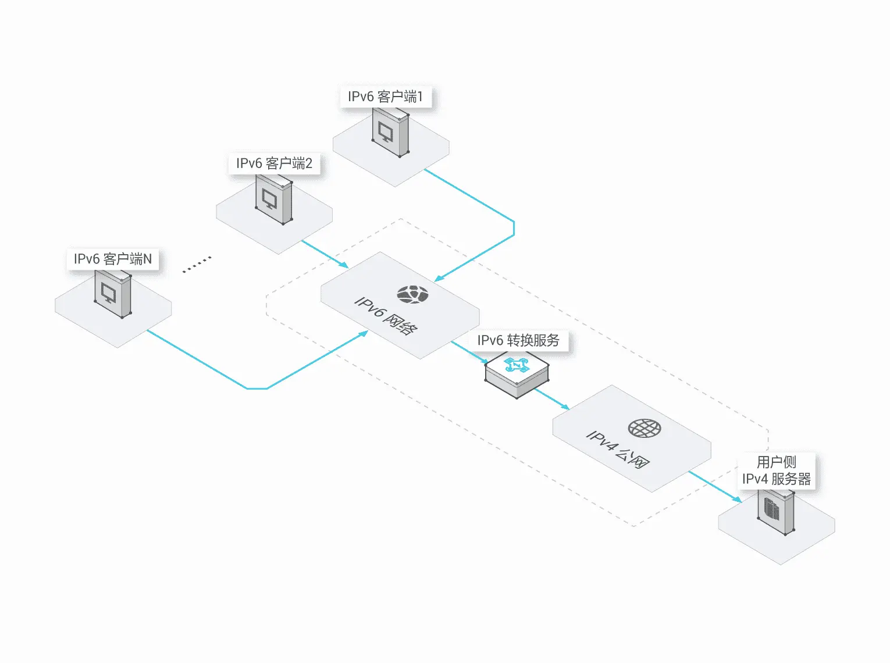
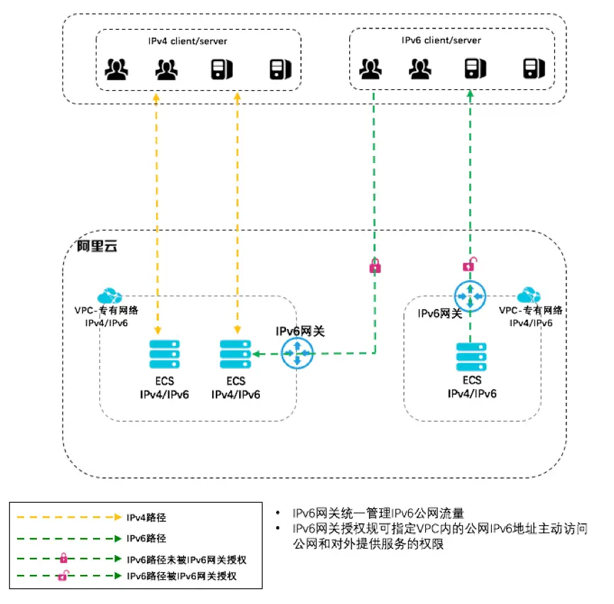

# 阿里云
<!-- toc --> 

### [开源mirror网址](https://developer.aliyun.com/mirror/)

***



### [阿里云专有网络](https://help.aliyun.com/document_detail/100380.html)

***

* 专有网络是您独有的云上虚拟网络，您可以将云资源部署在您自定义的专有网络中.
* 云资源不可以直接部署在专有网络中，必须属于专有网络内的一个交换机（子网）内.
* 目前专有网络必须手动开启ipv6功能


### 阿里云支持ipv6






### [阿里云ECS配置ipv6](https://help.aliyun.com/document_detail/108458.html)


* VPC和ECS支持双栈后，ECS上会分配到IPv6地址，部署在ECS上的系统需要主动访问Internet的IPv6系统，这就需要配合IPv6网关使用
* 开通IPv6网关后，通过配置IPv6网关规则，允许VPC内指定IPv6地址访问公网，则指定的IPv6 ECS就可以主动访问公网了
* 如不配置IPv6网关规则，默认ECS分配的IPv6地址只能在VPC内部通信

* 安全组,源:"::/0"表示允许ipv6,源:"0.0.0.0/0"表示允许ipv4,要支持双栈就要同端口开放两个规则
* [ip6无法访问解决办法](https://help.aliyun.com/document_detail/187463.html)

### 阿里云邮箱 默认开通

***

| 服务器名称 | 服务器地址 | 服务器端口号（非加密）| 服务器端口号（SSL加密）|
| -- | -- | -- | -- |
| POP3 | pop3.aliyun.com | 110 | 995 |
| SMTP | smtp.aliyun.com |25 | 465 |
| IMAP | imap.aliyun.com | 143| 993 |

>**subject**不能太随意了,否则会认为垃圾邮件,被系统退信的!
>发件邮箱最好加入白名单

### 杂项

***

* [阿里云:云市场,买各种api接口](<https://market.aliyun.com/products>)
* [阿里云:云效代码托管](<http://codeup.aliyun.com>),可能快速导入其他的repos
* [钉钉开放平台](https://open.dingtalk.com/)
* 弹性云手机-远程虚拟手机,可以批量安装测试
* 批量安装设置服务器
  * 设置一台机器为种子,进行各种配置和安装
  * 把种子机器导出为镜像
  * 购买其他实例,选择从指定镜像初始化
* 号码隐私保护服务-真实号码绑定虚拟号码,其他人可用虚拟号码转到真实号码

### 阿里云ECS高危漏洞问题处理

***

```bash
# 升级系统及软件就能解决多数
yum -y upgrade
```

### 服务器vi乱码

***

```bash
cd ~
vi .vimrc

set fileencodings=utf-8,ucs-bom,gb18030,gbk,gb2312,cp936
set termencoding=utf-8
set encoding=utf-8
set number
filetype on
syntax on
```
