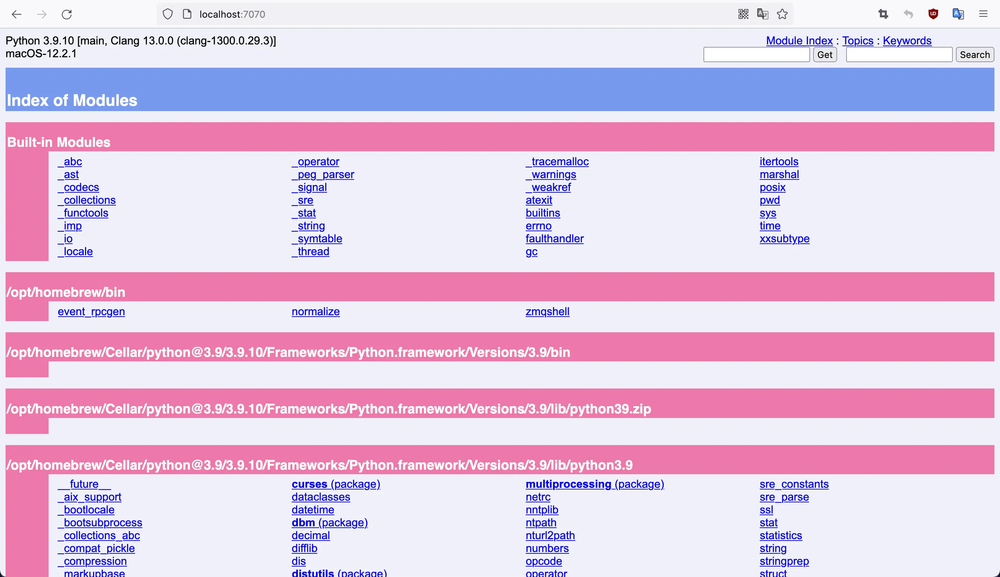

---
# python
---

### 重要网站

***

* [官网](https://www.python.org/)

>python2已死,不要再学再用啦！！！

* [pypi](https://pypi.org/)

>官方第三方包网站,你绝对值得拥有!

* venv-解决不同项目依赖不同版本包,依赖冲突

```bash
# 源码编译安装
# 官网 python.org 下载压缩包，解压
# 然后，在./configure的时候，需要加上  --enable-optimizations参数，这样才能启用很多功能。

# 创建tutorial-env目录,复制一份python相关环境
python3 -m venv tutorial-env

# windows执行，激活虚拟环境
tutorial-env\Scripts\activate.bat

# Macos/unix执行，激活虚拟环境
source tutorial-env/bin/activate
```

### 安装pip

***

```sh
#看看pip是否安装,现在一般都安装的,特别是采用brew,安装包之类
python3 -m pip --version
#手动安装,一般不用
python3 -m ensurepip --default-pip

# 升级pip
python3 -m pip install --upgrade pip

# 在某些情况下，我们需要查看第三方包的依赖包和被依赖包
# 命令输出的 Requires 和 Required-by
pip show pkg_name 
# 能显示所有的依赖包及其子包,推荐用这个
pip deptree -p pkg_name
# 永久性切换国内清华源
pip3 config set global.index-url https://pypi.tuna.tsinghua.edu.cn/simple
# 换回默认源
pip3 config unset global.index-url
# 本次下载python中的Django包，这里使用的是豆瓣源
pip3 install django -i http://pypi.douban.com/simple 
```

### requirements.txt可以通过pip命令自动生成和安装

* 生成requirements.txt文件

```bash
# 产生整个python环境的安装依赖,方便移值及复制
pip freeze > requirements.txt
```

* 安装requirements.txt依赖包：

```bash
pip install -r requirements.txt
```

### 安装常用库

***

```sh
# pylint执行pep8规范
pip3 install pylint

pylint xxx.py

# 更严格的检测flake8
pip3 install flake8

flake8 xx.py

# 强制统一代码风格
pip install black

black code_dir/xxx.py

# yapf是google开源的格式化代码工具
pip install yapf 

# 统一import格式
pip3 install isort

isort xx.py

# 静态检查
pip3 install mypy

mypy xxx.py

# 比内置unittest更好用单元测试
pip3 install pytest
```

```python
# content of test_sample.py
def inc(x):
    return x + 1


def test_answer():
    assert inc(3) == 5
```

```bash
pytest
```

```python
if __name__ == '__main__':
    # 我是主模块身份
  
# 列举任意对象的全部属性
dir(obj)
```

* [fabric](http://www.fabfile.org/)
* [awesome-python](https://github.com/vinta/awesome-python)
* [Selenium是一个用电脑模拟人操作浏览器网页](https://www.selenium.dev/)
* [js2py纯python执行js](https://pypi.org/project/Js2Py/)
* [supervisor-进程管理](https://github.com/Supervisor/supervisor)
* [numpy](https://numpy.org/)
* [pandas](https://pandas.pydata.org/)
* [PyGithub-封装github的api](https://github.com/PyGithub/PyGithub)
* [plotnine](https://plotnine.readthedocs.io/en/stable/)
* [pillow](https://python-pillow.org)
* [xlwings操作excel](https://www.xlwings.org/)
* [flet-flutter的python包装](https://www.flet.dev/)
* [pydantic-类型注解加强版](https://docs.pydantic.dev/)
* [anaconda-独立开源包管理器](https://www.anaconda.com/)

> Anaconda包括Conda、Python以及一大堆安装好的工具包，比如：numpy、pandas等
Miniconda包括Conda、Python
conda是一个开源的包、环境管理器，可以用于在同一个机器上安装不同版本的软件包及其依赖，并能够在不同的环境之间切换

* [Django](https://www.djangoproject.com/)

```python
# settings.py
LANGUAGE_CODE = "zh-hans"
TIME_ZONE = "Asia/Shanghai"
USE_TZ = False
```

* [Flask](http://flask.pocoo.org/)
* [requests](http://docs.python-requests.org/en/master/)
* [Django-rest-framework](http://www.django-rest-framework.org/)
* [scrapy](https://scrapy.org/)
* [falcon](https://falconframework.org/)
* [odoo以前openERP](https://www.odoo.com/zh_CN)
* [uvicorn-快如闪电的web框架](https://www.uvicorn.org/)

```bash
docker odoo
```

* [frida](https://frida.re/)
* [vibora](https://github.com/vibora-io/vibora)
* [web3.py](https://github.com/pipermerriam/web3.py)
* [pycorrector-中文纠错](https://github.com/shibing624/pycorrector)
* [atomicwrites-原子写](https://github.com/untitaker/python-atomicwrites)
* [sqlalchemy2.0-sql数据库](https://docs.sqlalchemy.org/en/20/)
* [deepcompare-深度比较]
* [jsonlines-jsonl文件]
* [boltons-常见第三方工具集合]
* [fastapi-后起之秀http框架](https://fastapi.tiangolo.com/)
* [sanic-最快的web框架](https://sanic.dev/)
* [office-自动化系列](https://www.python-office.com/)
* [Pyodide-浏览器中运行python,采用webasm](https://pyodide.org)

```python
from atomicwrites import atomic_write

with atomic_write('foo.txt', overwrite=True) as f:
    f.write('Hello world.')
    # "foo.txt" doesn't exist yet.
# Now it does.
```

### 特别包

```bash
# import cv2
pip3 install opencv-python

pip3 install numpy

# import PIL
pip3 install pillow

pip3 install image

# No matching distribution found for onnxruntime
# 暂时不支持m1芯片
pip3 install onnxruntime
```

### 浏览器本地文档

***

```sh
#更多命令 pydoc3 -help
pydoc3 -p 7070
```



### 说明requirement.txt

* 通常我们会在项目的根目录下放置一个 requirement.txt 文件，用于记录所有依赖包和它的确切版本号。
* 每行一个依赖包,可以指定包的具体版本

```shell
tencentcloud-sdk-python=3.0.720
```

### 连接memcached

***

```sh
pip3 install pymemcache
```

```python
#!python3
from pymemcache.client.base import Client

client = Client('localhost')

memKey = '/memcached'

client.set(memKey, '<HTML><H1>hello,world!</H1></HTML>')

result = client.get(memKey)

print(result)
```

### 连接redis

***

```sh
pip3 install redis
```

```python
#!python3
import redis

client = redis.Redis(host='localhost', port=6379, db=0)

key = "python3Redis"

client.set(key, "From Python3 Redis")

resp = client.get(key)

print(resp)
```

今天这篇文章，聊一下python在web开发上的一些基础实现，阐述下自己理解中的WSGI、ASGI，以及拿uvicorn+FastAPI的组合举个ASGI应用的例子。

* WSGI-同步web应用

  * python-web-app，也就是web应用层，实现WSGI接口，用作web请求的handler
  * 用户向python-web-server发送web请求
  * python-web-server，又称作WSGI Server，解析请求数据，整理当前session的环境信息
  * python-web-server加载python-web-app，调用python-web-app实例的WSGI接口，处理请求
  * python-web-app处理完请求，返回结果给到python-web-server
  * python-web-server写回返回结果，给回用户

```python
def application(environ, start_response):
    start_response('200 OK', [('Content-Type', 'text/plain')])
    return [b'Greetings universe']
```

* ASGI-异步web应用

  * 一方面是支持asyncio的机制
  * 另一方面也能够解决WSGI难以支持WebSocket之类长连接模式的问题
  * 执行流程和wsgi差不多

```python
async def application(scope, receive, send):
    event = await receive()
    ...
    await send({"type": "websocket.send", ...})
```

### [百度开源Paddle](https://www.paddlepaddle.org.cn/)

* 安装框架

```bash
python3 -m pip install paddlepaddle==2.3.1 -i https://mirror.baidu.com/pypi/simple
```

* 安装ocr

```bash
pip3 install "paddleocr>=2.0.1" -i https://mirror.baidu.com/pypi/simple
```

* [m1芯片特别安装](https://github.com/PaddlePaddle/PaddleOCR/issues/6720)
  * Download source code locally
  * In requirements.txt, update to opencv-contrib-python==4.6.0.66
  * Pip install - r requirements.txt
  * python setup.py install
  * ppadleocr 安装在/opt/homebrew/opt/python@3.9/Frameworks/Python.framework/Versions/3.9/bin
  * 第一次运行会下载训练好的模型到~/.paddleocr目录
  * ln -s /opt/homebrew/opt/python@3.9/Frameworks/Python.framework/Versions/3.9/bin/paddleocr paddleocr

* 安装paddleocrlabel

* [m1芯片源码安装]

  * 下载源码

  ```bash
  git clone git@github.com:PaddlePaddle/PaddleOCR.git
  cd PPOCRLabel
  python setup.py install
  # 如果出现安装pyqt5失败,则采用brew install pyqt5
  Installing PPOCRLabel script to /opt/homebrew/opt/python@3.9/Frameworks/Python.framework/Versions/3.9/bin
  cd /opt/homebrew/bin
  ln -s /opt/homebrew/opt/python@3.9/Frameworks/Python.framework/Versions/3.9/bin/PPOCRLabel PPOCRLabel


  # 运行,第一运行会下载必要东西~/.paddleocr目录
  PPOCRLabel --lang ch
  # 针对特别业务,可以事先处理图片,再传入自动标注
  ```

```bash
# 直接下载whl文件,本地安装
pip3 install xxx.whl
```

```bash
# applie m1 芯片安装,会有问题，因为没有直接aarch64.whl,需要重头编译,但目前没有办法成功
pip3 install pyqt5

# 幸好brew可以帮忙编译
brew install pyqt5
```

* 模型结构可视化VisualDL

```bash
python3 -m pip install visualdl -i https://mirror.baidu.com/pypi/simple
# Running VisualDL at http://localhost:8040/ (Press CTRL+C to quit)
./visualdl
# 网络结构-静态，把模型文件拖进去<https://www.paddlepaddle.org.cn/inference/master/guides/export_model/visual_model.html>
```

* 另一个神经网络模型可视化-[Netron](https://github.com/lutzroeder/Netron)

### wheel(轮子),wheel是一个zip压缩文件，将.whl扩展名替换为.zip

* wheel是python新的发行标准，旨在替代传统的egg，pip >=1.4的版本均支持wheel， 使用wheel作为你python库的发行文件，有如下好处：

  * 纯Python和本机C扩展软件包的安装速度更快
  * 避免执行任意代码进行安装。
  * (避免setup.py）C扩展的安装不需要在Linux，Windows或macOS上进行编译
  * 允许更好地缓存以进行测试和持续集成
  * 在安装过程中创建.pyc文件，以确保它们与使用的Python解释器匹配跨平台和机器的安装更加一致

  ```bash
  # 制作wheel安装包-方式1
  python setup.py bdist_wheel
  # 制作wheel安装包-方式2
  pip wheel --wheel-dir=/root/whl ./
  ```

### [注解解释](https://www.cnblogs.com/hls-code/p/15393272.html)

* 在 Python 3.5 中，Python PEP 484 引入了类型注解（type hints）
* 在 Python 3.6 中，PEP 526 又进一步引入了变量注解（Variable Annotations）。

* 具体的变量注解语法可以归纳为两点：

  * 在声明变量时，变量的后面可以加一个冒号，后面再写上变量的类型，如 int、list 等等。
  * 在声明方法返回值的时候，可以在方法的后面加一个箭头，后面加上返回值的类型，如 int、list 等等。

* 在PEP 8 中，具体的格式是这样规定的：

  * 在声明变量类型时，变量后方紧跟一个冒号，冒号后面跟一个空格，再跟上变量的类型。
  * 在声明方法返回值的时候，箭头左边是方法定义，箭头右边是返回值的类型，箭头左右两边都要留有空格。

* 值得注意的是，这种类型和变量注解实际上只是一种类型提示，对运行实际上是没有影响的。

### opencv,python绑定

```python
# OpenCV-Python接口中使用cv2.findContours ()函数来查找检测物体的轮廓。 
contours, hierarchy = cv2.findContours (image,mode,method)

# mask是与iamge一样大小的矩阵，其中的数值为0或者1，为1的地方，计算出image中所有元素的均值，为0 的地方，不计算
cv::Scalar mean = cv2.mean (image, mask)

应用cv2.warpPerspective()前需先使用cv2.getPerspectiveTransform()得到转换矩阵
cv2.warpPerspective() 叫做透视变换。

# 以彩色模式加载图片
img = cv2.imdecode(np_arr, cv2.IMREAD_COLOR)
```

### numpy

```python
1、numpy.ones()函数
可以创建任意维度和元素个数的数组，其元素值均为1
2、使用语法
numpy.ones(shape, dtype=None, order='C')
b = np.ones((3,4),dtype=np.int64)
print(b)
[[1 1 1 1]
 [1 1 1 1]
 [1 1 1 1]]
```

### paddleocr

```python

self.input_tensor.copy_from_cpu(norm_img_batch)
self.predictor.run()
outputs = []
for output_tensor in self.output_tensors:
    output = output_tensor.copy_to_cpu()
    outputs.append(output)
if len(outputs) != 1:
    preds = outputs
else:
    preds = outputs[0]
  
```

* Tensor 是 Paddle Inference 的数据组织形式，用于对底层数据进行封装并提供接口对数据进行操作，包括设置 Shape、数据、LoD 信息等。 注意： 应使用 Predictor 的 get_input_handle 和 get_output_handle 接口获取输入输出 Tensor
