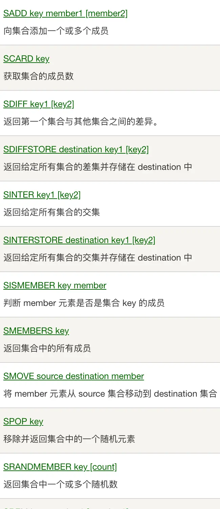
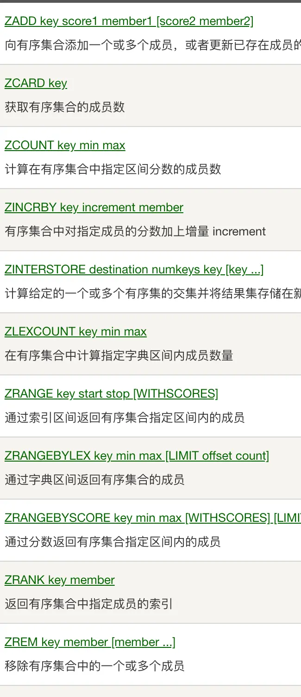
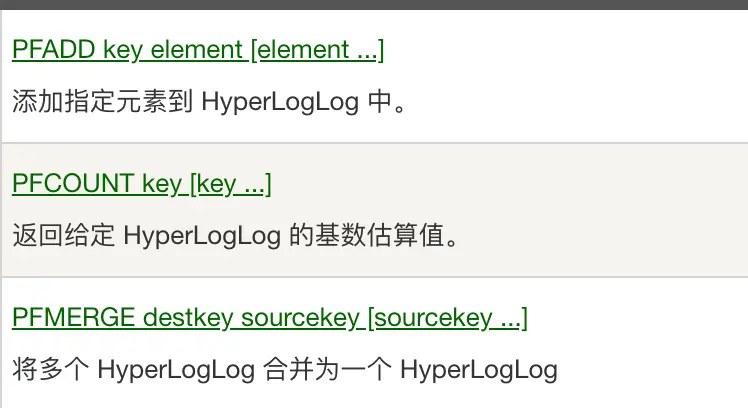

---
# redis
---

### 安装运行

***

```sh
brew install redis
brew services start redis
```

***

```sh
wget https://download.redis.io/redis-stable.tar.gz
tar -xzvf redis-stable.tar.gz
cd redis-stable
make

# If the compile succeeds, you'll find several Redis binaries in the src directory, including:
# redis-server: the Redis Server itself
# redis-cli is the command line interface utility to talk with Redis.
# To install these binaries in /usr/local/bin, run:
make install
```

### 自带客户端

***

```sh
#Usage: redis-cli [OPTIONS] [cmd [arg [arg ...]]]
#Examples:
#  cat /etc/passwd | redis-cli -x set mypasswd
#  redis-cli get mypasswd
#  redis-cli -r 100 lpush mylist x
#  redis-cli -r 100 -i 1 info | grep used_memory_human:
#  redis-cli --quoted-input set '"null-\x00-separated"' value
#  redis-cli --eval myscript.lua key1 key2 , arg1 arg2 arg3
#  redis-cli --scan --pattern '*:12345*'
#When no command is given, redis-cli starts in interactive mode
#redis-cli的命令提示非常有帮助,比其他终端好用的多
redis-cli
```

### RedisInsight是Redis官方出品的可视化管理工具，可用于设计、开发、优化你的Redis应用

### redis4引入自动内存碎片整理

***

```sh
# 开启自动内存碎片整理(总开关),默认no
activedefrag yes
# 当碎片达到 100mb 时，开启内存碎片整理
active-defrag-ignore-bytes 100mb
# 当碎片超过 10% 时，开启内存碎片整理
active-defrag-threshold-lower 10
# 内存碎片超过 100%，则尽最大努力整理
active-defrag-threshold-upper 100
# 内存自动整理占用资源最小百分比
active-defrag-cycle-min 1
# 内存自动整理占用资源最大百分比
active-defrag-cycle-max 25
```

> **Notice:开启后,可能特定时间影响redis响应速度**

### redis5带来了Stream

***

>Redis对消息队列（MQ，Message Queue）的完善实现


### redis6增加了多线程

***

```sh
# io-threads 4
# Setting io-threads to 1 will just use the main thread as usual.
# io-threads-do-reads no
# Note that Gopher is not currently supported when 'io-threads-do-reads'
```

>Redis实例占用相当大的CPU耗时的时候才建议采用,否则使用多线程没有意义。基本上我们都是**观众**!!!

### 常用功能

***

| 功能 | 命令 | 备注 |
| -- | -- | -- |
| String | set,get,setnx,mget,mset,msetnx | 最大512MB,可存任何数据 |
| List | lpush,lpop,rpush,rpop,blpop,brpop,llen,lpushx,lrem,lrange | 超过40亿个元素 |
| Hash | hget,hset,hdel,hgetall,hkeys,hvals,hlen,hmset,hmget | 超过40亿个元素 |
| Set | sadd,spop,srem,scard,smembers,sismember,sdiff,sinter,sunion | 超过40亿个成员 |
| SortedSet | zadd,zrem,zcard,zcount,zscore,zrange | 超过40亿个成员 |
| Pub/Sub | subscribe,publish,unsubscribe | 消息不会保存,广播型 |
| Stream | xadd,xdel,xlen,xread,xgroup,xreadgroup,xinfo,xtrim | 消息会保存,每个消息都是一组键值对,同组竞争,组间广播 |
| Key | del,keys,type,object,ttl,persist,randomkey,rename | 针对键操作 |
| Pipelining |  优点:减少RTT(往返时间),多次网络IO,系统调用的消耗 | 缺点:独占链接,占用redis内存缓存命令结果 |
| Auth | auth password | 验证密码 |
| HyperLogLog | pfadd,pfcount | 基数估计 |








* xreadgroup和xack配合使用

```c
WHILE true
    entries = XREADGROUP $GroupName $ConsumerName BLOCK 2000 COUNT 10 STREAMS mystream >
    if entries == nil
        puts "Timeout... try again"
        CONTINUE
    end

    FOREACH entries AS stream_entries
        FOREACH stream_entries as message
            process_message(message.id,message.fields)

            # ACK the message as processed
            XACK mystream $GroupName message.id
        END
    END
END
```

### 常见问题

***

1. **缓存雪崩:短时间内大量键超时失效**

2. **缓存击穿:缓存中没有键值**

    1. 确实不存在:用布隆过滤器优化
    2. 键超时:设置永不超时,受最大内存限制

### 批量删除

***

```lua
--批量删除msg开始的键值
EVAL "return redis.call('del', unpack(redis.call('keys', ARGV[1])))" 0 'msg*'
```

### redis通讯协议-RESP

***

* 请求协议
  1. *后面数量表示存在几个$
  2. $后面数量表示字符串的长度
  3. 每项用\r\n分隔

```sh
*3\r\n$3\r\nSET\r\n$5\r\nmykey\r\n$7\r\nmyvalue\r\n
```

>**pipeline实现就是连接发送命令,不用每个都等**
