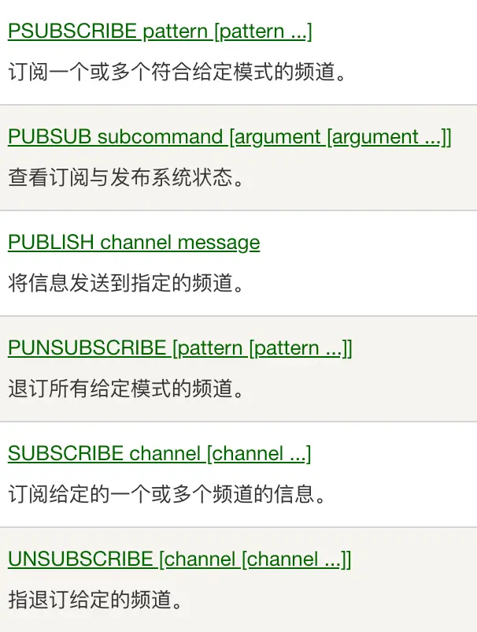

---
# redis
---

### 安装运行

***

```sh
brew install redis
brew services start redis
```

***

```sh
wget https://download.redis.io/redis-stable.tar.gz
tar -xzvf redis-stable.tar.gz
cd redis-stable
make

# If the compile succeeds, you'll find several Redis binaries in the src directory, including:
# redis-server: the Redis Server itself
# redis-cli is the command line interface utility to talk with Redis.
# To install these binaries in /usr/local/bin, run:
make install
```

### 自带客户端

***

```sh
#Usage: redis-cli [OPTIONS] [cmd [arg [arg ...]]]
#Examples:
#  cat /etc/passwd | redis-cli -x set mypasswd
#  redis-cli get mypasswd
#  redis-cli -r 100 lpush mylist x
#  redis-cli -r 100 -i 1 info | grep used_memory_human:
#  redis-cli --quoted-input set '"null-\x00-separated"' value
#  redis-cli --eval myscript.lua key1 key2 , arg1 arg2 arg3
#  redis-cli --scan --pattern '*:12345*'
#When no command is given, redis-cli starts in interactive mode
#redis-cli的命令提示非常有帮助,比其他终端好用的多
redis-cli
```

### RedisInsight是Redis官方出品的可视化管理工具，可用于设计、开发、优化你的Redis应用

### redis4引入自动内存碎片整理

***

```sh
# 开启自动内存碎片整理(总开关),默认no
activedefrag yes
# 当碎片达到 100mb 时，开启内存碎片整理
active-defrag-ignore-bytes 100mb
# 当碎片超过 10% 时，开启内存碎片整理
active-defrag-threshold-lower 10
# 内存碎片超过 100%，则尽最大努力整理
active-defrag-threshold-upper 100
# 内存自动整理占用资源最小百分比
active-defrag-cycle-min 1
# 内存自动整理占用资源最大百分比
active-defrag-cycle-max 25
```

> **Notice:开启后,可能特定时间影响redis响应速度**

### redis5带来了Stream

***

>Redis对消息队列（MQ，Message Queue）的完善实现


### redis6增加了多线程

***

```sh
# io-threads 4
# Setting io-threads to 1 will just use the main thread as usual.
# io-threads-do-reads no
# Note that Gopher is not currently supported when 'io-threads-do-reads'
```

>Redis实例占用相当大的CPU耗时的时候才建议采用,否则使用多线程没有意义。基本上我们都是**观众**!!!

### 常用功能

***

| 功能 | 命令 | 备注 |
| -- | -- | -- |
| String | set,get,setnx,mget,mset,msetnx | 最大512MB,可存任何数据 |
| List | lpush,lpop,rpush,rpop,blpop,brpop,llen,lpushx,lrem,lrange | 超过40亿个元素 |
| Hash | hget,hset,hdel,hgetall,hkeys,hvals,hlen,hmset,hmget | 超过40亿个元素 |
| Set | sadd,spop,srem,scard,smembers,sismember,sdiff,sinter,sunion | 超过40亿个成员 |
| SortedSet | zadd,zrem,zcard,zcount,zscore,zrange | 超过40亿个成员 |
| Pub/Sub | subscribe,publish,unsubscribe | 消息不会保存,广播型 |
| Stream | xadd,xdel,xlen,xread,xgroup,xreadgroup,xinfo,xtrim | 消息会保存,每个消息都是一组键值对,同组竞争,组间广播 |
| Key | del,keys,type,object,ttl,persist,randomkey,rename | 针对键操作 |
| Pipelining |  优点:减少RTT(往返时间),多次网络IO,系统调用的消耗 | 缺点:独占链接,占用redis内存缓存命令结果 |
| Auth | auth password | 验证密码 |
| HyperLogLog | pfadd,pfcount | 基数估计 |





* xreadgroup和xack配合使用

```c
WHILE true
    entries = XREADGROUP $GroupName $ConsumerName BLOCK 2000 COUNT 10 STREAMS mystream >
    if entries == nil
        puts "Timeout... try again"
        CONTINUE
    end

    FOREACH entries AS stream_entries
        FOREACH stream_entries as message
            process_message(message.id,message.fields)

            # ACK the message as processed
            XACK mystream $GroupName message.id
        END
    END
END
```

### 常见问题

***

1. **缓存雪崩:短时间内大量键超时失效**

2. **缓存击穿:缓存中没有键值**

    1. 确实不存在:用布隆过滤器优化
    2. 键超时:设置永不超时,受最大内存限制

### 批量删除

***

```lua
--批量删除msg开始的键值
EVAL "return redis.call('del', unpack(redis.call('keys', ARGV[1])))" 0 'msg*'
```

### redis通讯协议-RESP

***

* 请求协议
  1. *后面数量表示存在几个$
  2. $后面数量表示字符串的长度
  3. 每项用\r\n分隔

```sh
*3\r\n$3\r\nSET\r\n$5\r\nmykey\r\n$7\r\nmyvalue\r\n
```

>**pipeline实现就是连接发送命令,不用每个都等**

作为Redis专家，以下是对Redis近年来核心发展及未来趋势的全面总结，结合技术演进、功能扩展及社区动态综合分析：

---

### **一、核心功能演进（2019-2025）**

1. **多模态数据结构的扩展**  
   * **Stream数据类型（5.0）**：支持消息队列功能，实现轻量级流数据处理，填补了Redis在复杂消息场景的空白。  
   * **GEO功能（3.2）**：新增地理空间索引命令（如`GEOADD`、`GEOSEARCH`），支持位置服务场景。  
   * **增强型位图操作**：例如`BITCOUNT`和`BITOP`的优化，提升大数据分析的效率。  

2. **模块化与可扩展性**  
   * **Redis Module API（4.0）**：允许开发者通过C语言扩展自定义功能，推动生态多样化。例如RedisSearch（全文搜索）、RedisGraph（图数据库）等模块的涌现。  
   * **Function（7.0）**：替代传统Lua脚本，支持持久化和主从复制，解决脚本丢失问题，并计划支持JavaScript、Python等多语言。  

3. **持久化与一致性优化**  
   * **RDB-AOF混合持久化（4.0）**：结合RDB快照的高效性与AOF日志的实时性，提升数据可靠性。  
   * **Multi-part AOF（7.0）**：分片存储增量日志，降低内存和磁盘IO消耗，支持按时间点恢复（PITR），显著提升容灾能力。  

---

### **二、架构与性能突破**

1. **分布式能力增强**  
   * **Redis Cluster（3.0）**：官方集群模式实现数据分片与高可用，后续版本持续优化网络通信与数据迁移效率。  
   * **Sharded-pubsub（7.0）**：在集群模式下按分片分发消息，避免广播风暴，减少资源浪费。  

2. **单线程模型的演进**  
   * **Threaded I/O（6.0）**：引入多线程处理网络I/O，缓解高并发下的性能瓶颈，保留核心逻辑的单线程设计以维持低延迟。  
   * **Client-eviction（7.0）**：全局限制客户端内存使用，防止因输出缓冲区过大触发数据驱逐。  

3. **内存管理与性能优化**  
   * **Lazy-free（4.0）**：异步删除大键（如`UNLINK`命令），避免阻塞主线程。  
   * **LFU缓存淘汰算法（4.0）**：优化缓存策略，提升热点数据命中率。  

---

### **三、生态系统与社区发展**

1. **企业级功能增强**  
   * **ACL（6.0）**：细粒度访问控制，支持多用户权限管理。  
   * **TLS加密（6.0）**：提供端到端通信加密，满足安全合规需求。  

2. **云原生与商业化集成**  
   * **阿里云Tair**：贡献Multi-part AOF等核心功能至开源社区，并推出增强型数据结构（如时序数据库模块）。  
   * **Redis Labs商业化**：推动RedisSearch、RedisJSON等模块的标准化，拓展应用场景。  

3. **开源社区争议**  
   * **许可证变更（2024年）**：Redis公司调整开源协议引发社区争议，部分开发者认为其背离开源初衷，促使替代项目（如Valkey）兴起。  

---

### **四、未来趋势与挑战**  

1. **分布式一致性优化**  
   * 改进Redis Cluster的分片均衡与故障恢复机制，探索更灵活的一致性协议（如Raft）。  

2. **实时计算与AI集成**  
   * 结合流处理（Stream）与机器学习模块，支持实时特征计算与模型推理。  

3. **安全性强化**  
   * 增强数据加密（如静态数据加密）与审计功能，应对企业级安全需求。  

4. **多模型数据库演进**  
   * 通过模块化扩展支持图计算、时序分析等场景，向“计算型内存数据库”转型。  

---

### **总结**

Redis从高性能键值存储发展为多模型内存数据库，其核心在于**极致的性能优化**与**灵活的扩展能力**。未来，Redis将面临分布式场景深化、开源生态平衡、与云原生技术融合等挑战，但其在实时数据处理领域的地位仍不可替代。开发者需关注新版本特性（如7.0的Function与Sharded-pubsub），并结合业务场景合理选型。
