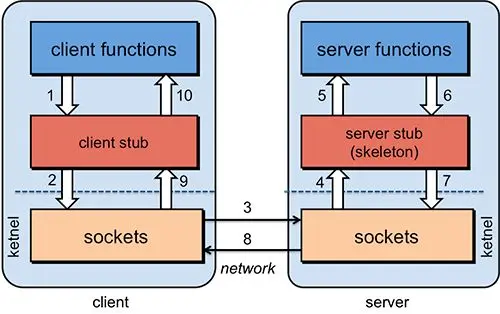
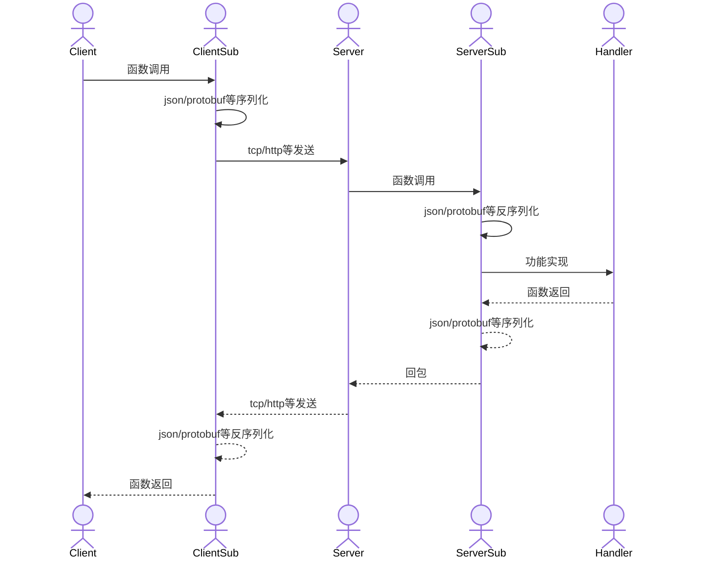
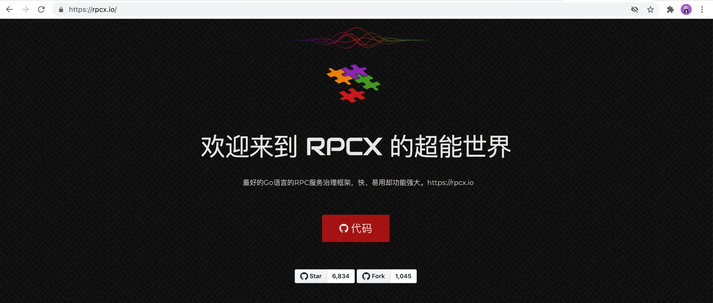

# rpc

### 运行过程

***

```mermaid

sequenceDiagram
    actor c as Client
    actor cs as ClientSub
    actor s as Server
    actor ss as ServerSub
    actor h as Handler
    c->>cs: 函数调用
    cs->>cs: json/protobuf等序列化
    cs->>s: tcp/http等发送
    s->>ss: 函数调用
    ss->>ss: json/protobuf等反序列化
    ss->>h: 功能实现
    h-->>ss: 函数返回
    ss-->>ss: json/protobuf等序列化
    ss-->>s: 回包
    s-->>cs: tcp/http等发送
    cs-->>cs: json/protobuf等反序列化
    cs-->>c: 函数返回

```

### 常见框架

***

* 

* 

* 

* 

* grpcurl 类似curl,但用于grpc
