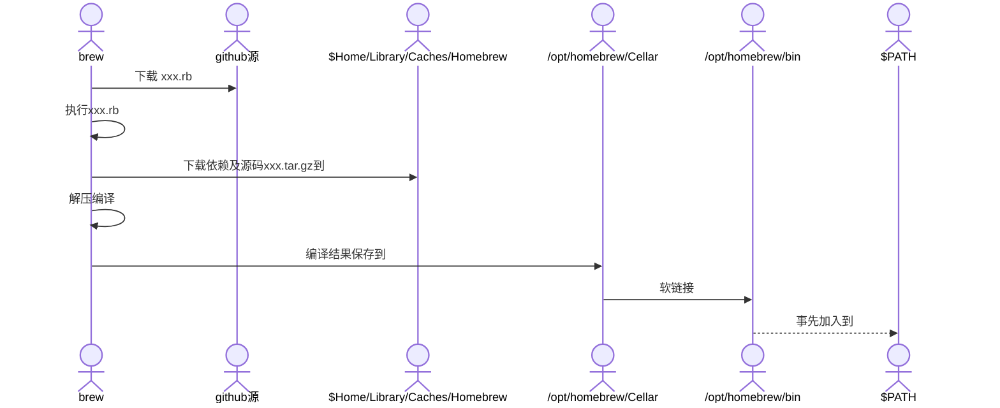

# brew-酿制
<!-- toc --> 

### [官网](https://brew.sh/)


* Homebrew 类似于一个软件中心，你可以理解成 App Store 或者 Google Play 那样的软件商店，只不过，Homebrew 比前者以及 Mac App Store 来说有着更丰富的资源与更高效的管理。
* Homebrew Cask，它是一套建立在 Homebrew 基础之上的 OS X 软件安装命令行工具，是 Homebrew 的扩展.
* homebrew-自家酿酒
* formula-配方
* key-桶酒,编译完成的套件资料夹
* Cellar-地窖

### 安装命令

```sh
# 如果很慢,可能切换国内源
/bin/bash -c "$(curl -fsSL https://raw.githubusercontent.com/Homebrew/install/HEAD/install.sh)"
```

### 常用命令

```sh
# 在 .zshrc 文件中添加
# Homebrew 取消自动更新
export HOMEBREW_NO_AUTO_UPDATE=true


# 安装hugo,nginx,memcached,redis,mongodb-community,mysql,jenkins-lts等等
brew install hugo

# 查看
brew info memcached

# 搜索
brew search redis

# 查看支持的命令
brew commands 

# 列出常用帮助
brew help

# 运行后台服务 start restart stop
brew services start nginx

#unbound is a validating, recursive, caching DNS resolver.
brew services start unbound

# unrar已经被删除了,只能安装私人的
brew install unrar
brew install carlocab/personal/unrar
```

### 附录

* HOMEBREW_NO_INSTALL_CLEANUP参数说明

    ```sh
    Unless HOMEBREW_NO_INSTALL_CLEANUP is set, brew cleanup will be run for the installed formulae or, every 30 days, for all formulae
    ```

* brew install xxx过程



* [github源](https://github.com/Homebrew/homebrew-core/tree/master/Formula)
