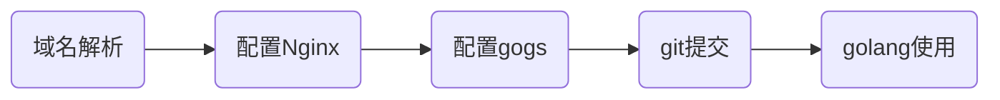
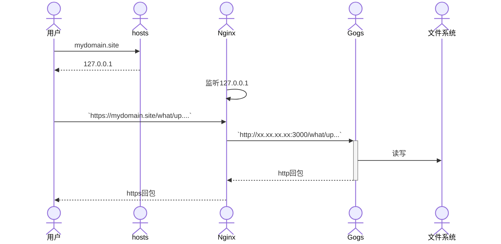

# 代码托管
<!-- toc --> 

#### 总览





#### 域名解析

1. 修改hosts

    ```sh
    vim /etc/hosts

    #配置mydomain.site的dns为本机
    #如果域名有备案,可以跳过此步,直接增加域名的A记录
    127.0.0.1 mydomain.site
    ```

2. 申请域名证书

    现在都不走http,都走https.个人项目,所以申请免费证书.生产环境还是要收费证书.免费申请证书途径:

    * [freessl](https://freessl.cn)网站
    * [letsencrypt](https://letsencrypt.org/zh-cn)网站
    * 阿里云SSL证书服务
    * 又拍云SSL 证书服务
    * 七牛云免费SSL证书
    * 百度云SSL证书服务
    * 腾讯云SSL证书服务
    * 华为云SSL证书管理SCM

#### 配置Nginx

1. 安装nginx

    ```sh
    brew install nginx
    # 如果遇到不能启动，尝试启动sudo brew services start nginx
    brew services start nginx
    ```

    * nginx源码安装,点[这里](/nginx/install)
    * 其他方式安装,看[这里](https://nginx.org/en/docs/install.html)

2. 修改配置文件

```nginx
...
server {
        listen       443 ssl;
        server_name  mydomain.site;

        #mydomain.site.pem/mydomain.site.key
        #就是申请域名证书后,网站提供的相关文件
        ssl_certificate      ssl/mydomain.site.pem;
        ssl_certificate_key  ssl/mydomain.site.key;

        ssl_session_cache    shared:SSL:1m;
        ssl_session_timeout  5m;

        ssl_ciphers  HIGH:!aNULL:!MD5;
        ssl_prefer_server_ciphers  on;

        location / {
            #直接转发gogs目录
            proxy_pass http://xx.xx.xx.xx:3000;
        }
    }
...
```

#### 配置gogs

1. 安装gogs

    ```sh
    wget https://dl.gogs.io/$VERSION/gogs_$VERSION_$OS_$ARCH.tar.gz
    tar -zxvf gogs_$VERSION_$OS_$ARCH.tar.gz
    cd gogs_$VERSION_$OS_$ARCH
    
    ```

    * 其他方式安装,看[这里](https://gogs.io/docs/installation/install_from_binary.html)

2. 修改配置

    ```sh
    [server]
    DOMAIN           = mydomain.site
    HTTP_PORT        = 3000
    //旧版本是修改ROOT_URL
    EXTERNAL_URL     = https://mydomain.site/
    ```

3. 运行

    ```sh
    #后台守护进程运行
    nohup ./gogs web &
    ```

4. 创建仓库(可以导入其他的repos，快速创建)

    ```sh
    #假设用户名为what,仓库名为up,仓库必须为公开,则仓库地址:
    https://mydomain.site/what/up.git
    ```

#### git使用

 ```sh
#git下载
git clone https://mydomain.site/what/up.git

#增加代码及其他
....

#提交代码
git push
```

#### golang使用

1. 设置私域名,不走代理

    ```sh
    go env -w GOPRIVATE=mydomain.site
    ```

2. 代码使用

    ```golang
    package main

    import (
        "fmt"

        "mydomain.site/what/up"
    )

    func main() {
        fmt.Println(up.Add(10, 10))
        fmt.Println(up.Power(10, 10))
    }            
    ```
