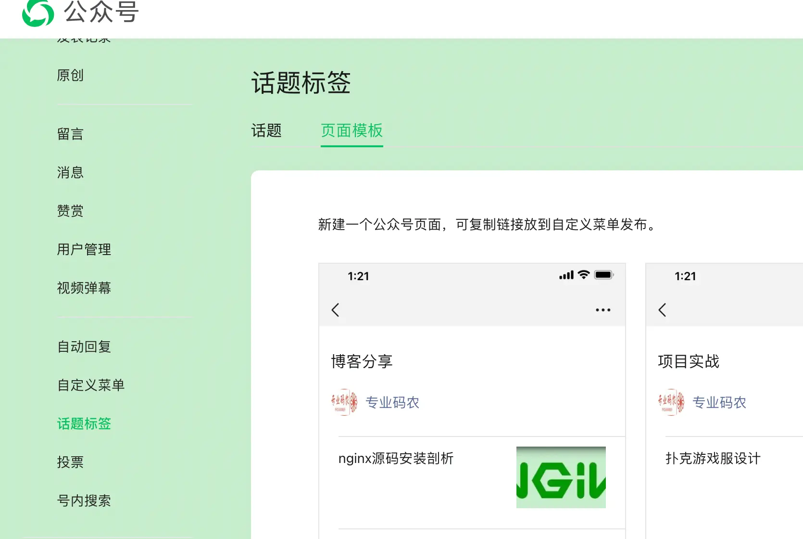

# 腾讯

### 微信公众号

***

1. 清除微信公众号

    >找到 文件传输助手, 发送 debugtbs.qq.com, 打开链接，清楚TBS内核，success
    

2. 头像300*300像素左右

3. 页面模板位置
    

### 信息

***

* [开放平台](https://developers.weixin.qq.com)

* 微信允许手机号转账,不必加好友(支付宝也支持)

* [移动APP集成报告](https://bugly.qq.com/)
