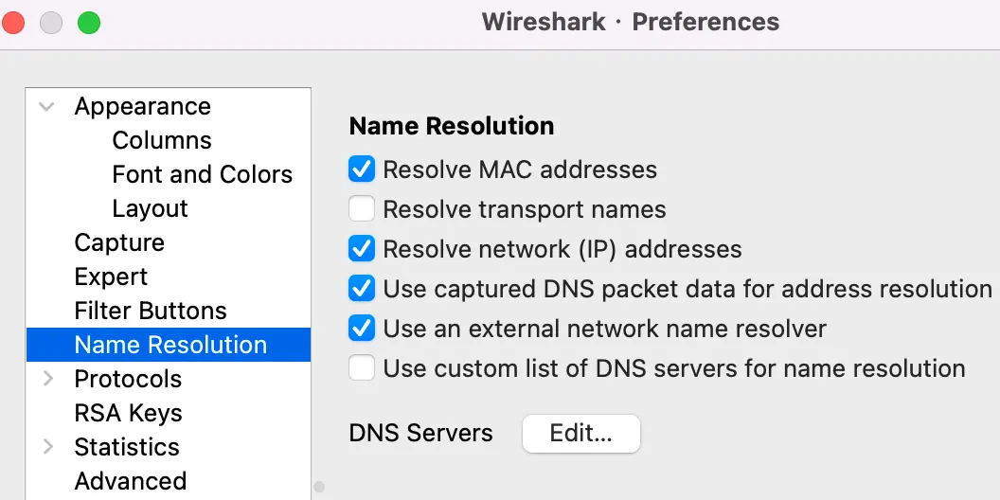

---
# wireshark
---

### 抓https,http2包

***

* 配置firefox

```sh
#设置环境变量,让firefox编入通讯密钥,调试完成后记得删除这个环境变量,它会影响速度和浪费空间
export SSLKEYLOGFILE=~/sslkeylog.log
#命令行启动,让firefox继承环境变量,也防止firefox后台运行,没有真正重启
/Applications/Firefox.app/Contents/MacOS/firefox-bin
```

* 配置wireshark

  * 设置通讯密钥文件位置
  

  * 设置显示域名,默认显ip
  

* firefox访问网址,wireshark抓包


### 显示过滤语法

***


```sh
# 获取指定port包
tcp.port == 8411
tcp.port in {80, 443, 8080}

# 指定ip源或目的
ip.src == 192.168.0.1
ip.dst == 192.168.0.1

# 按长度
http.content_length <=20
udp.length < 30

# 按协议
http
http contains "https://www.wireshark.org"
http.request.method == "POST"
http.request.method in {"HEAD", "GET"}

# 条件组合 and or
ip.src == 192.168.0.1 or ip.dst == 192.168.0.1
ip.dst eq www.mit.edu

```

### [capture过滤语法](https://www.wireshark.org/docs/wsug_html_chunked/ChCapCaptureFilterSection.html)

***

* 表达式规则

```sh
[not] primitive [and|or [not] primitive ...]
```

* primitive有几种形式
  * [src|dst] host <host>
  * ether [src|dst] host <ehost>
  * gateway host <host>
  * [src|dst] net <net> [{mask <mask>}|{len <len>}]
  * [tcp|udp] [src|dst] port <port>
  * less|greater <length>
  * ip|ether proto <protocol>
  * <expr> relop <expr>

* 示例

```sh
tcp port 23 and not src host 10.0.0.5
```

### 小知识

***

* 局域网抓包可采用路由器**镜像端口**
* 远程服务器抓包,远程抓包+rpcap,本机wireshark连接远程rpcap,则远程数据包转发到本机
* wireshark支持lua扩展解释自定义协议
